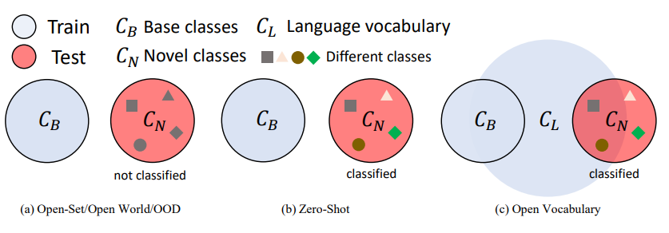
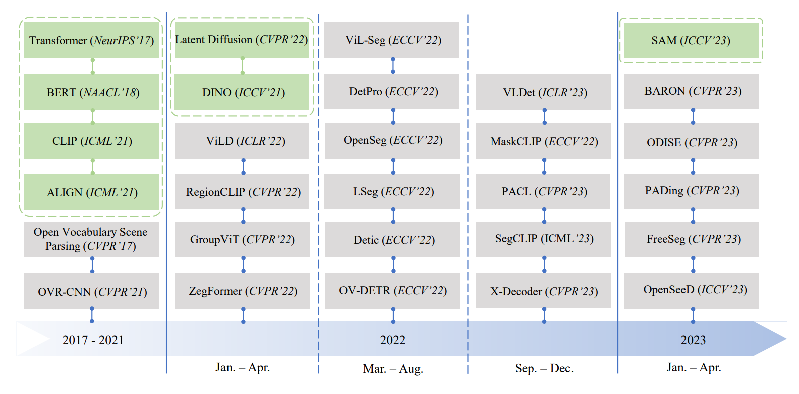
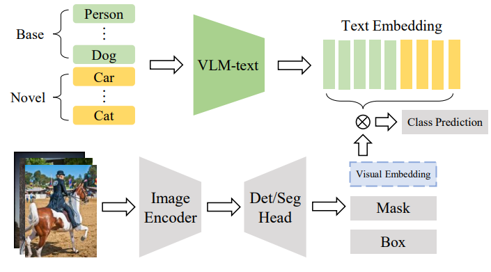
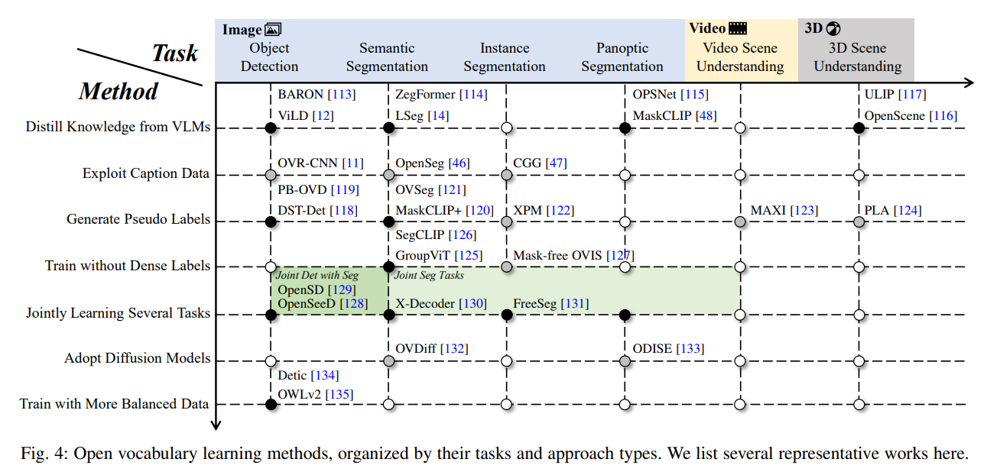
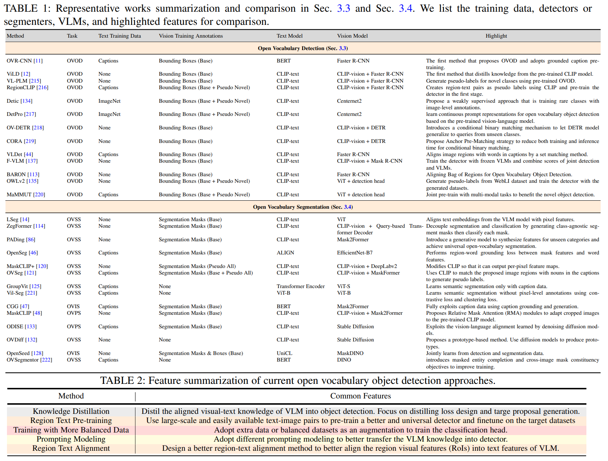
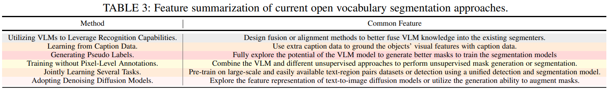
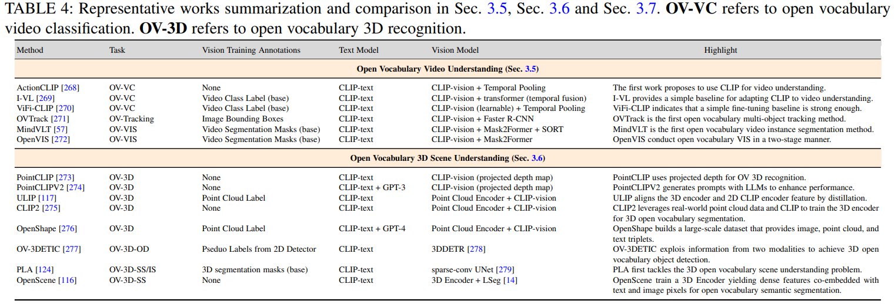

# [Towards Open Vocabulary Learning: A Survey](https://arxiv.org/pdf/2306.15880)

传统计算机视觉算法依赖于封闭数据集-->目标检测、分割和追踪只能在数据集对应的有限的类别集合上进行，而现实世界的目标类别远超过这些有限的类别 --> 视觉语言模型的发展促进开放式词汇方法的发展。

## 1 Introduction

+ 传统CV方法
+ 零样本学习（Zero-shot Learning, ZSL）：通常使用词嵌入，训练解码器通过已知类别判别未知类别（词嵌入方法 based on their pre-defined
word embeddings，无法利用视觉信息和关系信息）
+ Open vocabulary learning与ZSL的区别在于其可以利用visual-related language vocabulary data（如图片标题）作为辅助监督项：文本数据更易label（与图片mask相比），更extendable和general
+ VLM（Visual Language Model）:将图片特征和文本特征对齐到同一空间，开放词汇学习通常会用到VLM学习到的alignment
+ 本文的内容：少样本学习、多模态学习、视觉语言预训练|目标检测、分割、视频理解、三维场景理解|与ZSL、开放集识别（open-set recognition，OSR）、分布外检测（out of distribution detection，OOD）

## 2 Background

（novel classes就是OOD examples）

（绿色的是基础技术）

## Methods

### preliminary
+ pixel-based：语义分割、实例分割
+ query-based：vision transformer
### VLM

+ large scale visual langauge pre-training: 2-stream network
+ turning close-set detector and segmenter into open vocabulary settings.

### open vocabulary object detection

### open vocabulary segmentation

### open vocabulary video understanding

### open vocabulary 3d understanding

+ 3D recognition: 点云分类和分割：先投影到二维，然后再进行图片的类似操作；改进：改进投影方式，缝合额外的解码器，组合多模态数据（点云+图像+文本）
+ 3D object detection
+ 3D scene understanding:

### closely related tasks

+ Class Agnostic Detection and Segmentation: 不明确划分类别（所谓class agnostic），只输出score，可能提升泛化能力
+ Open World Object Detection: 标注novel category为unknown、
+ Open-Set Panoptic Segmentation: 全景分割，标注novel category

## Chanllenges and Outlook

+ 挑战：base classes过拟合；训练成本过高；跨数据集评估存在性能差异；已有类别存在概念上的重叠
+ 展望：探索时序信息；直接的3D open vocabulary 场景理解；制备基础模型 for 自定义任务的特定调整（in-context model，连接VLM和LLM）；与增量学习的组合；与大语言模型的组合