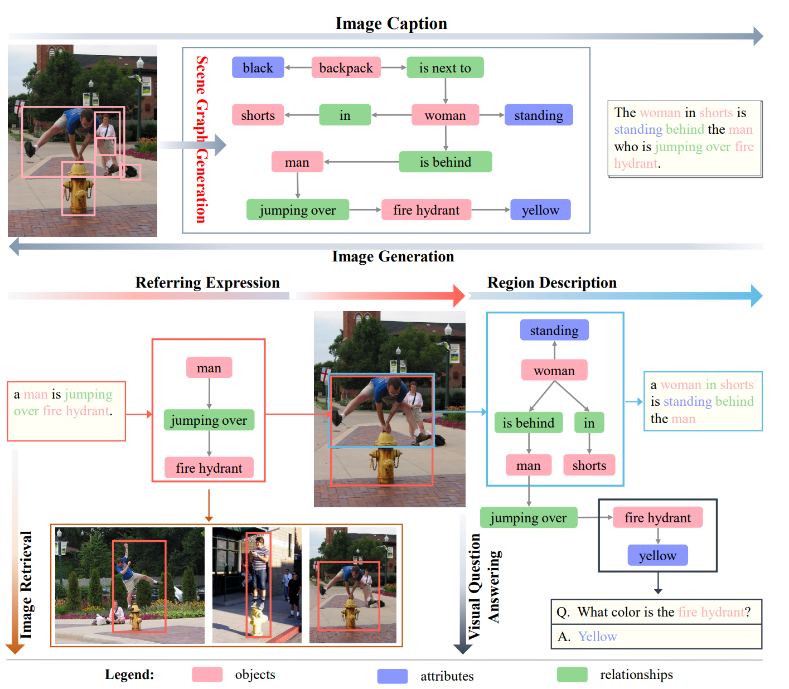
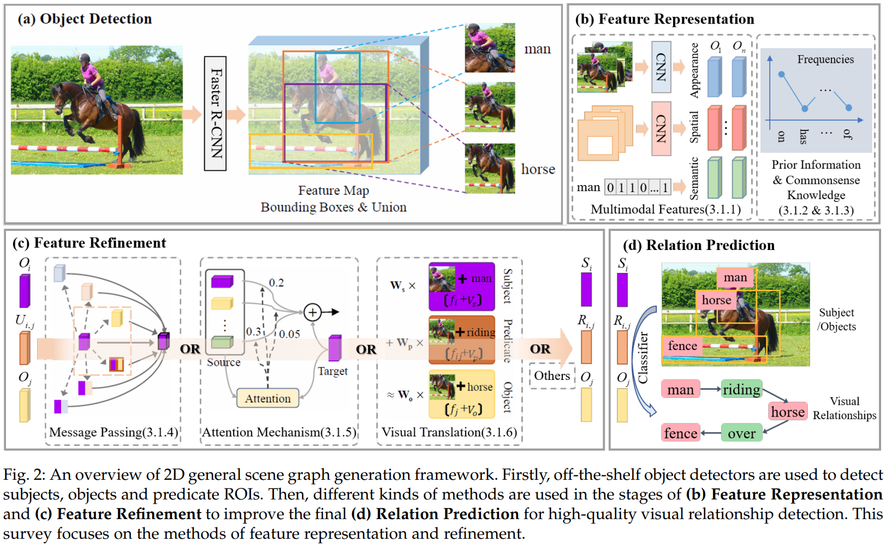
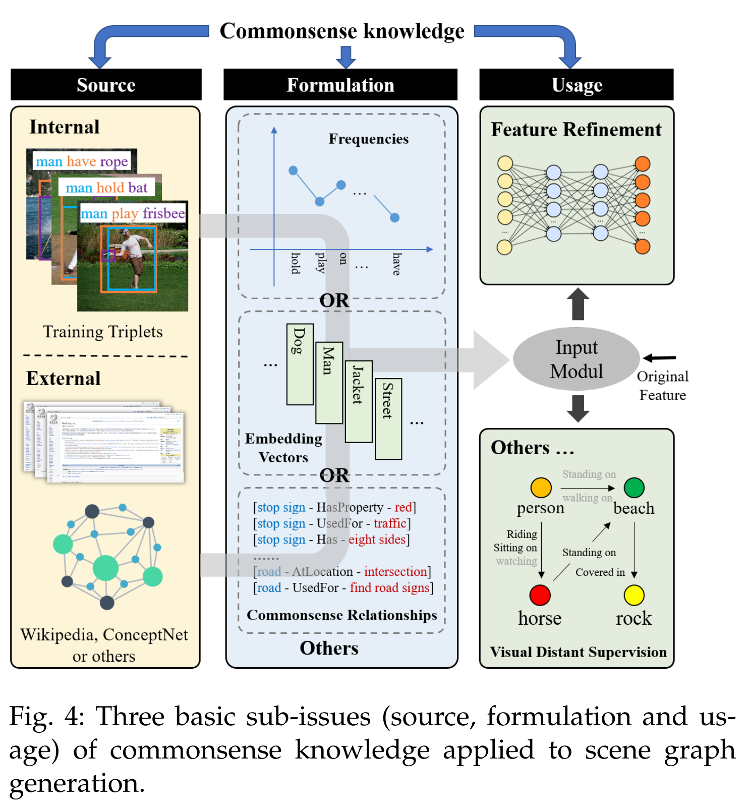
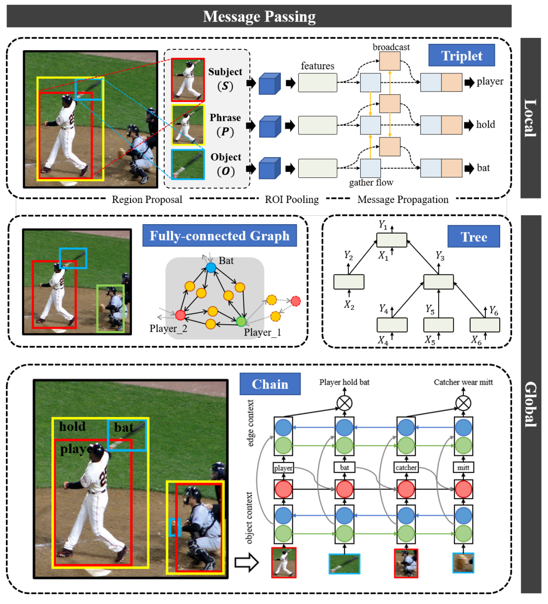
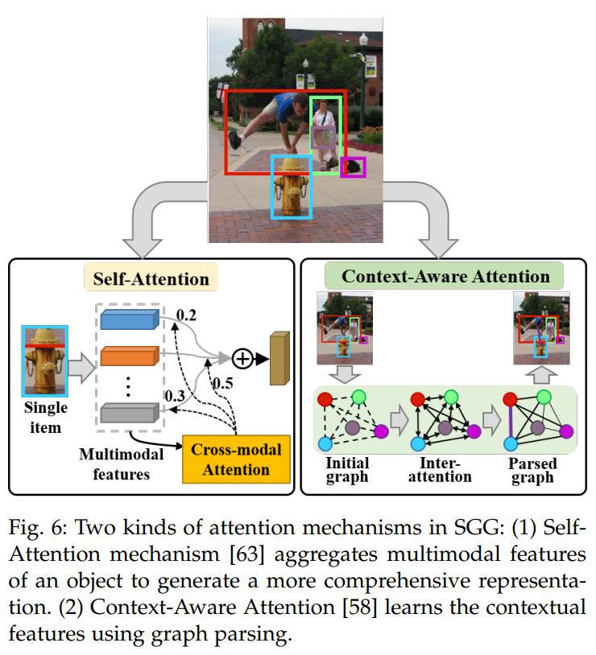
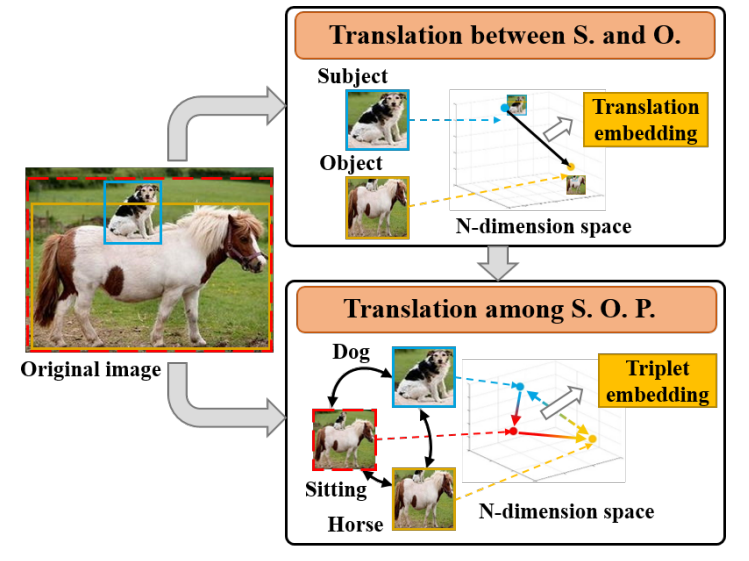

# [Scene Graph Generation: A Comprehensive Survey](https://arxiv.org/pdf/2201.00443)

在场景理解中场景图生成因其语义表达和应用而备受关注。所谓的场景图生成，就是自动从图片或视频中提取对象的语义图结构表达，通常需要正确标注对象并提取对象间的关系。

## Introduction

关注全局感知和信息的有效表达-->场景图，scene graph，节点对应对象，边对应对象之间的关系

+ Scene graph generation models take an image as an input and generate a visually-grounded scene graph.
+ Image caption can be generated from a scene graph directly. 
+ Image generation inverts the process by generating realistic images from a given sentence or scene graph.
+ The Referring Expression (REF) marks a region of the input image corresponding to the given expression, while the region and expression map the same subgraph of the scene graph.
+  For the Visual Question Answering (VQA) task, the answer can sometimes be found directly on the scene graph, even for the more complex visual reasoning, the scene graph is also helpful.

常见的SGG方法：CRF, TransE, CNN, RNN/LSTM, GNN，可能需要额外的先验知识。

本文主要对2D SGG的特征表达和优化（融合先验知识，结合消息传递、注意力、VTransE等）及各类方法在2D、时空、3D场景等多类数据集上的表现进行了综述。

## Scene Graph

A scene graph is a structural representation, which can capture detailed semantics by explicitly modeling objects, attributes of objects, and relations between paired objects.

场景图就是视觉关系三元组集合，一个三元组可以是<*subject, relationship, object*>或*<*object, is, attribute*>，场景图就是一个有向图。

（笔者认为其实后者就是节点与其自身的relationship，就是节点本身的属性，本质上前者已涵盖了后者）

对于静止场景，三元组可以表达为$R_S\subseteq O_S\times P_S \times (O_S\cup A_S)$，$O_S,P_S,A_S$分别对应对象集合、属性集合和关系集合，每个对象都有label和bbox两个属性。

与知识图谱的比较：场景图中蕴含的视觉关系与知识图谱中对象之间的关系本质上是不同的，前者是特定场景下的特定关系（image-specific, situation-specific）。

Visual phrases: integrate linguistic representations of relationship triplets encode the
interactions between objects and scenes.

2D图，3D图和时空图的关系。

## Scene Graph Generation

通常是一个自下而上的过程，给定场景$S$，其视觉图$T_S$的概率可以视作如下分量的组合：

$p(T_S|S)=p(B_S|S)p(O_S|B_S,S)p(A_S|O_S,B_S,S)p(R_S|O_S,B_S,S)$

### 2D Scene Graph Generation

主流方法：检测对象+所有对象间的关系分类（两阶段）。也可以基于object region直接同时进行对象检测和关系建立。通常使用联合区域（union area）（称之为relation features，关系特征）作为微词推断的基本表达。主要步骤包括目标检测、特征表达、特征优化和关系预测。本部分主要关注：

+ 现有的解码器已经可以检测对象和ROI，如何使用这些多模态的特征
+ 如何集成视觉短语（visual phrase）的先验知识和commonsense知识
+ 场景图还包含对象的上下文信息，对象特征和关系特征需要融合：message passing, attention mechanism, visual translation embedding

#### 多模态特征

主要关注：appearance feature（CNN提取）, semantic feature（对象或关系的语义特征）, spatial feature（对象的照片坐标）, contextual feature（上下文信息）

+ appearance-semantic features: 直接concatenate/使用语义词嵌入对关系finetune/直接得到对象间的关系
+ appearance-semantic-spatial features: 对象的空间分布不仅是空间位置的反应，也内涵了结构信息。对象的空间分布由其区域属性描述，即位置关系、大小关系、距离关系和形状关系等，可以作为显式约束或后续特征score的一类
+ appearance-semantic-spatial-contextual features: 有约束的目标关系只关注局部关系，但全局上下文也需要考虑，如可以自适应或多尺度利用上下文信息

#### 先验信息

(s, p, o)之间是存在语义相关性的，可以从以下两方面进行考虑

+ Statistical Priors: an event should happen this time since it almost always does. 通常使用statistical co-occurrences信息
+ Language Priors: 词在不同的语境下有多义性（polysemy），不能直接将对象及其谓词作为索引或者掩码（如不同对象之间虽然用同一谓词连接，但谓词表达的不是一个意思：television-on-wall v.s. cat-on-suitcase；对象间的关系也不只由空间位置决定，还需要考虑表达的合理性：dog-sitting on-horse v.s. dog-riding-horse v.s. person-sitting on-horse v.s. person-riding-horse；给定若干对象对，描述关系的谓词相似度与对象对的相似度是相关的：person-ride-horse v.s. person-ride-elephant），而应该利用其语义来处理多义性这一问题，在语义空间提取语义先验知识。

#### commonsense knowledge

knowledge beyond the training data: Commonsense knowledge includes information about events that occur in time, about the effects of actions, about physical objects and how they are perceived, and about their properties and relationships with one another. 通常需要考虑以下三项：

+ source: 从local训练样本提取或者从Wiki等外部的大数据集上提取
+ formulation: 即怎么使用这些知识，通常使用共现频率/嵌入向量/从中直接提取关系
+ usage: 通常作为融合特征的一部分；但也被利用从其他角度参与SGG过程，如作为无监督SGG的参照，或者将SGG视作知识图谱的图像实例化过程，采用知识图谱的生成方法，先生成对象和关系的节点，再生成边连接节点

#### Message Passing

Individual predictions of objects and relationships are influenced by their surrounding context. 可以从如下三个角度理解上下文：

+ 对于三元组本身，其组分本身相互依赖（compositionality）
+ 三元组不是独立的，由关系的对象语义依赖，共享对象的关系之间也存在语义依赖
+ 视觉关系是场景特化的，从全局视角学习特征也是有帮助的

因此对象之间、三元组之间的消息传递对于视觉关系探测是有价值的。

先验的布局结构：triplet set、chain（-->RNN/LSTM/GRU）、tree（-->TreeLSTM）、fully conected graph（-->GNN/CRF, Conditional Random Fields）。

#### Attention Mechanisms

通过注意力机制关注输入中最重要的部分：优化局部特征+融合全局特征。在特征表示阶段（多个特征的处理使用attention, self-attention）和特征优化阶段（利用全局信息更新对象和关系的特征表达, context-aware attention）均可以引入注意力机制。

#### Visual Translation Embedding

存在的问题：偏度大（存在着低频分布的共现关系），长尾分布问题影响着模型的泛化能力；类内偏差大（同一谓词对应的主谓语可能相当不同）：appearance存在巨大差异，其需要被正确表达；数据的稀疏性问题-->视觉嵌入方法： Visual embedding approaches aim at learning a compositional representation for subject, object and predicate by learning separate visual-language embedding spaces, where each of these entities is mapped close to the language embedding of its associated annotation.

+ translation embedding between subject and object: subject + predicate ≈ object
+ translation embedding between subject, object and predicate: A denotes the attention matrix of all predicates.

$$
W_SX_S+T_P\approx W_OX_O\\
W_P(A)X_P\approx W_O(A)X_O - W_S(A)X_S\\
$$

### Spatio-Temporal Scene Graph Generation

动态的，存在时间依赖性，通常集成图片SGG和多目标追踪（multi-obkect tracking）技术。

object detection in videos still suffers from a low accuracy, because of the presence of blur, camera motion and occlusion in videos, which hamper an accurate object localization with bounding box trajectories.

basic pipeline: 
+ multi-object tracking
+ relation prediction
+ relation instances association

### 3D Scene Graph Generation

The ultimate goal is to be able to accurately obtain the shapes, positions and attributes of the objects in the three dimensional space, so as to realize detection, recognition, tracking and interaction of objects in the real world.

3D信息的不同表达形式：multiple views, point clouds, polygon meshes, wireframe meshes...

## Dataset

略。这里介绍了若干2D数据集、视频数据集和3D数据集。

## Performance Evaluation

略。

## Challenges & Future Research Directions

挑战：
+ 对象虽然类别很多，但其相互之间合理且有意义的关系很稀疏
+ 视觉关系存在长尾分布问题，这会导致模型更可能预测简单和粗糙的关系-->biased SGG, make the tail classes to receive more attention in a coarse-to-fine mode.
+ visual appearance of the same relation varies greatly from scene to scene
+ 尚缺乏对关系的清晰定义-->数据集中会存在噪声，是生成任务ill-posed
+ 常用的evaluation存在问题，none of them can provide perfect statistics on how well the model performs on the SGG task.

前景：

+ 学习视角：构建一个有fine-grained labels和精准注记的大数据集很重要
+ 应用视角：可以分割场景，减小关系分布的不平衡性
+ 3D SGG：需要定义高效统一的3D图结构