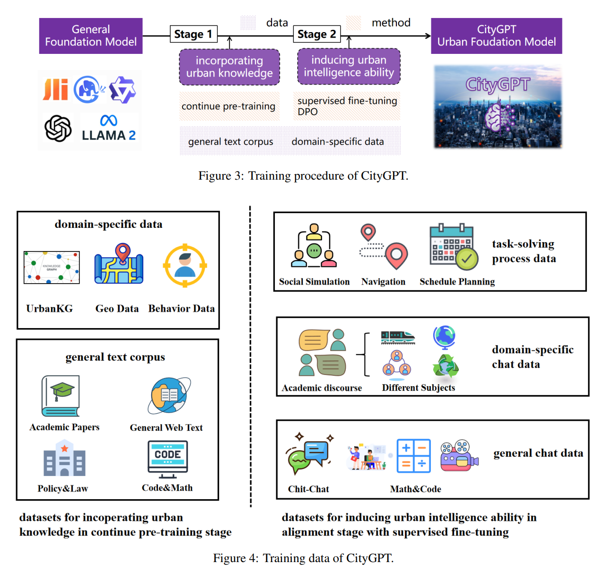
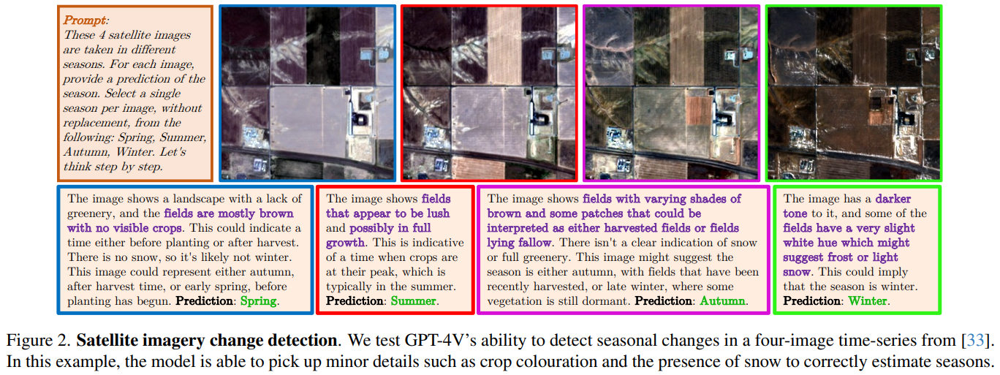
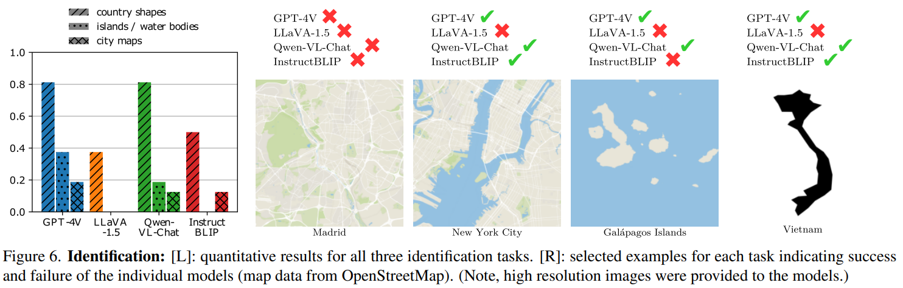

# GeoLLM
## LLM Basics
## [GeoLLM: Extracting Geospatial Knowledge from Large Language Models](https://openreview.net/pdf?id=TqL2xBwXP3)

+ 任务类型：空间预测任务，如对人口密度和经济活力的预测
+ GeoLLM: a novel method that can effectively extract geospatial knowledge from LLMs with auxiliary map data from OpenStreetMap
+ project website: https://rohinmanvi.github.io/GeoLLM

### Introduction

使用机器学习的空间预测已广泛开展，但有限的时空数据覆盖率、制备的高成本和数据的可获取性壁垒通常是此类研究所面临的问题。虽然诸如使用开放的全球遥感影像集进行贫困、人口、基础设施等研究也有所开展，但此类模型的预测能力通常有限，因为某些重要的特征可能在空间中并不是可见的。

LLMs已被证实是一类高效的基础模型，可以通过fine-tuned或prompted在诸如健康、教育、法律、金融和科研等领域进行应用，其原因在于LLMs已经对其训练用到的来自互联网的billions甚至trillions级别的数据token对应的corpus中的知识进行了压缩。本文即探索了大语言模型是否有空间知识，以及将这些知识提取生成一系列增强各类空间机器学习任务的变量的方法。

通过检索地址，LLM有一定的空间描述能力，但从中提取知识不是trivial的。直接输入坐标和任务描述的结果较差，其挑战在于LLM理解数字坐标和将其与现实世界关联的能力。本文方法是使用由OSM数据构造的提示词来向LLM提供足够的空间上下文信息，从而提升LLM提取空间知识的能力。提供邻域信息的此方法极大地由于只提供坐标的任务效果。

main contribution:
+ 语言模型拥有大量的地理空间知识，本文方法能够在一系列模型和任务中解锁这些知识。
+ 构建正确的提示是提取地理空间知识的关键。通过消融实验发现，从地图数据构建的提示使模型能够更高效地访问它们的知识。

### Related Work

+ identifying knowledge: 从语言模型中量化知识。 With the recent introduction of instruction-finetuned LLMs, directly querying knowledge with prompts is a potentially simpler method. 本文展示了从预训练的模型中对空间知识的量化过程。
+ knowledge extraction: 通过fine-tuning或prompt tuning技术从语言模型中改进知识提取。但是prompt通常难以制备且对微小改动较为敏感，fine-tuning与其相比通常可以获得更加的性能表现，且LoRA可以减少fine-tuning的计算成本，本文使用fine-tuning方法提取知识。
+ NLP for Geospatial Tasks: 此前相关研究，如GeoGPT仅使用自然语言的指令，自主地进行地理空间数据收集、处理和分析，K2地理科学LLM完成问答、摘要、文本分类等常见的NLP任务。本文深入研究了从LLMs中提取地理空间知识的可能性，以及是否可以将其用于预测人口密度等各种现实世界的地理空间任务。通过微调各种LLMs，本文展示了LLMs中包含的地理空间知识的数量、质量和可扩展性。

### Method

+ Minimum viravle geospatial prompt: basic提示词由地理坐标和任务描述组成，任务描述由任务名称和指示可能的label的描述组成。视作分类任务处理（0.0-9.9，100类）
+ Prompt with map data: 向提示词中添加额外的信息有：地址描述（详细的反地理编码描述，从街区等级到国家等级对地址的描述），邻域地点（100千米内的最近邻10个点的列表，每个点的信息包括点名称、距离和方向）。使用Nominatim进行反地理编码，使用Overpass API进行邻近地点信息的获取
+ Fine-tuning and inference with language models: RoBERTa(encoder-only transformer model, 125M), Llama 2(decoder-only transformer model, 7B), gpt-2(decoder-only transformer model, 124M), GPT-3.5-TURBO-0613( decoder-only transformer model, 175B)

### Experiments

+ 任务和数据源：人口密度（WorldPop），家庭级别的住房情况、教育情况等（DHS(Demographic and Health Surveys)），美国人口和经济数据（UCSB, ACS），住房指数（Zillow）。训练集使用100，1000，10000三个大小的样本点，验证集和测试集使用2000个样本点。
+ baselines: 
  + k-NN（这里使用了5-最近邻）
  + XGBoost（变量有提示词中的经纬度，距离和角度）
  + XGBoost-FT(组合XGBoost和fastText，使用提示词中的所有信息)
  + MLPBERT（经纬度，距离和角度以及由BERT编码得到的sentence嵌入）
  + Nightlight（16km*16km重采样，使用ResNet）

### Performance on tasks

### Ablations on the prompt

### Discussion

+ GeoLLM的性能表现超过了已有研究
+ LLM固有的不足（通常只是分类而不是回归）
+ LLM可训练的参数相比于参数总量来说很少，地理知识可能蕴含在LLM的冻结参数中，模型效果随LLM训练的大小的提升而提升
+ One could potentially use our method to better understand the biases of LLMs that they inherit from their training corpora. 这种偏差在本研究中已初见端倪
+ 本研究可视作未来LLM空间任务的基础研究，可以添加额外的空间信息维度（如道路名、时序信息等）对本方法进行拓展

### Conclusion

prompt后模型表现佳：Our simple method revealed that LLMs are sample-efficient, rich in geospatial information, and robust across the globe. Crucially, GeoLLM shows promise in substantially mitigating the limitations of traditional geospatial covariates.

## [GeoLLM-Engine: A Realistic Environment for Building Geospatial Copilots](https://arxiv.org/pdf/2404.15500)

Geospatial Copilots解锁了通过自然语言指令在地球观察应用层面史无前例的潜力，然而现有的agents大多依赖于过于简化的任务和基于模板的提示词，这使其与真实世界的应用场景大多脱节。本文团队提出了GeoLLM-Engine，一个执行遥感平台常规复杂任务的tool-augemented agents环境。通过空间API工具、动态地图/UI和外部多模态知识库丰富了这一环境，借助GPT-4节点，覆盖了超过50万多工具任务和1.1M景遥感影像。使用多种state-of-the-art的agents和prompting技术，以应对long-horizon prompts，且超越传统的单任务image-caption范式。

### Introduction

LLM已彰显了增强地球观测流程的潜力，但现有的方法大多只考虑低层次的基于模板的提示词，仅能捕获预测的图像-标题对的表面文本形式（texture surface form），在高层次的自然语言中的功能性代理正确性（functional agent correctness）则通常被忽略。这种高层次的理解在地理空间领域很重要，因为地理空间领域包含了时空维度的各种复杂的多模态数据。

In this work, our key insight is that amidst the abundance of “geospatial benchmarking”
works, a subtle refocus is necessary, prioritizing the construction of a robust engine as the foundation for benchmark creation, rather than the benchmarks themselves.

现实环境描述：集成各类API和动态地图网页UI，引入model-correctness检查器使后端引擎确认生成的benchmark的正确性。By reducing the necessity for human intervention, we can massively parallelize our benchmark suite across 100 GPT-4-Turbo nodes to create large-scale benchmarks.

### GeoLLM-Engine Environment

前端环境、工具集、后端引擎、environment formulation、user intent formulation

user intent=$\{q, T, r, S\}$被封装为四个部分：
+ the question $q$ that triggers the agent
+ the executed tool sequence $T=\{t_1, t_2, ..., t_n\}$，$t_i = \{tool_i, args_i\}$
+ the agent’s textual response $r$ to the user
+ the concluding environment state $S$

通过与标准流程比较，就可以确认上述生成步骤的功能上的正确性。

### GeoLLM-Engine Benchmark Suite

intern collection --> tool templates --> gpt-driven benchmark creation --> model-checker formulation --> agent evaluation metrics

### Remote Sensing Datasets

使用了包括目标检测、土地利用分类和视觉问答等多种任务场景的1149612景遥感影像

### Results

(Chammeleon、CoT、ReAct都是指导智能体通过以下方式隐式构建工具链的技术)

### Related Work

列举了若干强化学习的网页交互应用。

### Limitations and Future Work

+ GPT-4既生成ground-truth也参与评估，使用混合策略可能会更好
+ 涉及的复杂任务强调深度而非广度，可以拓展任务场景
+ 使用的智能体是 finetuning-free agents，可以对tool-agent进行训练
+ 没有对模型cost优化，可以使用诸如LLM编译器、动态工具和token压缩技术提升效率

### Conclusion
+ In this work, we introduce GeoLLM-Engine, a novel environment for evaluating geospatial Copilots, designed to bridge the gap between simplistic benchmarks and the complex demands of Earth Observation (EO) applications.
+ By leveraging a rich array of geospatial API tools, dynamic interfaces, and a massive parallel processing framework over 100 GPT-4-Turbo nodes, our environment facilitates the execution of over half a million multifaceted tasks across 1.1 million satellite images
+ This advancement not only highlights the limitations of existing benchmarks but also sets a new standard for the development and evaluation of AI agents in the geospatial domain.
+ Looking forward, GeoLLM-Engine paves the way for future research to explore sophisticated EO tasks, promising significant strides toward realizing the full potential of geospatial Copilots.

## [UrbanKGent: A Unified Large Language Model Agent Framework for Urban Knowledge Graph Construction](https://arxiv.org/pdf/2402.06861)

城市知识图构建，提取蕴含在城市空间实体的复杂空间关系和语义关系为异质图。

[网站](https://htmlpreview.github.io/?https://raw.githubusercontent.com/usail-hkust/UrbanKGent/main/UrbanKGent%20Demo/index.html)

## [URBAN GENERATIVE INTELLIGENCE (UGI): A FOUNDATIONAL PLATFORM FOR AGENTS IN EMBODIED CITY ENVIRONMENT](https://arxiv.org/pdf/2312.11813)

## [Charting New Territories: Exploring the Geographic and Geospatial Capabilities of Multimodal LLMs](https://arxiv.org/pdf/2311.14656)

本文评估了多个多模态大模型在各类地理任务的能力。

Notable multimodal large language models (MLLMs) include PaLM-E , Flamingo, LLaVA-1.5, InstructBLIP, IDEFICS, Qwen, Kosmos-2, and recently, GPT-4V.

任务类型：
1. localization
  
  
2. 遥感影像类
   + zero-shot遥感影像分类
  
   + 变化检测
  
   + 分割（网格分割/Svg分割）
  
   + 目标检测
  
   + 小物件计数
  
3. 地图
   + 区域识别：从轮廓线推测区划名称|从地图中推测城市名称|从地图中推测岛屿和水体名称
  
   + 定位：map→real world
  
   + 定位：real world→map
  
4. 旗帜识别
  
5. 失败案例
  + routing/navigation using maps
  
  + drawing and improving country outlines
  
  + annotating missing labels on travel maps
  
  + estimating population growth from satellite time series
  
  + determining the elevation profile of mountains.
  

We demonstrate the strong capabilities of MLLMs to detect fine-grained details from imagery and perform nuanced reasoning, with potential applications in environmental research and disaster response. On the other hand, we highlight numerous cases where the current models are severely lacking, especially in map interpretation. Our analysis suggests there are geographical biases in thedata, with weaker performance consistently shown for regions such as Africa that were perhaps less represented inthe training distribution.
