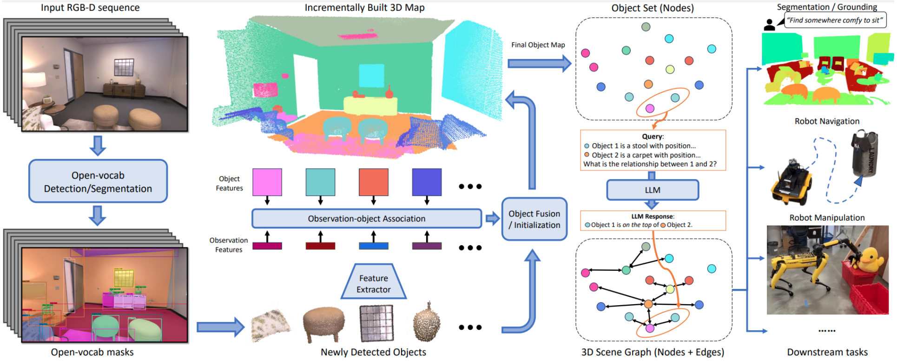
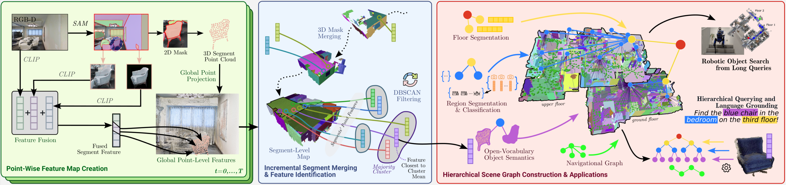
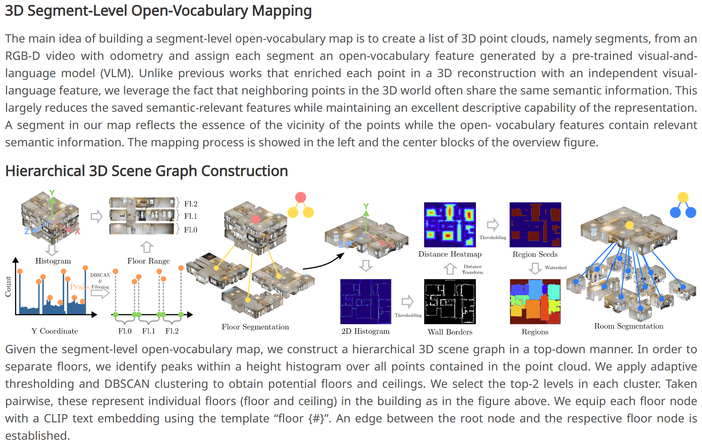
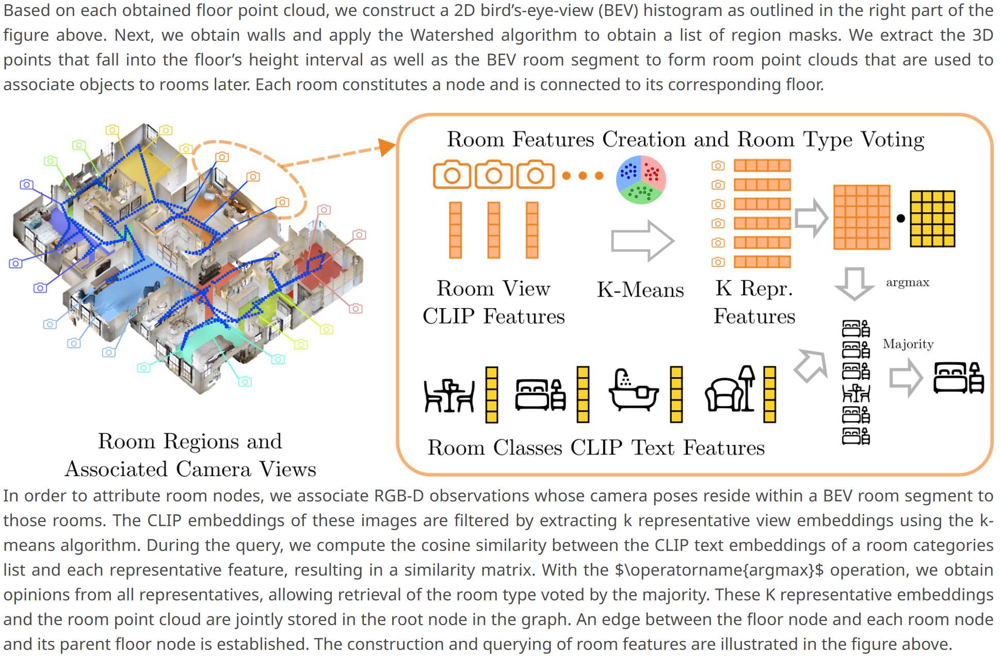
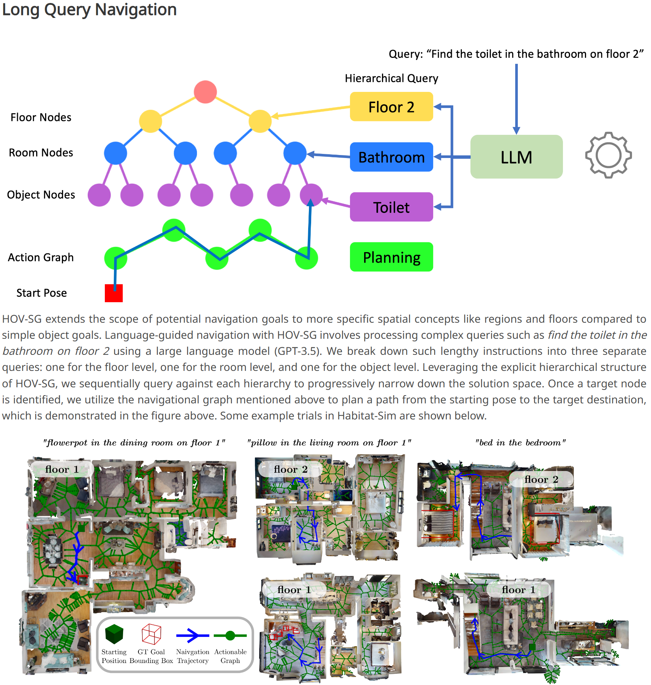

# 3D SGG
## [ConceptGraphs: Open-Vocabulary 3D Scene Graphs for Perception and Planning](https://concept-graphs.github.io/)

1. input data: **a sequence of posed RGB-D images**. 
2. use generic instance segmentation models to segment regions from RGB images
3. extract semantic feature vectors for each
4. project them to a 3D point cloud
5. associate regions and fuse regions from multiple views, and get a set of 3D objects and associated vision (and language) descriptors
6. use large vision and language models to caption each mapped 3D objects and derive inter-object relations
7. use generated the edges to connect the set of objects and form a graph

The resulting 3D scene graph provides a structured and comprehensive understanding of the scene and can further be easily translated to a text description, useful for LLM-based task planning.

## [Hierarchical Open-Vocabulary 3D Scene Graphs for Language-Grounded Robot Navigation](https://hovsg.github.io/)

