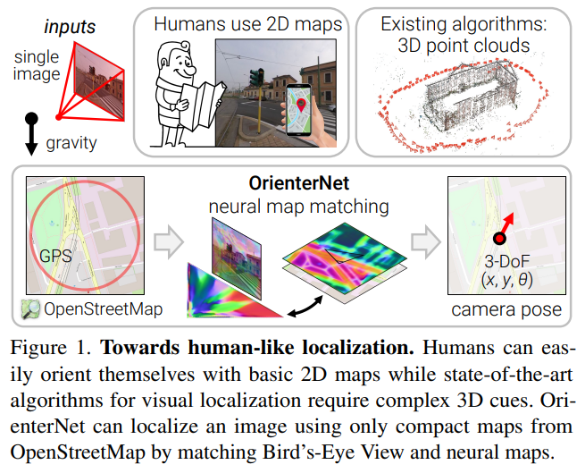
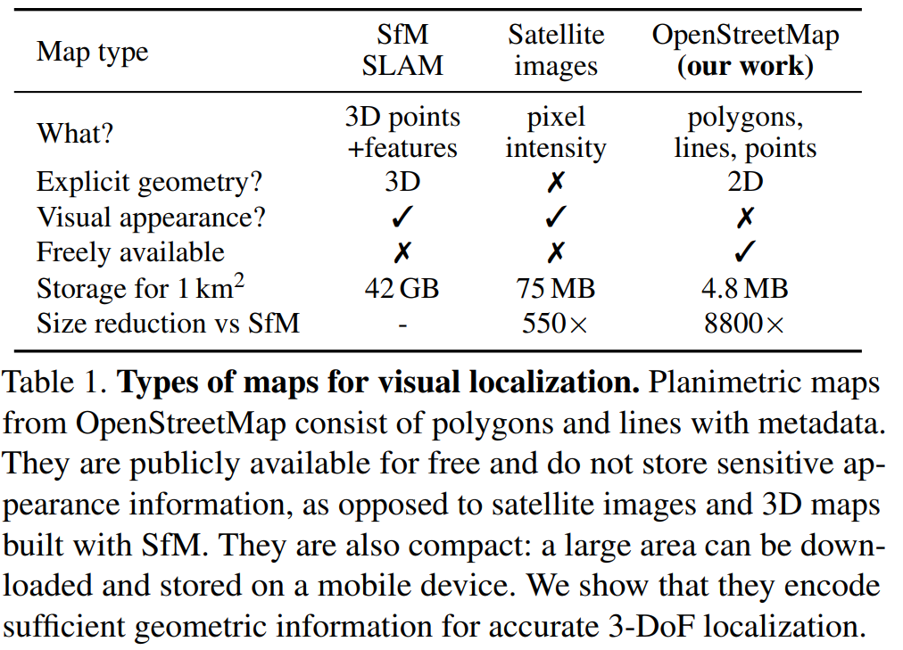
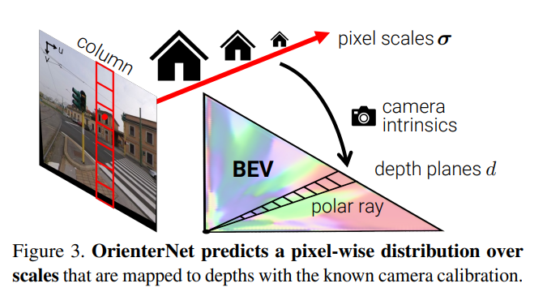
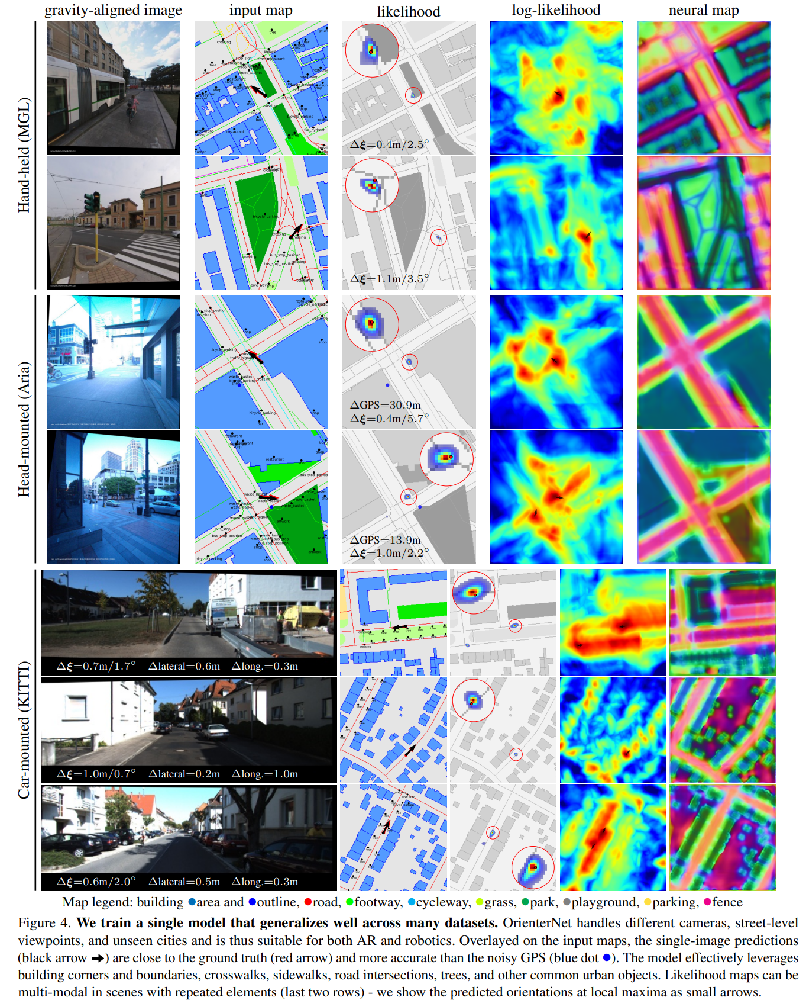
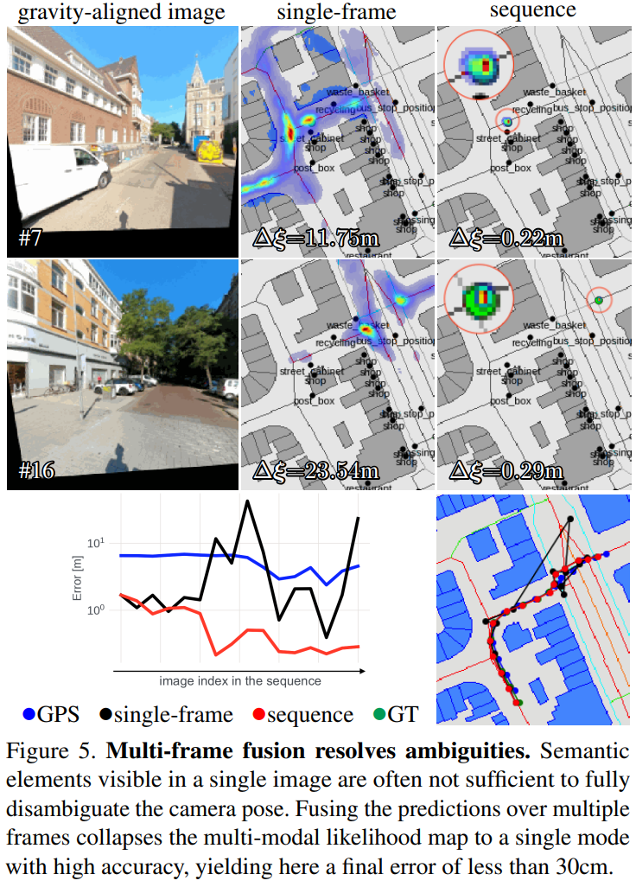
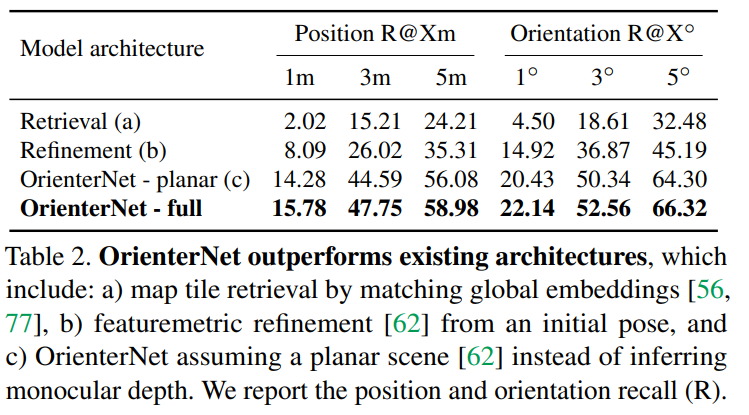
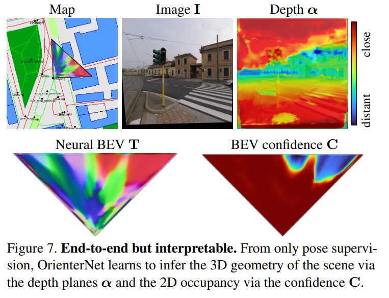
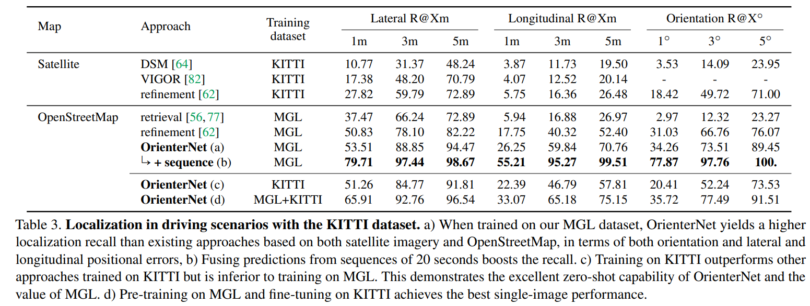
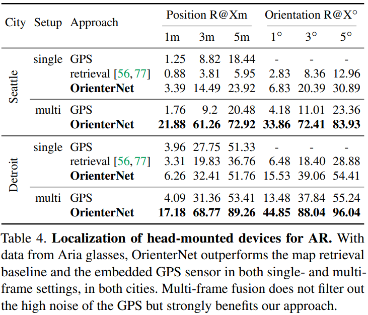
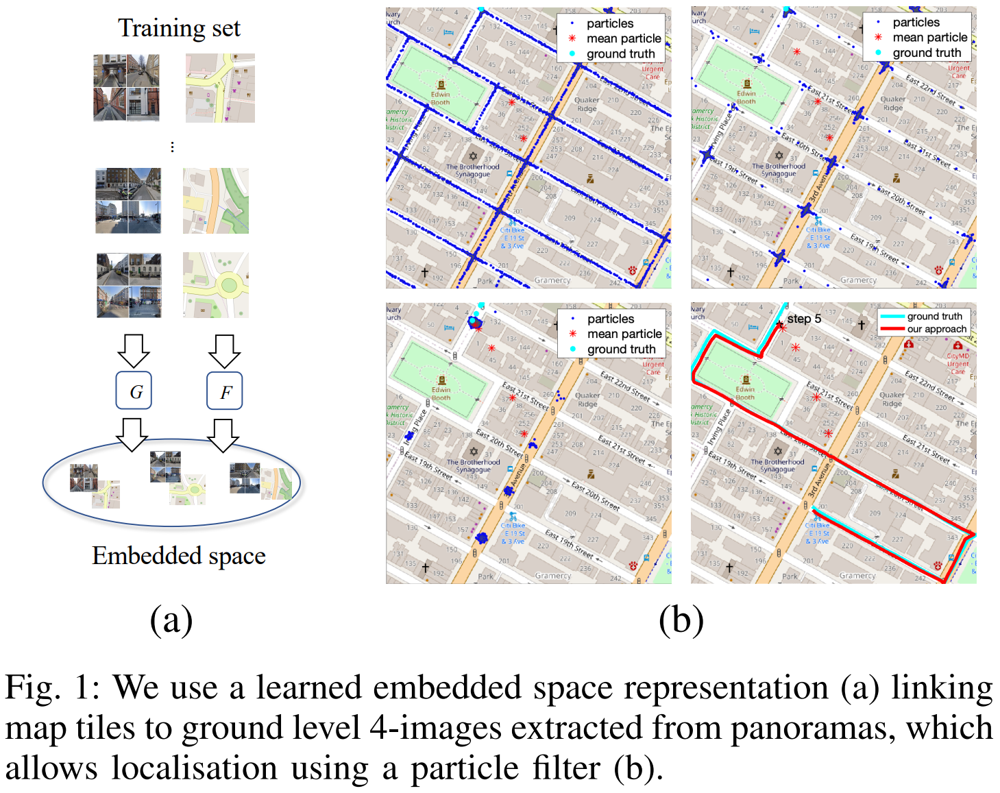

# localization
## [OpenStreetMap-based LiDAR Global Localizationin Urban Environment without a Prior LiDAR Map](https://arxiv.org/pdf/2202.07516)

【略，雷达点云数据比较专业】

## [OrienterNet: Visual Localization in 2D Public Maps with Neural Matching](https://openaccess.thecvf.com/content/CVPR2023/supplemental/Sarlin_OrienterNet_Visual_Localization_CVPR_2023_supplemental.pdf)

人类可以在3D环境中使用2D地图导航，但视觉定位的算法往往依赖于复杂的3D点云数据。本文提出的OrienterNet可以基于人使用的2D地图完成亚米级别的图像定位，检索图像会匹配OSM地图来实现位置和角度定位。影像数据集是12个城市的车、自行车和行人等的多角度图像。代码仓库为： github.com/facebookresearch/OrienterNet。

### Introduction

人类可以本能地理解二维地图和真实三维场景的关系，在位置的环境中人类可以通过比较地图和周围环境的地理要素准确地完成定位。但准确的视觉定位算法通常很复杂，因为其依赖于图像匹配且需要详尽的点云数据和视觉描述。在世界尺度上使用雷达或摄影测量构建三维地图成本高昂，且需要更新数据以捕获其视觉变化。三维地图在存储方面代价也更高，因为其比二维地图的组成巨大的多。这对可执行的on-device定位造成阻碍，且需要成本高昂的云存储设施。因此对于大尺度部署的机器人或增强现实设备空间定位成为瓶颈。人与机器在定位范式之间存在的差异于是引出了本研究的问题：如何使机器像人一样从二维地图中定位？

本文首次提出了给定使用的地图，亚米级精度的定位单张图片或者图片序列的方法。设计的平面地图仅对位置、重要物体的粗糙形状进行了编码，不涉及其外观和高度，从而其极其简洁，与三维地图相比其大小减小了一万倍，因此可以存储在设备中。本文使用OSM地图阐述了这些特性，既不需要成本高昂的三维地图，也不需要潜在收集敏感数据。

具体地说，本文算法估计了三自由度姿态，作为在二维地图中校准图片的位置和朝向。此估计是概率的，可以与GPS的先验知识或多视角多图片融合。结果比消费者级别的GPS传感器精准得多，达到了基于特征匹配的传统方法的准确率级别。

OrienterNet是一个深度神经网络，端到端地学习视觉数据和语义数据的匹配，其速度极快且高度可解释。训练单个模型在其他城市中也效果良好，关键之一是训练使用了Mapillary平台的大尺度的多城市训练数据集。

Our experiments show that OrienterNet substantially outperforms previous works on localization in driving scenariosand vastly improves its accuracy in AR use cases when applied to data recorded by Aria glasses. We believe that ourapproach constitutes a significant step towards continuous, large scale, on-device localization for AR and robotics.

### Related work

精准定位的三种数据源：

+ Mapping with ground-level images：目前最常见，地点图像识别提供粗定位，精确定位需要六自由度姿态，而其特征匹配需要三维地图。这种地图通常由稀疏点云组成，检索图像的姿态由对应地图的几何解决器（geometric solver）估计。一些工作加入了额外的传感器输入，如GPS粗定位、重力方向和相机高度。得益于这些特征，近期的定位系统已取得了很好的精度和稳定性。然而这个过程包含着大量的有高维视觉信息描述的3D点云，在将私人数据透漏入地图中也会存在较高风险。为了减轻此问题，一些工作致力于压缩地图，或在场景外观或几何中进行privacy-preserving的表达。但这样会显著地降低精度，且无法轻易回复精度。
+ Localization with overhead imagery：假设世界mostly planar，重力方向由传感器获得，问题则简化为三自由度姿态估计。此类工作的主题是多视角的地面至卫星定位。虽然其比三维地图更简洁，但其获取成本较高，通常不免费，高分辨率的影像存储仍是问题。大多数工作仅仅只能通过图像查询估计粗位置。估计方向角则不准确，因此会产生数米的误差。其他工作则依赖于直接提供三维信息的传感器，如从雷达中得到的2为稠密地图。其在二维地图和传感器视角进行模板匹配，在精度和稳定性方便均可得到保障，但这类方法需要昂贵的特定传感器，这对于消费者级别的AR应用是不适合的。本文工作则展示了单角度视觉先验替代此类传感器的模板匹配的能力。
+ Planimetric maps：仅保留了地图元素的二维位置、形状和类型，不包含任何的外观或高度信息。SOM是一个覆盖全球的地图平台，给定一个区域，其开放的API可以返回一系列地理要素，包含着一千多类的fine-grained语义信息的元数据。以往的工作设计了单一或者几个类别的检测器，包含建筑轮廓、道路线、交叉口、道路标识、街道组成甚至文本等。近期的工作通过端到端的深度网络从地图瓦片中计算更丰富的表达，他们只描述了粗位置，因为其从全球影像描述中检索地图瓦片，其需要高度和视觉表达，而这在户外空间中并不能方便获取。本文工作则在精度和稳定性方面取得了巨大进步，通过组合投影几何的约束和端到端学习到的OSM所有语义类别的表现力。

### Localizing single images in 2D maps

problem formulation:

三姿态问题：$\xi=(x,y,\theta)$，输入$I,\xi_{prior}$，$I$是被校正过的影像，$\xi_{prior}$包括消费者级别的粗定位（误差可以在20米量级）和从OSM检索的区域地图（一系列点线面以及类别的语义信息）。OrientNet包含以下三个模块：

+ The image-CNN extracts semantic features from the image and lifts them to an orthographic Bird’s-Eye View(BEV) representation $T$ by inferring the 3D structure of the scene.
+ The OSM map is encoded by the map-CNN into a neural map $T$ that embeds semantic and geometric information. 
+ We estimate a probability distribution over camera poses $\xi$ by exhaustively matching the BEV against the map.

具体而言：
+ Neural Bird’s-Eye View inference: 图像特征至极坐标空间（map each column to a ray），再变换到笛卡尔网格中，得到特征$T$和置信度$C$。
+ Neural map encoding：对三类地图数据进行栅格化，然后编码为neural map$F$
+ Pose estimation by template matching
$$
P(\xi)=softmax(M+\Omega)\\
M(\xi)=\frac{1}{UZ}\sum_{p\in(U\times Z)}{F(\xi(p))^T(T)(T\odot C)(p)}\\
\xi^*=\argmax_{\xi}P(\xi|I,map,\xi_{prior})
$$

$P$是概率$W\times H\times K$, $K$是常见的旋转角采样数量；$M$是图像-地图匹配得分，最后使用最大的$P$

### Sequence and multi-camera localization

通过多帧影像联合定位，视角$i$的姿态$\xi_i$未知，从$j$到$i$的相对姿态$\hat\xi_{ij}$已知，则对任意视角$i$，有：

$$
P(\xi_{i}|{I_j},map)=\Pi_{k}P(\xi_i\oplus\hat\xi_{ij}|{I_j},map)
$$

### Training a single strong model

+ Supercision: BP网络+对数最大似然损失+三线性插值
+ Training dataset: 论文团队生产，Mapillary Geo-Localization (MGL) dataset, 760k images
+ Implementation: $\Phi_{image}$ and $\Phi_{map}$ are U-Nets with ResNet-101 and VGG-16 encoders. $\Phi_BEV$ has 4 residual blocks. We use $S=32$ scale bins, $K=512$ rotations. The BEV has size $L\times D=32×32$ m with resolution $\Delta=50$ cm. For training, we render maps W×H=128×128 m centered around points randomly sampled within 32 m of the GT pose. Localizing in such map takes 94ms on an NVIDIA RTX 2080 GPU.

### Experiments

### Conclusion

limitations：如果环境中缺乏独特的元素或地图中缺乏某些要素，则本方法应用会受限，OSM中也可能在空间上不准确。

conclusion：
+ OrienterNet是第一个亚米级精度的将图像和地图融合的深度神经网络
+ 使用2D地图extremely compact，可以用于在环境中定位
+ OSM免费且全球适用
+ contribute了一个数据集
+ state-of-the-art 3-DoF 定位
+ 对AR设备和最小化能耗的机器人在无需costly cloud infrastructure的情况下的定位提供了极大的便利

## [OpenStreetSLAM: Global Vehicle Localization Using OpenStreetMaps](https://www.vision.rwth-aachen.de/media/papers/florosicra13.pdf)

## [Efficient Localisation Using Images and OpenStreetMaps](http://www.ipb.uni-bonn.de/pdfs/zhou2021iros.pdf)

定位是机器人导航的关键，本文描述了一种基于视觉的定位方法，该方法组合了sequential Monte Carlo Tracking和地面街景图片-2D地图制图匹配机制。

+ Introduction: 自动定位和姿态跟踪是移动机器人的基础能力。基于视觉的传感器的方法在自动驾驶领域已有出现。此类方法中的大多数是将在线图片与街景图片或点或三维重建或遥感影像相匹配。然而基于图像或三位重建的方法有两个缺陷：升尺度存在问题；这些图像或重建只是a single snapshot，无法应对建成环境的变化。基于地图的语义表达more invariant，且scalable
+ Related Work
+ Methodology:  Embedding Images and Maps + Monte Carlo Localisation + Map Generation + Observation model
+ ...

