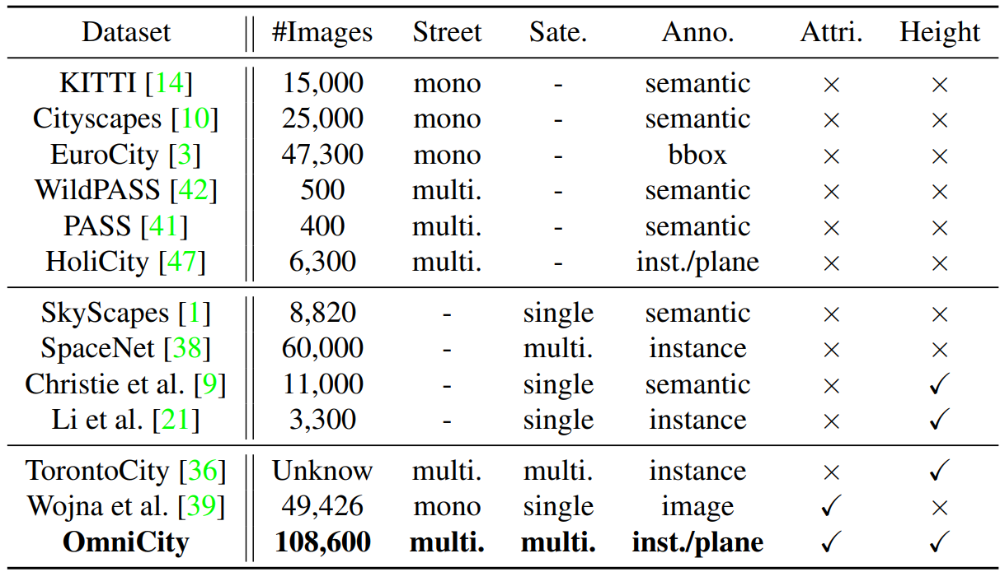

# Geo Computer Vision
## [OmniCity: Omnipotent City Understanding with Multi-level and Multi-view Images](https://liweijia.github.io/assets/pdf/CVPR2023_OmniCity_camera_ready.pdf)

本文提出了OmniCity数据集，可以从多层级-多视角的影像中提供对城市的全能理解。本数据集包含多视角的遥感影像和街道级的全景图像，影像来自纽约市超过25K个地理点，共包含超过100K景pixel-wise annotated影像。并提出了一个利用现有的遥感影像标注地图和不同视角变换关系的高效的街景图象注记pipeline。基于本数据集，提供了包括建筑轮廓提取、高度估计、建筑平面分割等在内的一系列任务的benchmark。并对跨视角图像匹配、合成、分割和目标检测，以及开发大尺度城市理解、重建、模拟等新方法提出了问题陈述。

+ Introduction：对上述摘要的重新表述。
+ Related work：已有的一些街景数据集和遥感影像数据集(e.g. PLUTO)

+ Datasets: 数据集的收集、注记和数据集统计信息描述
+ Benchmark results: 基于本数据集的各类任务benchmark，影像集任务包括建筑分割和高度估计（三视角），街道级任务包括2-instance（全景）/3-instance分割（单视角）。

+ Potential of the OmniCity dataset： 可作为各类任务的全新数据集；提出了新的应用场景（宏观线检测、城市轮廓分析等）；3D城市重建和模拟（每张全景影像都可以视作一个完整3D模型的特定视角表达）；3D建筑的重建（with the well-aligned satellite and street-level images as well as the various annotations）,3D建筑的重建需要街景影像的参与
+ Conclusion：We believe that OmniCity will not only promote new algorithms and application scenarios for existing tasks, but facilitate novel tasks for 3D city reconstruction and simulation. 更多：更多建筑信息的监测、检测更多地理对象、拓展应用到更多国家的更多城市，可以基于本数据集从多视角图像中开展有关目标检测、实例分割和3D重建的研究。

## [BlockPlanner: City Block Generation with Vectorized Graph Representation](https://openaccess.thecvf.com/content/ICCV2021/papers/Xu_BlockPlanner_City_Block_Generation_With_Vectorized_Graph_Representation_ICCV_2021_paper.pdf)

城市建模是城市规划、导航和相关游戏的基础，本文提出了BlockPlanner这样一种合成有土地利用属性的城市地块模型的模型（3D几何模型+土地利用的语义信息）

### Introduction

城市建模在很多领域都有需求，传统方法受启发式规则制约难以反映真实动态的街区结构。室内楼层规划生成是类似的任务，基于栅格图像的方法在此领域已经获得巨大成功，但难以直接应用到矢量街区生成中：简单的掩膜处理会造成街区块结构的缺失；栅格类方法受限于其分辨率，过大会造成小lot的缺失，过小则会极大地影响计算性能；街区数据存在着天然的拓扑约束和属性约束；对于栅格类方法，实例关系的建立将变得困难。

本文方法：

+ 构建了一个统一的环形拓扑结构，作为街区（block）内各种地块（land lot）的backbone，并构建了双层图（2-tier graph）来表示街区个体。
+ 整体街区作为一个父节点，每个地块作为子节点表示，与一组几何参数和几何属性以及土地使用语义相关联。其邻接关系通过边矩阵反映。
+ 这样的表示方式捕捉了街区的整体结构以及其地块之间的局部关系。
+ 本模型按照变分自编码器（VAE）的方案构建的。设计了一系列损失函数，以惩罚各种几何违规行为，确保有效的拓扑结构。
+ 构建数据集：NYC-Block

### Related Work

+ City Modeling and Urban Representation: 过程化城市布局生成（路网/3d建筑模型）建模已有开展，建筑的几何信息与语义信息都重要
+ Generative Models for Structured Layout: 布局有全局的拓扑约束以及局部的形状一致性约束，基于图结构的生成模型用于3D形状生成研究已有开展。

### NYC-Block Dataset

纽约街区建筑数据集：覆盖了纽约的5个区，包含城市和郊区区域；层次化结构：每个地块都与其街区、区和大区相关联；注记丰富：有93个字段，有使用功能、建筑年限等多种属性，属性来源与你约束规划局；易于泛用，可以与其他数据集关联，因为带有地理位置信息。

### Block Planner

+ City Block Representation
  + canonical view: 地理空间坐标变换至相对空间坐标，长边方向作为heading direction，高度也根据街区内建筑的高度进行正则化，几何坐标缩放至[-1, 1]，高度信息则缩放至[0, 1]
  + 全局结构的拓扑环: 按照统一的规则建立拓扑环，边界可达性参数$s_b=\{0,1,2,3\}$，融合参数$s_m=\{0,1\}$
  + 街区-地块的图表达: 使用两层图进行城市街区的表达：$G=\{V,E\},V=\{B,\{L_i\}\}$，$B$是城市街区，$L_i$是街区内地块，其有几何属性$g=\{x_c,y_c,w,h,n\}$，分别代表2DBox的质心坐标和3DBox的长宽高和土地利用语义属性$s_l$，边集表征地块间的邻接关系。
+ Generate City Blocks with Graph VAE: GNN+VAE(variational autoencoder)
  + Encoder: 特征包括位置特征、土地利用属性特征和环内位置的独热编码，每次卷积后有额外的街区最大值池化步骤
  + Decoder: 最后的预测输出包括$g,s_l,s_b,s_m,p$，$p$指示了边的存在性
+ Loss Function Design:
  + 位置重构损失: $L_r=\sum_i ||L_i-\hat(L_i)||_1+||r_y-\hat{r_y}||_1$
  + 存在性损失：$L_x=L_{lot}+L_{edge}+M_e||E-\hat{E}||_1$
  + 土地利用交叉熵损失$L_s$
  + 几何合理性损失：$L_g=L_{adj}+L_{bound}+L_{merge}$
  + VAE变分正则化损失$L_v$
  + 最终的损失是上述几类损失的加权和

### Experiments

与其他方法的对比：

消融实验：

### Applications

+ 拓扑优化
+ 足迹生成
+ 迁移应用（Manhattan to Brooklyn）
+ 室内场景拓展

### Conclusion

With such merits, BlockPlanner opens a new direction for large-scale city modeling in an end-to-end manner.

## [GeoLocator: a location-integrated large multimodal model for inferring geo-privacy.](https://arxiv.org/pdf/2311.13018)

样本量太少。。。

## [CityNav: Language-Goal Aerial Navigation Dataset with Geographic Information](https://arxiv.org/pdf/2406.14240)

视觉语言导航（Visual-and-language navigation）旨在集成视觉和语言线索对真实世界环境的智能体进行自动化的引导。尽管在地面导航领域交互式的模态集成已经取得了大量进展，但是在空域导航还有待探索。这主要是由于真实世界城市尺度的空域导航研究的数据稀少。因此本文介绍了CityNav这一语言导向的新的数据集，本数据集使用三维点云表达真实世界中的城市。CityNav数据集包含32637对与人类轨迹相关的语言描述，这些轨迹数据由三维生产器生成，每个描述包含导航目标，真实世界城市中的地标的名称和区位信息。本文还提供了描述对应的地标的二维空间地图的导航智能体作为基线模型，并对最新的空域导航模型及本文作者提出的模型进行了benchmark。结果表示：本文模型效果最好，揭示了人类驱动的导航策略的重要性；集成二维地图显著地增强了城市尺度导航的性能。

数据集和代码仓库：https://water-cookie.github.io/city-nav-proj/
