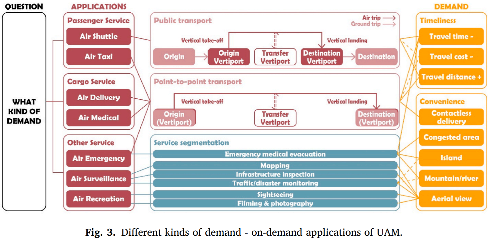
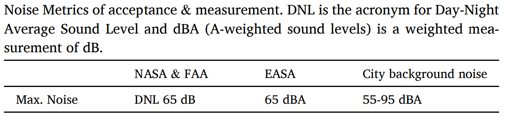
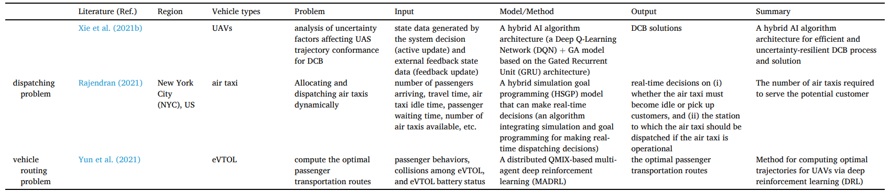

# Urban Air Mobility
## NASA concept vehicles and the engineering of advancedair mobility aircraft, 2022
## A Proposed Taxonomy for Advanced Air Mobility, 2022
## Advanced Air Mobility and Evolution of Mobile Networks, 2023
## Designing airspace for urban air mobility: A review of concepts and approaches, 2021

### abstract

本文对学界及业界的空域设计和管理进行了文献综述。本文分析了各个与空域相关的概念，比较了其优缺点，指出了研究差距，提供了对设计空域的一种更加整体的方法的建议。首先，本文定义了诸如大小、容量、几何等与空域相关的结构性因素，这些因素被组织成四大类：安全因素、社会因素、系统性因素和航空器因素；其次，本文综述了世界范围内的城市空域概念；再次，本文按照结构性因素对空域概念进行了评价，大多数的空域概念是理想的抽象网络，强调最大化安全性和容量，忽略技术复杂度、噪音和隐私。空域的机构性直接影响了其安全性、效率和容量的级别。在结构性更弱的空域中飞行器有更高的自由度，其可以自由地选择位置、高度、朝向和速度，从而增加空域容量，减小飞行成本。然而此类概念通常要求高的技术能力，如动态地理围栏和先进的感知避障能力，从而达到所需的安全级别。有更少自由度的空域容纳更少的飞行器，但是需要更加严格的管控规则以保证安全。最后，这些提出的空域概念需要广泛的地面基础设施，如起降站、通讯、导航、监测基础设施等。以城市规划的视角来看，分析城市空中交通的研究有必要成为新的分支，包含分区、空域权力、房地产开发、公共交通、公众接受度、可达性的不平等性等。

### introduction

随着自动化、电能存储等的发展，城市空中交通的想法已经再城市航空领域迸发。UAM的概念由一系列的规则、进程和技术组成，其概念促使在城市环境中的客运和货运等空中操作得以进行。UAM是NASA FAA提出的先进空中交通的一部分（AAM），也是使用电动空中机动车进行空中客运/货运行业的一部分。世界范围内的公司都在与主流的航空器提供者合作，创造城市航空器的原型，证明城市飞行的技术。这种推动对城市和政府机构创造适用于城市空域的规则带来压力，考虑到不同的空中飞行器设计、可操作性、速度、起降程序、自动化程度、监测和通讯技术制定规则并不是一个容易的任务。这些差别使飞行器安全有效地使用空域变得困难，亟需标准化的飞行规则和程序集。

今天，无人机在重建、交通监测、灾害监测、火情监测、基础设施检查、制图、森林和农业等领域已被广泛使用。这些操作虽然数量很多但是通常只在有限的地理空间区域内进行，不会对民航系统造成大的风险。然而，设想的城市、郊区、远郊区空中交通的确可能会对民航系统带来显著的影响。

设想的操作将最可能是电力有人和无人机动车的垂直起降。与传统的直升飞机不同，新的空中机动车使用多种发动机
推进器、电动引擎和更轻的材料，这些可以使其更便宜、更安静、更高效。这些操作预期会覆盖城乡地区。这些操作将会为相同的有限空间竞争，这将推动行业采用更小的分离标准。因此，多个机构都在发展管理城市空域和确保安全的框架。

本文意在分析管理空域的前沿性提案，找出其共性，指出空域设计的最佳实践。本文需要识别和分析决定城市空域物理性结构的结构性因素。通过城市的物理性结构，我们就可以考虑空域元素的位置和大小，如飞行轨迹、管道、廊道、飞行层和与其相关的操作规则。

### the need for urban airspace

当前空中交通管理对城市空域的能力不足是发展城市空中交通的主要阻碍，多个挑战阻碍了当前NAS活动和城市活动的集成：更多的活动量；更大的活动密度；更低的活动高度和多种飞行器的不同性能。这些挑战延伸了目前空域交通控制系统的能力，指示着在当前系统中进行重要变化的需求。

国际民航组织将空域划分为ABCDEFG七类，前五类为管制区域，后两类为非管制区域，空域划分综合飞行服务的类型、速度和高度限制、雷达通讯需求和空中交通管制许可等划定。

ATC如果也管理非控制区域，那么将需要NAS所有方面的剧烈调整，这是一个长期且成本巨大的过程。→ It is more likely that UAM operations will be conducted within a separate, newly created airspace with a new set of rules and standards. 

这样的系统将远比ICAO的七类空域复杂，在密集的城市空域安全地分离空中机动车的难度可以通过小心地空域结构设计来降低，因为他们可以最小化复杂度、增加流量。然而，应该应用哪种空域结构并无定论。一些研究认为管理高交通密度需要预先划设好的路径和区域，也有研究则认为空域应该对全自动飞行器不设限且完全开放。大都数研究从空域应当最大化容量和安全性的角度出发，其认为优化空域设计应该通过最小化损坏（如飞行器与建筑碰撞）和最大化容量和流量实现。但是容量和安全性只是设计功能化的城市空域的多个变量中的两个变量。

### factors that determine the geometry of urban airspace

首先通过考虑不同的因素如何影响空域的物理空间进行阐述。如对安全性因素，显然建筑物本身是禁飞区，如果考虑更多因素，如风场，则禁飞区将会延申，考虑更多因素则禁飞区将会继续拓展。本文使用此逻辑来识别限制移动和影响飞行开放空间的因素。这些因素被分为四类：

1. 安全相关的因素

FAA认为对于城市空中交通的成功被接受而言，安全性因素是对于人、机动车和财产来说都是最重要的因素。可以通过降低风险的方式改善安全性。可以通过通过降低事故的严重程度或降低发生事故的可能性降低风险。在空域，风险不能完全消除，但可以通过避开物体、有湍流的区域和可能危及飞行的天气等减少。

2. 社会因素
3. 与系统特性相关的活动因素
4. 与飞行器特性相关的活动因素

## Demand analysis in urban air mobility: A literature review

+ 不同场景下的需求，包括客运、货运和其他服务
+ 影响市场需求的因素，如时间、距离、安全、隐私、噪音等
+ UAM需求分析的方法：调查/离散选择模型/聚类算法
+ UAM市场需求的循环
+ 与UAM需求分析相关的未来研究点：空域航空服务、潜在的货运应用、公众接受度、基础设施点位、与已有交通系统的集成、新的需求评估模型

### Introduction

+ 从直升机到eVTOL（如Joby Aviation公司），市场的发展
+ 学术界相关的文献也指数增长：如对UAM研究方向的综述/对UAM市场需求、生态系统、市场潜力和挑战的综述
+ 需求分析的结果为系统开发、基础设施建设、规章制度建立和市场优化提供参考和引导，也已有相关综述

### Methodology

+ term： “demand” AND ((“UAM” OR “urban air mobility”) OR (“air taxi” OR “air shuttle” OR “air cargo”) OR (“eVTOL” OR “helicopter”))，直升机目前仍是UAM最常用的。
+ database:  ScienceDirect, IEEE Xplore, AIAA publication database, ASCE Library,  Taylor & Francis Online, and Wiley Online Library, USA/ Europe ATM R&D Seminar (ATM seminar), International Conference on Research in Air Transportation (ICRAT), and SESAR Innovation Days (SIDs)
+ 时间范围：2017-2022

检索结果：74 + 73 + 64 + 3 + 1

### On-demand application in UAM 

+ 客运：air shuttle service, air taxi service，都是点对点的
+ 货运：主要是无人机运输药物等货物
+ 其他：空中紧急情况（紧急医疗疏散），空中监测（制图、基础设施监测、交通监测、灾害监测等）和空中娱乐（观光摄影等）

交通工具由直升机转变为eVOTLs，因其更小的噪音污染、更低的运行成本和更安全的特性。其与UAM的未来集成还面临着基础设施建设、规章制度框架和社会接受度等方面的挑战。

### Factors that affect the demand for UAM 

### Demand estimation for UAM

两大类：
+ survey-based demand estimation，基于调查的定性评估
+ data-based demand estimation，基于数据的定量评估

定性方法（现实性偏好法/叙述性偏好法）：the stated-preference surveys were designed to ask potential travelers which transportation modes they would take under hypothetical situations, while the revealed-preference surveys refer to changes in existing transport characteristics and services.

定量方法可分为长期和短期需求评估。长期需求评估对于识别UAN市场最有潜力的区域而言是重要的初始步骤，也可以对长期市场决策中的策略调整提供参照。长期评估包含了对潜在城市/区域以及基础设施选点的考量，短期评估则需要分析市场需求的时空分布模式以优化UAM效率。评估结果对促进城市空域服务建设和减少UAM成本等都有用处。

#### Preference survey of the market demand for UAM

问卷调查，对区域信息、UAM对象类型、时间信息、问卷数量、调查方法、调查的实施方法（在线问卷/纸笔etc）、量表方式、问卷的主要属性（如支付意愿、使用意愿等）等进行了综述，一般的问卷包含区域类型（发达/发展中）、年龄嗯不、性别比例、家庭类型、教育背景、就业情况、收入情况、住房情况等。

基于调查结果进行离散选择模型的建立，具体可选：

+ multinomial logit model
+ mixed logit model
+ random parameter multinominal logit model
+ ordered logit model

发展中国家的相关调查尚缺乏。

#### Demand estimation for potential city and region

输入变量包括社会经济变量（人口、GDP、经济指标、地面交通拥堵情况）、与服务相关的变量（时间成本、货币成本、距离/目的地和规章）、其他因素还可以考虑城市增长、水体、高科技产业信息、建筑密度等。主要用到的模型有重力模型、Pugh矩阵、OD矩阵、离散选择模型等。

有如下几点结论：

+ 现有研究中用到的参数都不同，目前的研究主要关注人口、人口密度和GDP等变量，忽略了诸如地表交通拥堵情况、管制约束和公共接受度（如噪音、隐私和视觉污染的不良影响）等重要的其他因素。
+ 因此，使用统一的参数集对于潜在城市的发现是有必要的，其对于未来的需求评估也可以充当参考。
+ POI和城市形态等数据也可以使用，深度重力模型、ABM等方法也可以使用。

#### Demand estimation for infrastructure capacity and placement

UAM市场需求分布——>垂直升降机场的容量和地点

+ KMeans算法是优化机场区位的主要方法，然而这样的选址结果可能缺乏可实施性
+ 可以结合土地利用数据进一步优化土地利用的选址
+ 已有的研究中对城市建筑环境的因素考量不够充分
+ 基础设施的选址问题通常是离散选择模型的一部分，因此此类问题的点位通常是固定的，综合系统的决策区位规划仍是待探索的领域。

#### Demand estimation for general market operation

预测消费者的需求。准确的需求预测可以增强系统的效率，减少总出行时长、出行成本以及能量消耗。此方面目前主要的预测关注air taxi services。

#### Demand estimation for operational planning problems 

决策规划，优化目标如最小化拥挤空域中的空车数量，设计最高效的路线等等。大致可以分为调度安排（scheduling）、指派方法（dispatching）和路径规划（routing）三类。

### Demand in UAM life cycle

+ design & construction: UAM由飞行器、基础设施和空域三方面组成，可以基于交通需求对这些布恩进行设计
+ operation & management: feasibility(pre-operation), efficiency(intra-operation), potentiality(post-operation)
+ regulation: these restrictions, including flight purpose, UAV weight, minimum distance from people and buildings, and altitude limit, can be adopted as references for airspace design and operation for UAM based on demand.

### Discussion and conclusion

几个潜在的研究点：

+ Air shuttle services may be more feasible in the short term compared to air taxis, which face limitations in infrastructure construction in high-density urban areas. The on-demand characteristics of air taxis can be combined with the shuttle transit characteristics of air metro services to improve efficiency. 
+ Cargo service is another potential application of UAM, offering advantages such as reduced labor costs and avoiding manned airworthiness certification. However, the potential of UAM cargo service has not been fully explored. Research is needed to investigate the potential applications of unmanned aircraft in cargo service and the advantages and disadvantages of this service compared to traditional cargo transportation modes. 
+ Public acceptance is a critical factor in the market demand for UAM, and more studies are required to investigate this aspect. 
+ UAM infrastructure is a research priority, and challenges include infrastructure placement and airspace design in high-density urban areas with complex urban environments that often coincide with high-demand areas. Research is needed to identify the optimal location and design of these facilities to meet the demand for UAM, taking into account factors such as population density, job density, existing noise, and ground-based transport accessibility. 
+ The integration of UAM with existing transportation modes is crucial for the initial implementation of UAM services. Future research could focus on developing efficient and suitable integrative ways to solve the first and last-mile problem in UAM service. 
+ Data collection is a significant challenge in UAM demand estimation due to the lack of historical data. Future research could focus on developing novel methods, models, or frameworks that can cover parameters such as urban building environment, public acceptance, and regulation, which are not effectively covered by current methods.
+ More research is needed to investigate the potential of machine learning algorithms and agent-based models for UAM demand estimation, as they show great potential in improving the accuracy of demand estimation.
