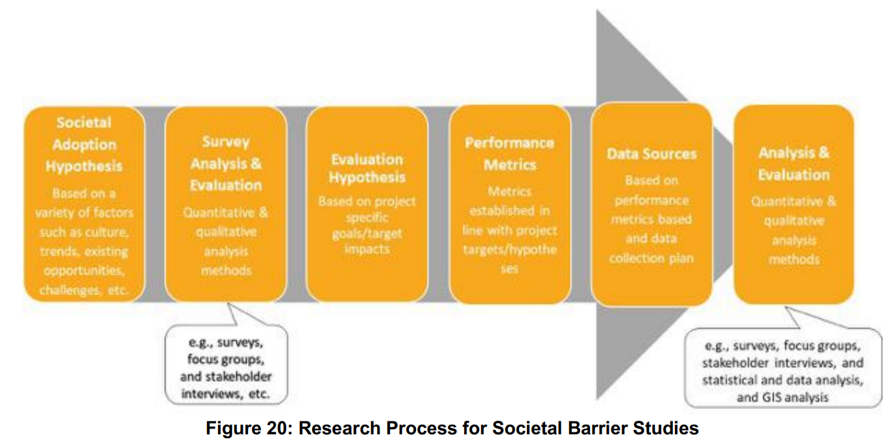
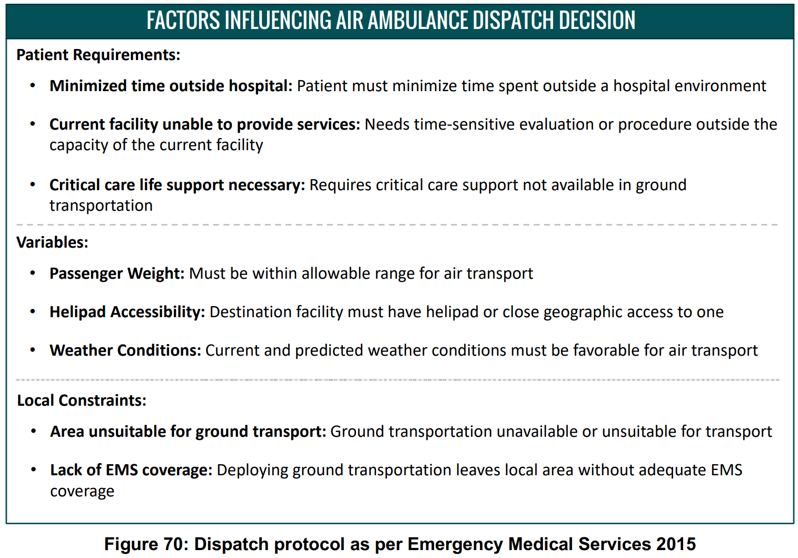

# Urban Air Mobility
## NASA concept vehicles and the engineering of advancedair mobility aircraft, 2022
## A Proposed Taxonomy for Advanced Air Mobility, 2022
## Advanced Air Mobility and Evolution of Mobile Networks, 2023
## Designing airspace for urban air mobility: A review of concepts and approaches, 2021

### abstract

本文对学界及业界的空域设计和管理进行了文献综述。本文分析了各个与空域相关的概念，比较了其优缺点，指出了研究差距，提供了对设计空域的一种更加整体的方法的建议。首先，本文定义了诸如大小、容量、几何等与空域相关的结构性因素，这些因素被组织成四大类：安全因素、社会因素、系统性因素和航空器因素；其次，本文综述了世界范围内的城市空域概念；再次，本文按照结构性因素对空域概念进行了评价，大多数的空域概念是理想的抽象网络，强调最大化安全性和容量，忽略技术复杂度、噪音和隐私。空域的机构性直接影响了其安全性、效率和容量的级别。在结构性更弱的空域中飞行器有更高的自由度，其可以自由地选择位置、高度、朝向和速度，从而增加空域容量，减小飞行成本。然而此类概念通常要求高的技术能力，如动态地理围栏和先进的感知避障能力，从而达到所需的安全级别。有更少自由度的空域容纳更少的飞行器，但是需要更加严格的管控规则以保证安全。最后，这些提出的空域概念需要广泛的地面基础设施，如起降站、通讯、导航、监测基础设施等。以城市规划的视角来看，分析城市空中交通的研究有必要成为新的分支，包含分区、空域权力、房地产开发、公共交通、公众接受度、可达性的不平等性等。

### introduction

随着自动化、电能存储等的发展，城市空中交通的想法已经再城市航空领域迸发。UAM的概念由一系列的规则、进程和技术组成，其概念促使在城市环境中的客运和货运等空中操作得以进行。UAM是NASA FAA提出的先进空中交通的一部分（AAM），也是使用电动空中机动车进行空中客运/货运行业的一部分。世界范围内的公司都在与主流的航空器提供者合作，创造城市航空器的原型，证明城市飞行的技术。这种推动对城市和政府机构创造适用于城市空域的规则带来压力，考虑到不同的空中飞行器设计、可操作性、速度、起降程序、自动化程度、监测和通讯技术制定规则并不是一个容易的任务。这些差别使飞行器安全有效地使用空域变得困难，亟需标准化的飞行规则和程序集。

今天，无人机在重建、交通监测、灾害监测、火情监测、基础设施检查、制图、森林和农业等领域已被广泛使用。这些操作虽然数量很多但是通常只在有限的地理空间区域内进行，不会对民航系统造成大的风险。然而，设想的城市、郊区、远郊区空中交通的确可能会对民航系统带来显著的影响。

设想的操作将最可能是电力有人和无人机动车的垂直起降。与传统的直升飞机不同，新的空中机动车使用多种发动机
推进器、电动引擎和更轻的材料，这些可以使其更便宜、更安静、更高效。这些操作预期会覆盖城乡地区。这些操作将会为相同的有限空间竞争，这将推动行业采用更小的分离标准。因此，多个机构都在发展管理城市空域和确保安全的框架。

本文意在分析管理空域的前沿性提案，找出其共性，指出空域设计的最佳实践。本文需要识别和分析决定城市空域物理性结构的结构性因素。通过城市的物理性结构，我们就可以考虑空域元素的位置和大小，如飞行轨迹、管道、廊道、飞行层和与其相关的操作规则。

### the need for urban airspace

当前空中交通管理对城市空域的能力不足是发展城市空中交通的主要阻碍，多个挑战阻碍了当前NAS活动和城市活动的集成：更多的活动量；更大的活动密度；更低的活动高度和多种飞行器的不同性能。这些挑战延伸了目前空域交通控制系统的能力，指示着在当前系统中进行重要变化的需求。

国际民航组织将空域划分为ABCDEFG七类，前五类为管制区域，后两类为非管制区域，空域划分综合飞行服务的类型、速度和高度限制、雷达通讯需求和空中交通管制许可等划定。

ATC如果也管理非控制区域，那么将需要NAS所有方面的剧烈调整，这是一个长期且成本巨大的过程。→ It is more likely that UAM operations will be conducted within a separate, newly created airspace with a new set of rules and standards. 

这样的系统将远比ICAO的七类空域复杂，在密集的城市空域安全地分离空中机动车的难度可以通过小心地空域结构设计来降低，因为他们可以最小化复杂度、增加流量。然而，应该应用哪种空域结构并无定论。一些研究认为管理高交通密度需要预先划设好的路径和区域，也有研究则认为空域应该对全自动飞行器不设限且完全开放。大都数研究从空域应当最大化容量和安全性的角度出发，其认为优化空域设计应该通过最小化损坏（如飞行器与建筑碰撞）和最大化容量和流量实现。但是容量和安全性只是设计功能化的城市空域的多个变量中的两个变量。

### factors that determine the geometry of urban airspace

首先通过考虑不同的因素如何影响空域的物理空间进行阐述。如对安全性因素，显然建筑物本身是禁飞区，如果考虑更多因素，如风场，则禁飞区将会延申，考虑更多因素则禁飞区将会继续拓展。本文使用此逻辑来识别限制移动和影响飞行开放空间的因素。这些因素被分为四类：

1. 安全相关的因素

FAA认为对于城市空中交通的成功被接受而言，安全性因素是对于人、机动车和财产来说都是最重要的因素。可以通过降低风险的方式改善安全性。可以通过通过降低事故的严重程度或降低发生事故的可能性降低风险。在空域，风险不能完全消除，但可以通过避开物体、有湍流的区域和可能危及飞行的天气等减少。

2. 社会因素
3. 与系统特性相关的活动因素
4. 与飞行器特性相关的活动因素

## Demand analysis in urban air mobility: A literature review

+ 不同场景下的需求，包括客运、货运和其他服务
+ 影响市场需求的因素，如时间、距离、安全、隐私、噪音等
+ UAM需求分析的方法：调查/离散选择模型/聚类算法
+ UAM市场需求的循环
+ 与UAM需求分析相关的未来研究点：空域航空服务、潜在的货运应用、公众接受度、基础设施点位、与已有交通系统的集成、新的需求评估模型

### Introduction

+ 从直升机到eVTOL（如Joby Aviation公司），市场的发展
+ 学术界相关的文献也指数增长：如对UAM研究方向的综述/对UAM市场需求、生态系统、市场潜力和挑战的综述
+ 需求分析的结果为系统开发、基础设施建设、规章制度建立和市场优化提供参考和引导，也已有相关综述

### Methodology

+ term： “demand” AND ((“UAM” OR “urban air mobility”) OR (“air taxi” OR “air shuttle” OR “air cargo”) OR (“eVTOL” OR “helicopter”))，直升机目前仍是UAM最常用的。
+ database:  ScienceDirect, IEEE Xplore, AIAA publication database, ASCE Library,  Taylor & Francis Online, and Wiley Online Library, USA/ Europe ATM R&D Seminar (ATM seminar), International Conference on Research in Air Transportation (ICRAT), and SESAR Innovation Days (SIDs)
+ 时间范围：2017-2022

检索结果：74 + 73 + 64 + 3 + 1

### On-demand application in UAM 

+ 客运：air shuttle service, air taxi service，都是点对点的
+ 货运：主要是无人机运输药物等货物
+ 其他：空中紧急情况（紧急医疗疏散），空中监测（制图、基础设施监测、交通监测、灾害监测等）和空中娱乐（观光摄影等）

交通工具由直升机转变为eVOTLs，因其更小的噪音污染、更低的运行成本和更安全的特性。其与UAM的未来集成还面临着基础设施建设、规章制度框架和社会接受度等方面的挑战。

### Factors that affect the demand for UAM 

### Demand estimation for UAM

两大类：
+ survey-based demand estimation，基于调查的定性评估
+ data-based demand estimation，基于数据的定量评估

定性方法（现实性偏好法/叙述性偏好法）：the stated-preference surveys were designed to ask potential travelers which transportation modes they would take under hypothetical situations, while the revealed-preference surveys refer to changes in existing transport characteristics and services.

定量方法可分为长期和短期需求评估。长期需求评估对于识别UAN市场最有潜力的区域而言是重要的初始步骤，也可以对长期市场决策中的策略调整提供参照。长期评估包含了对潜在城市/区域以及基础设施选点的考量，短期评估则需要分析市场需求的时空分布模式以优化UAM效率。评估结果对促进城市空域服务建设和减少UAM成本等都有用处。

#### Preference survey of the market demand for UAM

问卷调查，对区域信息、UAM对象类型、时间信息、问卷数量、调查方法、调查的实施方法（在线问卷/纸笔etc）、量表方式、问卷的主要属性（如支付意愿、使用意愿等）等进行了综述，一般的问卷包含区域类型（发达/发展中）、年龄嗯不、性别比例、家庭类型、教育背景、就业情况、收入情况、住房情况等。

基于调查结果进行离散选择模型的建立，具体可选：

+ multinomial logit model
+ mixed logit model
+ random parameter multinominal logit model
+ ordered logit model

发展中国家的相关调查尚缺乏。

#### Demand estimation for potential city and region

输入变量包括社会经济变量（人口、GDP、经济指标、地面交通拥堵情况）、与服务相关的变量（时间成本、货币成本、距离/目的地和规章）、其他因素还可以考虑城市增长、水体、高科技产业信息、建筑密度等。主要用到的模型有重力模型、Pugh矩阵、OD矩阵、离散选择模型等。

有如下几点结论：

+ 现有研究中用到的参数都不同，目前的研究主要关注人口、人口密度和GDP等变量，忽略了诸如地表交通拥堵情况、管制约束和公共接受度（如噪音、隐私和视觉污染的不良影响）等重要的其他因素。
+ 因此，使用统一的参数集对于潜在城市的发现是有必要的，其对于未来的需求评估也可以充当参考。
+ POI和城市形态等数据也可以使用，深度重力模型、ABM等方法也可以使用。

#### Demand estimation for infrastructure capacity and placement

UAM市场需求分布——>垂直升降机场的容量和地点

+ KMeans算法是优化机场区位的主要方法，然而这样的选址结果可能缺乏可实施性
+ 可以结合土地利用数据进一步优化土地利用的选址
+ 已有的研究中对城市建筑环境的因素考量不够充分
+ 基础设施的选址问题通常是离散选择模型的一部分，因此此类问题的点位通常是固定的，综合系统的决策区位规划仍是待探索的领域。

#### Demand estimation for general market operation

预测消费者的需求。准确的需求预测可以增强系统的效率，减少总出行时长、出行成本以及能量消耗。此方面目前主要的预测关注air taxi services。

#### Demand estimation for operational planning problems 

决策规划，优化目标如最小化拥挤空域中的空车数量，设计最高效的路线等等。大致可以分为调度安排（scheduling）、指派方法（dispatching）和路径规划（routing）三类。

### Demand in UAM life cycle

+ design & construction: UAM由飞行器、基础设施和空域三方面组成，可以基于交通需求对这些布恩进行设计
+ operation & management: feasibility(pre-operation), efficiency(intra-operation), potentiality(post-operation)
+ regulation: these restrictions, including flight purpose, UAV weight, minimum distance from people and buildings, and altitude limit, can be adopted as references for airspace design and operation for UAM based on demand.

### Discussion and conclusion

几个潜在的研究点：

+ Air shuttle services may be more feasible in the short term compared to air taxis, which face limitations in infrastructure construction in high-density urban areas. The on-demand characteristics of air taxis can be combined with the shuttle transit characteristics of air metro services to improve efficiency. 
+ Cargo service is another potential application of UAM, offering advantages such as reduced labor costs and avoiding manned airworthiness certification. However, the potential of UAM cargo service has not been fully explored. Research is needed to investigate the potential applications of unmanned aircraft in cargo service and the advantages and disadvantages of this service compared to traditional cargo transportation modes. 
+ Public acceptance is a critical factor in the market demand for UAM, and more studies are required to investigate this aspect. 
+ UAM infrastructure is a research priority, and challenges include infrastructure placement and airspace design in high-density urban areas with complex urban environments that often coincide with high-demand areas. Research is needed to identify the optimal location and design of these facilities to meet the demand for UAM, taking into account factors such as population density, job density, existing noise, and ground-based transport accessibility. 
+ The integration of UAM with existing transportation modes is crucial for the initial implementation of UAM services. Future research could focus on developing efficient and suitable integrative ways to solve the first and last-mile problem in UAM service. 
+ Data collection is a significant challenge in UAM demand estimation due to the lack of historical data. Future research could focus on developing novel methods, models, or frameworks that can cover parameters such as urban building environment, public acceptance, and regulation, which are not effectively covered by current methods.
+ More research is needed to investigate the potential of machine learning algorithms and agent-based models for UAM demand estimation, as they show great potential in improving the accuracy of demand estimation.

## [Urban Air Mobility (UAM) Market Study](https://ntrs.nasa.gov/api/citations/20190001472/downloads/20190001472.pdf)

### EXECUTIVE SUMMARY

主要研究了三类UAM市场的规模和潜在的阻碍：Airport Shuttle, Air Taxi, Air Ambulance。Airport Shuttle是可实施的（viable），在完全无约束的场景（任意时间从任意地点都能使用UAM飞行到任意目的地，且不受天气、基础设施及交通流量的影响）下在美国的总市值可达5000亿美元，在规章制度、天气、认证、公众认知和基础设施的约束下，短期内将缩减到25亿美元（0.5%）。然而，这些限制可以通过政府间的、政府企业间的和企业的投入合作解决。Air Ambulance市场不可实施（如果由受技术限制的eVTOL服务），如果混合式的VTOL飞行器被使用，则可能可实施。

阻碍可以分为以下几类：应用场景、通过技术实现的缓解措施和市场成熟度。短期内，服务的高成本是关键的经济挑战，通过增加动机效率和更成熟市场场景的自动化，服务成本可以被显著降低。天气情况也是一个巨大挑战，尽管可以通过一些技术，比如传感器克服低可见度，但在如雷暴和强风天气下扰乱仍会发生。密集操作短期内也会增加管理系统的压力，但是新的系统也会使之安全和有效率。现有的电池技术也是阻碍，特别是空中救护车市场，因为电池重量和充电时间都需要被保证，长期来看电池技术的进步以及混合VTOL可以减少此类阻碍。由于短期内UAM是一种可实施的交通方式，其有害的能源和环境影响，特别是噪音，可能会影响社区接受度，且伴随市场成熟规模更大一直存在。

对于非技术相关的挑战，基础设施约束是短期内的主要阻碍，但长期内可以通过开发起降场解决。与已有交通方式的竞争也是阻碍，短期内如共享骑行和出租车、长期内如自动驾驶汽车和电力火车。天气情况也会影响乘坐体验和基础设施等。作为乘客，公众对于安全很关注，如unruly乘客、蓄意破坏等对安全的影响，他们更愿意在搭乘前实施安全检查，也更偏好区域内的长途出行，公众对于自动化、自动操作以及无人飞行的理解也是挑战。

### 2.0-6.0

四阶段方法：

+ scoping: VTOL服务的36种任务情景被识别
+ initial assessment: 选出三种关注的市场，评估关注preliminary market analysis和阻碍
+ interim assessment: 基于Booz Allen SAG的反馈定义方法和假设，构建三种市场的综合分析
+ final assessment: Booz Allen形成文件和建议

36个市场情景：

主要市场选取准则：

仅关注城市区域(city center + suburban area + edge cities), promise: decongest road traffic, improve mobolity, reduce transport time, decrease pollution, reduced strain on existing public transport networks, rrduce traffic accidemts.

城市区域选取流程：

+ 通过人口过滤得到大的城市区域（人口数大于100万且人口密度大于1k/mile^2）
+ 地面交通拥堵由：travel time index（自由流速度下高峰期出行时长和所需时长之比）, commuter stress index（仅关注通勤的travel time index）和annual congestion index（出行厌恶价值和额外的燃料价值）描述。地面交通越拥堵则市场机会越大

+ 天气分类：

+ excepted and regulatory ease: 基于美国和美国州法律对UAM的法律约束进行分级（favorable，moderately favorable, moderately unfavorable, unfavorable）
+ demand sizing: 按照城市区域内的高级航空公司乘客数量建模。存在高级出发和到达的乘客代表了对高级服务支付意愿的最高一级：Bureau of Transportation Statistics(BTS) DB1B: 2010-2016 BTS DB1B Coupon Data by Fare Class; Fare Class Classification: 商务和第一类乘客被分类为premium passengers； Total annual average number of passengers for each airport: 计算每个机场的年均乘客数; market size aggregation for an urban area: 高级乘客的数量被居合道城市区域的主要商业机场。
+ existing infrastructures: 使用 Federal Aviation Administration’s Aviation Environment Design Tool(AEDT) database，基于helipad和airports对已有的基础设施做拓展
+ existing transportation: UAM的价值依赖于对通行时长的减少，使用主要商业机场和城市核心/边缘城市的平均距离，小型机场到城市中心/边缘城市的平均距离进行评估。

通过以上指标进行评估，对数据进行最大-最小归一化，归一化后值越大表示市场机会更高，在使用此方法后选取了五个城市区域进行initial analysis，选取了五个城市区域进行interim analysis。 We selected urban areas that were representative of the US and illuminated wide set of barriers for the Airport Shuttle and Air Taxi market operated with human pilots or autonomously.

### 7 legal and regulatory assessment

技术创新-政府监管的平衡点，法律规章阻碍<->对安全和隐私的保护。

这里的评估识别了在三个选出的市场中法律和规章的要求，不同尺度的不同需求，以及解决法律障碍和gap的可能机会。分析显示，远程驾驶和自主的空中出租车、空中救护车以及机场摆渡车的城市空中交通（UAM）市场面临共同的监管障碍。然而，州和地方法律从禁止无人机到保护无人机系统（UAS）运营的范围各不相同，这可能考虑到它可能创造的“法律拼凑”局面而变得有问题。同样，其他国家在不同程度上将无人机系统整合进他们的空域。此外，在确定哪些现有的联邦航空管理局（FAA）认证标准适用于考虑用于空中出租车或空中救护车UAM的车辆类型，以及如何满足现有认证标准或应如何修改这些标准方面，将面临挑战。空中救护车将需要进一步评估，因为它们需要符合操作员的空中救护车程序和他们通用运营手册（GOM）中特定于空中救护车的部分。最后，当前认证中的空白表明需要开发新的标准，特别是在与系统冗余和故障管理相关的领域。

7.2 7.3 美国federal - state - local之间的法律冲突。

7.4 国际相关规章综述（各个方面）

7.5 航空器适航器认证标准

### 8 social barriers

研究社会侧阻碍的意义：

+ 从社会角度理解与市场、使用案例和商业模型相关的潜在的可实施性，机会和挑战；
+ 为潜在的部署的的影响提供先见
+ 帮助识别早期的技术、市场和消费者的挑战，阐述UAM如何提升机场的可达性或减少通勤时长之类的场景
+ 提供对需求模式的预测性理解
+ 告知公共政策，以最大化潜力价值、最小化技术的不良影响

【不幸的是，已有的区域和国家级的调研没有包含预见性的问题，如模式转移和对其他交通方式的影响】

本研究：综述已有的对自动驾驶的信任度、对UAM和其他技术的看法以及对机组人员的组成和特点等相关的研究+定性调查（general population survey, Two focus groups were completed in June 2018 in Washington, D.C. and Los Angeles，，exploratory general population survey, approximately 1,700 respondents in Houston, Los Angeles, New York, San Francisco, and Washington, D.C. (approximately 350 respondents per city)）

#### literature review

#### focus groups

【样本过少，洛杉矶9+华盛顿6】

#### general population survey

#### societal barriers summary

+ 男性和年轻群体更愿意搭乘UAM
+ 熟悉UAM概念的人群也更愿意使用UAM
+ UAM出行的特点也会影响受试者的感受：更愿意与认识的人同行而非独自飞行或与陌生人飞行；自动化程度的提高会使飞行意愿下降，更愿意使用UAM进行长距离出行或机场出行，长距离娱乐出行比通勤出行更受欢迎。
+ 仅有17%的人对UAM的所有权感兴趣，近乎一半的人表示对将个人飞行器组建更大的船队有兴趣，未来UAM的POP运营成为可能
+ UAM需要解决对信任、可靠性、安全和其他问题的关注，以获得对非用户的接受度。调查结果表明噪音等级会影响非用户对UAM的支持。

### 9 weather condition

数据源： Meteorological Aerodrome Report (METAR，机场附近地表小时级), vertical soundings（气象气球数据，一天两次）,  pilot reports (PIREP)

### 10 airport shuttle and air raxi market analysis

系统各层包括：

+ supply：技术和UAM交通服务
+ demand：对UAM的需求
+ infrastructure：起降点的区位和容量
+ legal/regulatory environment
+ general public

分析包含如下四步：

+ definition of concept of operations：The ConOps included ground transportation for first last mile service, transfers, and air taxi flight.
+ development of operating model and calculation of key performance metrics: 服务成本计算（资本和维护，能源和电池，基础设施）+需求计算
+ what if scenario analyses: 在可用设施容量限制、每天的运行时间限制和制度阻碍的情境下进行计算
+ Monte Carlo based sensitivity analyses: 评估关键指标的不确定性传播

ride-sharing business model + 地面交通first/last mile

**Price per passenger mile**

** Market Size and Value**

+ trip generation: 通勤出行（ACS通勤数据），非通勤出行（收入数据），根据人口数量分配出行
+ trip scoping: 确定尺度：空间尺度（census）、时间尺度（average day of year）、模式类型（driving、ride-sharing、taxi、public transportation、walking），对于机场出行只关注airport shuttle on 1 to 3 passengers
+ trip distribution: 重力模型+移除比地面交通更慢的出行
+ mode choice: travel time, and travel cost per median household income per hour建立的logit模型
+ constraints: 受支付意愿、设施可获取性和容量、时间限制等的约束

air taxi and airport shuttle markets可实施，但受约束后只有0.5%可实施，基础设施是极大的阻碍，基于UAM通勤总时长被缩短至45分钟内，No significant demand for discretional trips was found due to passenger’s low willingness to pay

total market size and value: 按照出行时长对应的选择比例计算所有地块的选择比例，再与对应的人数比例中位数和人数相乘得到出行人次。

**潜在的外生影响**

空域管理：

噪音：

碳排：

**scenarios**

### 11 air ambulance

与airport shuttle/taxi相比有更高的公众接受度

基本价格假设（1-patient emergency medical transports）：

(非直接成本按直接成本的10%-30%计算)

eVTOL一趟9000$，混合型一趟9800\$？

scenearios: eVTOL的总电池需求容量很高
+ 场景1，病人到达目的地后增加充电过程，然后再返回服务站
+ 场景2，在服务站增加更换电池的过程

需求量建模：

需求量+需求的小时级分布

dispatch decision:

### 12 LESSONS LEARNED AND RECOMMENDATIONS

法律和监管分析表明，尽管立法过程通常缓慢而繁琐，但立法正在迅速发展，以跟上无人机系统（UAS）技术的进步，这有助于缩小实现城市空中交通（UAM）的差距。在本研究过程中，我们看到无人机系统整合试点计划（UAS IPP）的引入，这有助于推动允许更复杂操作的使能规则，2018年FAA重新授权法案的通过，该法案要求FAA在一年内制定有关无人机系统为报酬或租用而携带财产的法规，以及欧洲航空安全局（EASA）在监管5座以下、最大认证起飞重量2000公斤或以下的垂直起降（VTOL）飞机方面的进展。研究开始时被视为障碍的问题，随着项目接近尾声时许多这些发展逐渐显现为机会。考虑到这一点，我们建议未来的研究强调在快速变化的法律环境中保持敏捷的必要性，并将对“障碍”的关注转移到“机会”上，以便美国宇航局（NASA）能够找到设计、开发和测试先进UAM技术的方法，这些技术将转化为使能立法。

社会障碍分析表明，需要通过使用飞行模拟器和/或作为试点计划或测试诊所的一部分的实际认证飞机进行进一步研究。在UAM飞机中的模拟或飞行体验可能会让受访者对UAM旅行有更真实的理解。另一个选择是进一步研究拥堵对UAM感知的影响。在我们的调查中，我们没有收集有关受访者通勤时间或对拥堵态度的数据。有趣的是，通勤距离在回归模型中略微显著。为了更好地理解这一点，我们检查了居住城市作为可能与通勤时间相关的预测因素，因为每个城市的平均通勤时间不同。根据2016年美国社区调查（ACS），休斯顿的平均通勤时间为29.5分钟，洛杉矶为29.6分钟，纽约市为35.9分钟，旧金山湾区为32.1分钟，华盛顿特区为34.4分钟。二元逻辑回归模型在统计上对洛杉矶和旧金山湾区的系数显著，与休斯顿形成对比。然而，来自休斯顿和洛杉矶的受访者平均通勤时间较短，却更愿意使用UAM。这表明城市的平均通勤时间并不是一个好的代表受访者使用UAM的意愿，或者我们的受访者群体在通勤时间方面并不代表每个城市。在未来的项目中，进一步研究拥堵作为UAM兴趣预测因素的作用可能是有益的。

从天气分析中，我们发现综合潜在天气影响在广泛的操作和车辆上是一个挑战。例如，如果假设只有目视飞行规则（VFR）操作的飞行员，仪表飞行规则（IFR）条件可能具有高度影响，但对于配备传感器以实现IFR飞行的完全自动化车辆来说影响很小。根据操作细节，影响分数可能会有所不同。对于未来的研究，我们建议探索一些具体案例，以应用有关车辆和操作的详细假设，更全面地探索天气影响的范围。这也将使天气障碍能够更全面地纳入市场分析的供需模型中。

最后，市场分析显示了在分析过程中对技术可用性和规格、空中交通管制能力、地面基础设施发展、公众接受度、法律和法规的各种假设存在的不确定性。例如，通过文献综述和与SAG成员的访谈，我们做出了与技术和操作相关的假设。因此，这些假设似乎是现实的，但随着技术的发展和操作计划的制定，更新这些假设应成为未来工作的高优先事项。我们的分析还展示了不同技术、操作和市场相关情景的影响。例如，发现自动驾驶汽车和减少对旅行时间的重视严重限制了空中出租车的需求，而自主性、高网络效率和增加的拥堵被发现可以增加需求。对于未来的研究，我们建议详细探索可能影响UAM市场的所有交通部门的技术融合趋势（包括空间和时间）。我们还建议在系统层面研究UAM的环境可持续性（噪音、排放、生态和视觉污染）。在我们的研究中，我们确定了36个潜在的UAM市场，并将分析重点放在了十个城市区域上。我们对结果的外推到所有美国城市可能没有捕捉到其他城市区域的细微差别。因此，我们建议包括更多的城市区域进行详细分析，并且还研究剩余市场的市场可行性，以了解操作的真实规模。应该分析制造商的供应链，考虑到全球需求，并研究飞机价格（基于规模经济）、机队组合和演变。

