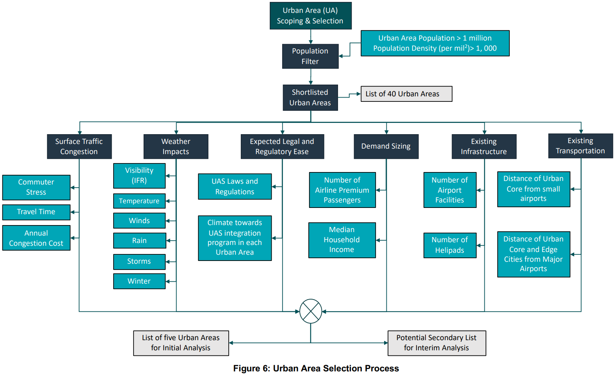
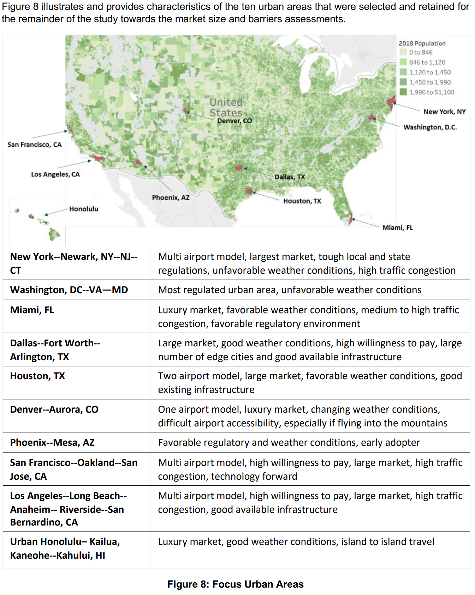
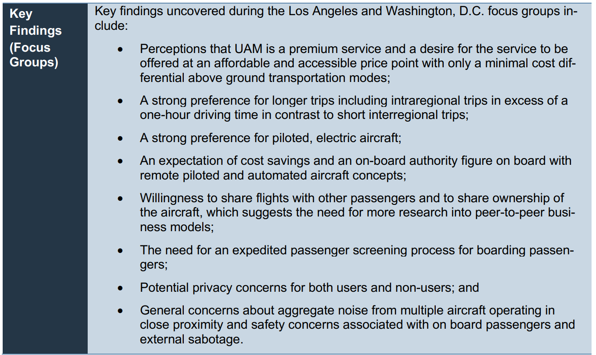
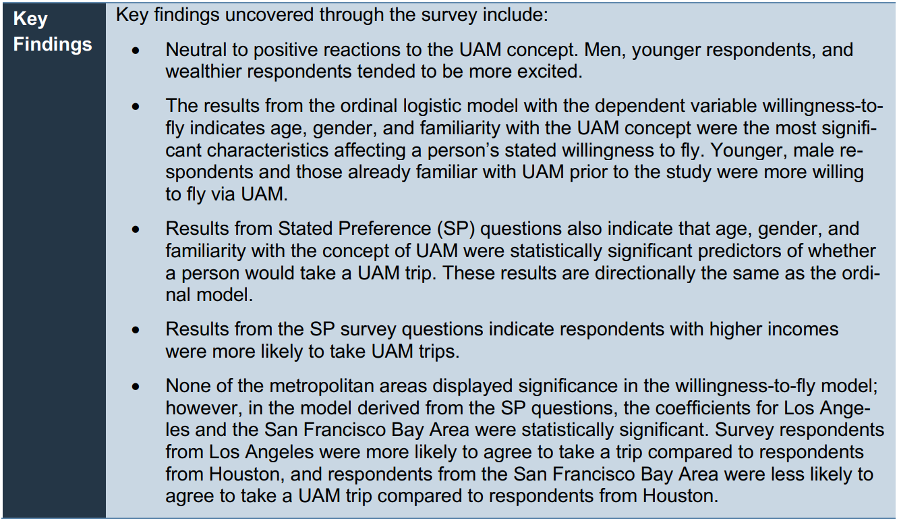
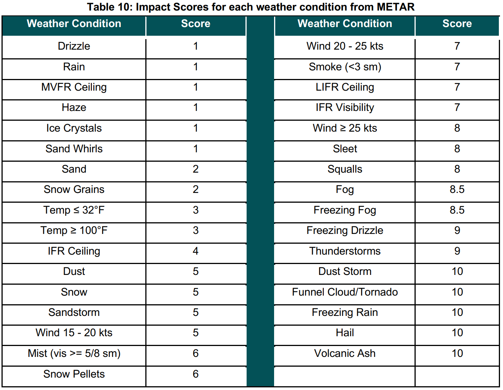

## [Urban Air Mobility (UAM) Market Study](https://ntrs.nasa.gov/api/citations/20190001472/downloads/20190001472.pdf)

### EXECUTIVE SUMMARY

主要研究了三类UAM市场的规模和潜在的阻碍：Airport Shuttle, Air Taxi, Air Ambulance。Airport Shuttle是可实施的（viable），在完全无约束的场景（任意时间从任意地点都能使用UAM飞行到任意目的地，且不受天气、基础设施及交通流量的影响）下在美国的总市值可达5000亿美元，在规章制度、天气、认证、公众认知和基础设施的约束下，短期内将缩减到25亿美元（0.5%）。然而，这些限制可以通过政府间的、政府企业间的和企业的投入合作解决。Air Ambulance市场不可实施（如果由受技术限制的eVTOL服务），如果混合式的VTOL飞行器被使用，则可能可实施。

阻碍可以分为以下几类：应用场景、通过技术实现的缓解措施和市场成熟度。短期内，服务的高成本是关键的经济挑战，通过增加动机效率和更成熟市场场景的自动化，服务成本可以被显著降低。天气情况也是一个巨大挑战，尽管可以通过一些技术，比如传感器克服低可见度，但在如雷暴和强风天气下扰乱仍会发生。密集操作短期内也会增加管理系统的压力，但是新的系统也会使之安全和有效率。现有的电池技术也是阻碍，特别是空中救护车市场，因为电池重量和充电时间都需要被保证，长期来看电池技术的进步以及混合VTOL可以减少此类阻碍。由于短期内UAM是一种可实施的交通方式，其有害的能源和环境影响，特别是噪音，可能会影响社区接受度，且伴随市场成熟规模更大一直存在。

对于非技术相关的挑战，基础设施约束是短期内的主要阻碍，但长期内可以通过开发起降场解决。与已有交通方式的竞争也是阻碍，短期内如共享骑行和出租车、长期内如自动驾驶汽车和电力火车。天气情况也会影响乘坐体验和基础设施等。作为乘客，公众对于安全很关注，如unruly乘客、蓄意破坏等对安全的影响，他们更愿意在搭乘前实施安全检查，也更偏好区域内的长途出行，公众对于自动化、自动操作以及无人飞行的理解也是挑战。

### 2.0-6.0

四阶段方法：

+ scoping: VTOL服务的36种任务情景被识别
+ initial assessment: 选出三种关注的市场，评估关注preliminary market analysis和阻碍
+ interim assessment: 基于Booz Allen SAG的反馈定义方法和假设，构建三种市场的综合分析
+ final assessment: Booz Allen形成文件和建议

36个市场情景：

主要市场选取准则：

仅关注城市区域(city center + suburban area + edge cities), promise: decongest road traffic, improve mobolity, reduce transport time, decrease pollution, reduced strain on existing public transport networks, rrduce traffic accidemts.

城市区域选取流程：

+ 通过人口过滤得到大的城市区域（人口数大于100万且人口密度大于1k/mile^2）
+ 地面交通拥堵由：travel time index（自由流速度下高峰期出行时长和所需时长之比）, commuter stress index（仅关注通勤的travel time index）和annual congestion index（出行厌恶价值和额外的燃料价值）描述。地面交通越拥堵则市场机会越大

+ 天气分类：

+ excepted and regulatory ease: 基于美国和美国州法律对UAM的法律约束进行分级（favorable，moderately favorable, moderately unfavorable, unfavorable）
+ demand sizing: 按照城市区域内的高级航空公司乘客数量建模。存在高级出发和到达的乘客代表了对高级服务支付意愿的最高一级：Bureau of Transportation Statistics(BTS) DB1B: 2010-2016 BTS DB1B Coupon Data by Fare Class; Fare Class Classification: 商务和第一类乘客被分类为premium passengers； Total annual average number of passengers for each airport: 计算每个机场的年均乘客数; market size aggregation for an urban area: 高级乘客的数量被居合道城市区域的主要商业机场。
+ existing infrastructures: 使用 Federal Aviation Administration’s Aviation Environment Design Tool(AEDT) database，基于helipad和airports对已有的基础设施做拓展
+ existing transportation: UAM的价值依赖于对通行时长的减少，使用主要商业机场和城市核心/边缘城市的平均距离，小型机场到城市中心/边缘城市的平均距离进行评估。

通过以上指标进行评估，对数据进行最大-最小归一化，归一化后值越大表示市场机会更高，在使用此方法后选取了五个城市区域进行initial analysis，选取了五个城市区域进行interim analysis。 We selected urban areas that were representative of the US and illuminated wide set of barriers for the Airport Shuttle and Air Taxi market operated with human pilots or autonomously.

### 7 legal and regulatory assessment

技术创新-政府监管的平衡点，法律规章阻碍<->对安全和隐私的保护。

这里的评估识别了在三个选出的市场中法律和规章的要求，不同尺度的不同需求，以及解决法律障碍和gap的可能机会。分析显示，远程驾驶和自主的空中出租车、空中救护车以及机场摆渡车的城市空中交通（UAM）市场面临共同的监管障碍。然而，州和地方法律从禁止无人机到保护无人机系统（UAS）运营的范围各不相同，这可能考虑到它可能创造的“法律拼凑”局面而变得有问题。同样，其他国家在不同程度上将无人机系统整合进他们的空域。此外，在确定哪些现有的联邦航空管理局（FAA）认证标准适用于考虑用于空中出租车或空中救护车UAM的车辆类型，以及如何满足现有认证标准或应如何修改这些标准方面，将面临挑战。空中救护车将需要进一步评估，因为它们需要符合操作员的空中救护车程序和他们通用运营手册（GOM）中特定于空中救护车的部分。最后，当前认证中的空白表明需要开发新的标准，特别是在与系统冗余和故障管理相关的领域。

7.2 7.3 美国federal - state - local之间的法律冲突。

7.4 国际相关规章综述（各个方面）

7.5 航空器适航器认证标准

### 8 social barriers

研究社会侧阻碍的意义：

+ 从社会角度理解与市场、使用案例和商业模型相关的潜在的可实施性，机会和挑战；
+ 为潜在的部署的的影响提供先见
+ 帮助识别早期的技术、市场和消费者的挑战，阐述UAM如何提升机场的可达性或减少通勤时长之类的场景
+ 提供对需求模式的预测性理解
+ 告知公共政策，以最大化潜力价值、最小化技术的不良影响

【不幸的是，已有的区域和国家级的调研没有包含预见性的问题，如模式转移和对其他交通方式的影响】

本研究：综述已有的对自动驾驶的信任度、对UAM和其他技术的看法以及对机组人员的组成和特点等相关的研究+定性调查（general population survey, Two focus groups were completed in June 2018 in Washington, D.C. and Los Angeles，，exploratory general population survey, approximately 1,700 respondents in Houston, Los Angeles, New York, San Francisco, and Washington, D.C. (approximately 350 respondents per city)）

#### literature review

#### focus groups

【样本过少，洛杉矶9+华盛顿6】

#### general population survey

#### societal barriers summary

+ 男性和年轻群体更愿意搭乘UAM
+ 熟悉UAM概念的人群也更愿意使用UAM
+ UAM出行的特点也会影响受试者的感受：更愿意与认识的人同行而非独自飞行或与陌生人飞行；自动化程度的提高会使飞行意愿下降，更愿意使用UAM进行长距离出行或机场出行，长距离娱乐出行比通勤出行更受欢迎。
+ 仅有17%的人对UAM的所有权感兴趣，近乎一半的人表示对将个人飞行器组建更大的船队有兴趣，未来UAM的POP运营成为可能
+ UAM需要解决对信任、可靠性、安全和其他问题的关注，以获得对非用户的接受度。调查结果表明噪音等级会影响非用户对UAM的支持。

### 9 weather condition

数据源： Meteorological Aerodrome Report (METAR，机场附近地表小时级), vertical soundings（气象气球数据，一天两次）,  pilot reports (PIREP)

### 10 airport shuttle and air raxi market analysis

