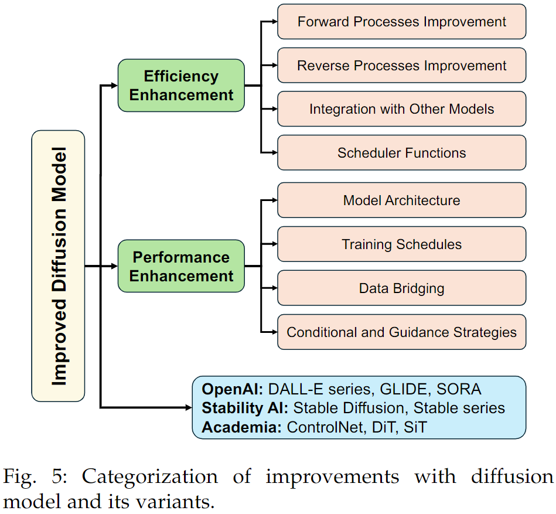
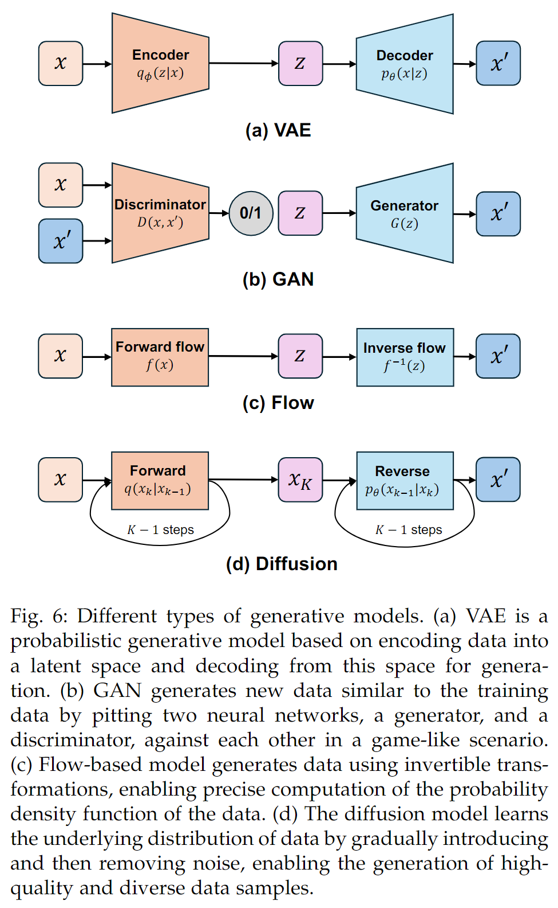

# Diffusion Model
## [A Survey on Diffusion Models for Time Series and Spatio-Temporal Data](https://arxiv.org/pdf/2404.18886)

扩散模型用于时间序列和时空数据挖掘——>可以增强生成和推理能力。本文根据模型类型、任务类型、数据模态和应用领域对扩散模型进行了分类。

+ unconditional model，无监督，可以分为probability-based和score-based两类，用于预测、异常检测、分类和归因等预测和生成式任务
+ conditional model，使用额外的信息增强性能，也可以用于预测和生成式任务
+ 在医疗、 推荐、气候、能源交通等诸多领域均已有应用。

### 1 Introduction

扩散模型代表了一系列概率生成模型，通常会经历两步过程进行优化，即在测试集样本上的注入和后续的移除噪声过程，通常forward phase指的是diffusion过程（噪声扩散），reverse phase指的则是denosing过程（移除噪声）。通过移除扩散过程中产生的噪声，模型可以通过对齐训练数据分布推理从而学习生成有效的数据样本。

近年来扩散模型已经在诸多领域产生了巨大影响，如CV、NLP、多模态学习等等，在诸如文生图、3D形状生成、分子设计和音频生成等领域展示出强大能力，对长久以来使用的生成式对抗网络（GANs）产生了挑战。扩散模型在传统上被auto regressive方法主宰的任务上作为一种non-autoregressive的替代方法也备受欢迎。Sora的出现也宣告了扩散模型在对时空连续的物理世界建模能力的到临。Google DeepMind团队的AlphaFold3团队也使用扩散模型生成3D原子坐标以预测如蛋白质、DNA和RNA的生物分子结构。

时空预测，已经经历了由感知智能（sensory intelligence）到生成智能（generative intelligence）的巨大转变，以通用基础模型的出现为特点，基础模型对领域特定模型产生挑战。扩散模型在图像、声音和视频等多模态数据中已经有了很多最新成果，因而成为LLM等领域的生成式基础模型。近年来扩散模型对于时空数据的预测受到的关注快速增长：what kind of sparks will emerge from the intersection of time series/spatio-temporal data analysis and diffusion models?

diffusion models emerge as a powerful generative framework that enables
+ the modeling of complex patterns within temporal data
+ the support of a wide range of downstream tasks

通过在大规模时间数据上进行训练，扩散模型有效地填补了时间序列/时空数据生成的空白，并在解决下一代、由大型语言模型(LLM)赋能的时间数据为中心的代理的难题方面展现出巨大的潜力。

本文填补了缺乏对此类模型系统论述的空白，阐明了扩散模型适合处理此类数据的原因，揭示了其优势的机理，对其类别及评述和发展趋势进行了介绍。

### Background

#### 时间序列和时空数据概览

单变量时间序列：$\mathbf{x}=(x_1,x_2,...,x_T)\in \mathbb{R}^T$；D维多变量时间序列：$\mathbf{X}=(\mathbf{x_1},\mathbf{x_2},...\mathbf{x_T})\in \mathbb{R}^{T\times D}$

这里没有对时空数据进行显式的描述，给出了几种描述方式：时空图、轨迹、视频等。

+ 时间序列分析：forecasting, generation（基于已有数据集的统计特性等生成新的时间序列）, anomaly detection, imputation
+ 时空数据分析：与时间序列类似

#### Why diffusion model and its history

扩散模型是一类基于概率的生成模型。diffusion本指粒子移动的物理过程，diffusion model的概念首次出现在统计物理学中，描述粒子从高浓度区域向低浓度区域的移动过程。早期的扩散模型关注对生成过程中的随机扩散行为的精确模拟。关键性的突破出现在2015年，在训练模型的过程中组合变分推理（variational inference）。自此之后相关领域，特别是高质量图像生成领域快速发展。2020年开始，扩散模型在更多领域展现出潜力，如文生图、音乐生成、语音合成等，这受益于模型结构的优化、训练方法的改进和计算资源的增长。

除了应用，在理论方面已有研究开始探索如何通过控制reverse process生成指定特征的数据，这指导了扩散模型可以生成高质量的多维度数据。从算法实现上讲，其可以表示为：随着对数据分布的逐步调整（逐步注入噪声），直至匹配目标分布，从而得到高质量的合成数据示例。

近期，更多研究者从各自视角出发对扩散模型进行关注，扩散模型已经成为生成类模型的首选。扩散模型擅长生成高质量的复杂序列（包括时间序列和时空数据），且通过逐步去除噪声可以有详细的连贯性（coherence）。在生成过程中可以添加强控制，允许基于各种情况的微调。此类模型在各类数据类型和模态之间都是flexible和adaptive的，且对逐步噪声减少机理的误差稳健，通过探索数据的丰富度可以进行创造性的输出。此外，其可以与其他类型的模型集成，如autoencoder，以增强生成的质量和对生成过程的控制。

#### Typical Diffusion Models

训练过程包含两步
+ forward process(diffusion)
+ reverse process(denoising)

【可以类比数字图像处理的FFT和IFT过程，先傅里叶变换到频域处理，处理后再进行逆傅里叶变换】

扩散模型由一个噪声分布开始，再一系列时间步中逐步调整。在向前过程，模型向原始数据中逐步添加噪声直至数据变成纯噪声，此过程通常是马尔可夫过程（当前时序只受上一时序影响）。反过程则是学习从训练数据中移除噪声的过程。通过训练模型移除从扩散过程中添加的噪声，模型可以学到生成与训练数据相同分布的样例。使用鼓励产生于真是数据分布的损失函数即可做到这点。目前的扩散模型通用框架包括：

+ DDPMs: denoised diffusion probabolistic models
+ Score SDEs: score-based stochastic differential equations
+ conditional diffusion models

接下来逐一介绍。

##### DDPM

典型的两阶段模型：

+ diffusion: 给定噪声分布，逐步将数据转为噪声
+ denoising: 通过深度网络将其复原为原始数据

**diffusion**

给定数据分布：$q(\mathbf{x})$，数据采样$\mathbf{x_0}\sim q(\mathbf{x_0})$。然后向原始数据中逐步添加高斯噪声直至数据呈标准的高斯分布，可以描述为如下的马尔可夫过程：

$$
q(\mathbf{x_k}\mid\mathbf{x_{k-1}}))):=\mathcal{N}(\mathbf{x_k};\sqrt{1-\beta_k}\mathbf{x_{k-1}})), \beta_k\mathbf{I})
$$

根据高斯分布的性质，可得：

$$
q(\mathbf{x_k}\mid\mathbf{x_0}))):=\Pi_{k=1}^{K}{q(\mathbf{x_k}|\mathbf{x_{k-1}})))}:=\mathcal{N}(\mathbf{x_k};\sqrt{\alpha_K^-}\mathbf{x_0})), \sqrt{1-\alpha_K^-}\mathbf{I})\\
\text{where}\quad \alpha_k:=1-\beta, a_k^-=\Pi_{i=1}^{K}\alpha_i
$$

则：

$$
\mathbf{x_k}=\sqrt{\alpha_k^-}\mathbf{x_0}+\sqrt{1+\alpha_k^-\epsilon}, \epsilon\sim\mathcal{N}(0, \mathbf{I})
$$

通常设计为：$\alpha_k^-\approx 0, s.t. q(\mathbf{x_k}):=\int{q(\mathbf{x_k}\mid\mathbf{x_0})q(\mathbf{x_0})}d\mathbf{x_0}\approx\mathcal{N}(\mathbf{x_k};\mathbf{0, I})$

**denoising**

不断去噪直至原始数据被重构，由$p(\mathbf{x_K})=\mathcal(\mathbf{x_K};\mathbf{0, I})$开始，高斯变换核$
p_{\theta}(\mathbf{x_{k-1}} \mid \mathbf{x_k}) := \mathcal{N}(\mathbf{x_{k-1}}; \mu_{\theta}(\mathbf{x_k}, k), \sigma_{\theta}(\mathbf{x_k}, k)\mathbf{I})
$，其中$\mu_{\theta}(\dot)$和$\sigma_{\theta}$是需要进行学习的参数，学习的目标是与$p_{\theta}(\mathbf{x_0})$的分布一致，则使用K-L散度作为损失函数。

$$
L = \mathbb{E}_q \left( D_{KL}(q(\mathbf{x_K} \mid \mathbf{x_0}) \mid\mid p(\mathbf{x_K})) + \sum_{k>1} D_{KL}(q(\mathbf{x_{k-1}} \mid \mathbf{x_k}, \mathbf{x_0}) \mid\mid p_{\theta}(\mathbf{x_{k-1}} \mid \mathbf{x_k})) - \log{p_\theta(\mathbf{x_0} \mid \mathbf{x_1})} \right) = L_k + \sum_{k>1} L_{k-1} - L_0
$$

**inference(sampling)**

使用训练得到的参数进行推理。

##### Score SDE

使用随机差分方程将DDPM的离散化forward过程连续化：

**forward**

$$
\mathrm{d}\mathbf{x}=\mathbf{f}(\mathbf{x}, t)\mathrm{d}t+g(t)\mathrm{d}\mathbf{w}, t\in[0, T]
$$

其中：$\mathbf{f}(\mathbf{x}, t)$是随机过程$\mathbf{x}(t)$的漂移系数，$g(\cdot)$是布朗运动$w$的扩散系数，对应高斯分布：

$$
\mathrm{d}\mathbf{x}=-\frac{1}{2}\beta(t)\mathbf{x}\mathrm{d}(t)+\sqrt{\beta(t)}\mathrm{d}\mathbf{w}, t\in[0, T]
$$

**reverse**

$$\mathrm{d}\mathbf{x} = \left[\mathbf{f}(\mathbf{x}, t) - g^2(t)\nabla_{\mathbf{x}} \log p_t(\mathbf{x})\right] \mathrm{d}t + g(t)\mathrm{d}\bar{\mathbf{w}}$$

损失函数：

$$L := \mathbb{E}_t \left\{ \lambda(t) \mathbb{E}_{\mathbf{x}_0} \mathbb{E}_{q(\mathbf{x}_t \mid \mathbf{x}_0)} \left[\| s_\theta(\mathbf{x}_t) - \nabla_{\mathbf{x}_t} \log p(\mathbf{x}_t \mid \mathbf{x}_0) \|_2^2\right] \right\}$$

求解方法：
+ Euler-Maruyama方法：将reverse-time SDE过程离散化
+ Prediction-Correlation方法：分为predictor和corrector两步，predictor可以是任意求解器，corrector可以是任意score-based MCMC方法
+ Probability Flow ODE方法：保留forward过程的$p_t$但使用ODE而非SDE，reverse过程求解ODE

##### conditional diffusion model

显式指定目标分布，即从$p_0(\mathbf{x}\mid c)$开始，其中$c$是condition，也作为输入，可以是类别标签或特征，情景生成算法如：label-based conditions / label-free conditions：further distrillation-based guidance, self guidance, textual-based guidance, graph-based guidance, physical based guidance和task-based guidance等

##### improvements with diffusion model and its variants

Efficency:

+ forward processes improvements: 引入物理机制/图像变换机制/改进高斯核
+ reverse processes improvements：减少生成步骤/简化生成模型，training-free sampling/knowledge distillation
+ integrated with other models：如VAE、GAN
+ scheduler functions：帮助更快收敛，减少迭代次数

Performance:

+ model architecture: 对UNet进行改进/使用transformer-based architecture
+ training schedules: 使用性能更好的优化模型/投影方式优化扩散过程
+ data bridging：使用更复杂的分布而非arbitrary高斯分布
+ conditional and guidance strategies

其他：Sora、stable diffusion等

+ stable diffusion是最新的扩散模型，用于使用文本生成高质量的细节图像，无需缓慢的迭代过程，提供了零样本边集和高效的训练选项

#### 与其他生成模型的对比

典型的生成模型：
+ variational autoencoder, VAE，建议、稳定、理论清晰，但是容易生成低质量的数据
+ generative adversarial networks, GAN，难以训练、不稳定，但生成能力较强
+ flow-based generative models，需要大量的计算资源、有着复杂的模型设计，但是提供了准确的似然估计、可以进行高质量的生成
+ diffusion model：训练时间和成本较高，但可以生成高

### Overview and Categorization

### Model Persecvtive

+ 标准扩散模型
    + 基于概率：
        + 时：TimeGrad，D3VAE，TSDiff，D3R，CARD，TS-Diffusion,WaveGrad，DiffWave,audio generation
        + 时空：（2023年开始有突破），MID++，DiffTAD,SpecSTG
    + 基于得分：
+ 改进扩散模型
    + CSDI，MIDM ，DiffAD
+ latent diffusion model
  + lower-dimensional latent space

### Task Perspective
### 

