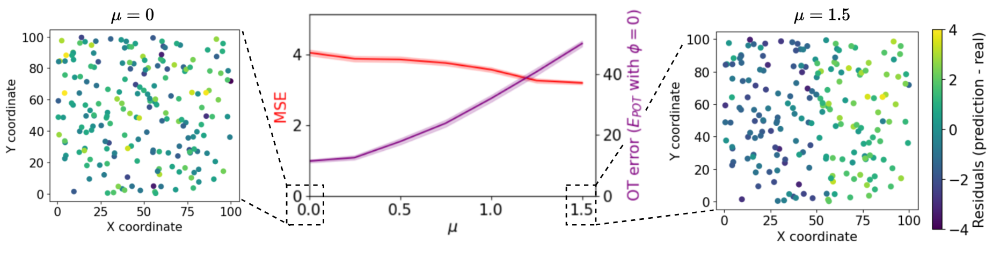
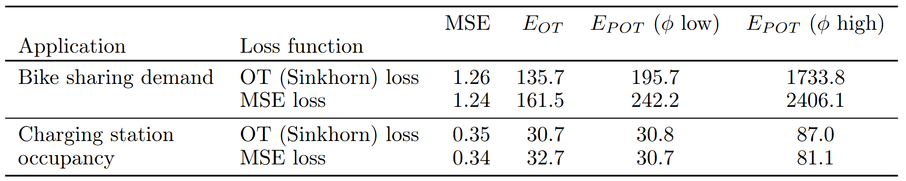

# Optimal Transport
## Optimal Transportation Theory and Computation

《最优传输理论与计算》，雷娜，顾险峰，2021年，高等教育出版社

### 前言

1995年，
+ shape from shading, 二维图片用于三维重建的几何问题等价于求解双曲型偏微分方程
+ Extended Gauss Imga：使用高斯曲率重建凸曲面$\eq$微分几何中的Minkowski问题$\eq$求解Monge-Ampère方程
20多年后，
+ 深度学习兴起，但算法背后的解释处于初始状态
+ 拓扑几何的理论框架：深度学习的核心任务：学习数据流形的结构；学习流形上的概率分布
+ 最优传输理论为学习流形上的概率分布提供了坚实的理论基础和强大的计算工具
+ Brenier理论与凸微分几何理论等价，最后归结为求解Monge-Ampère方程

本书内容：
+ 最优传输的对偶理论
+ 凸几何理论
+ 球面最优传输
+ 流体力学方法
+ Monge-Ampère方程
+ 计算方法
+ 人工智能应用

### 最优传输的对偶理论

#### Monge-Kantorovich理论

凸函数的Alexandrov理论

$X$和$Y$是完备、可分的度量空间，$\mathcal{P}(X)$是$X$所有测度构成的空间。

Monge问题：给定两个概率测度$\mu\in\mathcal{P}(X),\nu\in\mathcal{P}(X)$和代价函数$c:X\times Y\rightarrow [0, +\infty]$，求：

$$
(MP) \inf\{M(T):=\int_X c(x, T(x))d\mu(x):T_{\#}{\mu}=\nu\}\\
(T_{\#}{\mu})(A):=\mu(T^{-1}(A)), A\subset X
$$

Kantorovich问题：

$$
(KP) \inf\{K(\gamma):=\int_{X\times Y} c(x, y)d\gamma(x,y):\gamma\in\Pi(\mu, \nu)\}\\
\Pi(\mu,\nu):=\{\gamma\in\mathcal{P}(X\times Y):(\pi_x)_{\#}\gamma=\mu, (\pi_y)_{\#}\gamma=\nu\}
$$

可以证明进空间上连续代价函数的KP解是存在的

对偶问题：

$$
(DP)\max\{\int_X\phi d\mu+\int_Y\psi d\nu:\phi\in C_b(X),\psi\in C_b(Y):\phi\oplus\psi\le c\}\\
\phi\oplus\psi(x,y):=\phi(x)+\psi(y)
$$

可以证明KP和DP等价。

Brenier理论：欧氏距离平方代价下的最优传输映射唯一        

#### 凸几何理论

$P,Q\subset R^d$，定义Minkowski和：

$$
P\oplus Q:=\{p+q:p\in P \text{ and } q\in Q\}
$$

$A$和$B$位似：

$$
A=rB\oplus{x}
$$

Bruun-Minkowski不等式，$A$和$B$是凸集：

$$
V((1-\lambda)A\oplus \lambda B)^{\frac{1}{d}}\ge (1-\lambda)V(A)^{\frac{1}{d}} + \lambda V(b)^{\frac{1}{d}}
$$

$\lambda \in [0, 1]$，当且仅当$A$和$B$位似时取等。

【过于数学......】

## [On the potential of optimal transport in geospatial data science](https://arxiv.org/pdf/2410.11709)
### Introduction

bikes/cars的on-demand service关注的两个点：
+ prediction: 需求估计
+ optimization：re-distribute优化

GIS或交通领域的ML研究通常只单独关注预测问题忽略下游任务。例如只预测共享单车的单小时需求量，不考虑下一小时的需求，这可能会增加relocation的成本。

最优传输方法测度两个概率分布之间的散度，可以用来比较任意时空预测任务（例如，共享单车需求/交通拥堵/充电站使用率）的预测和真实数值之间的评估。relocation成本可以通过loss function的涉及得以最小化。本文的理论框架基于partial OT。

【这里所有的距离都跟carbon emission关联，是否有点。。。】

### Methods

#### OT for st prediction

理论溯源：1781年，Gaspard Monge的问题——Given a pile of earth, what is the most efficient way to redistribute it to a desired shape? --> Earth Mover's distance and optimal transport theory：最小化初始分布到目标分布的运输成本。该问题可以通过linear programming解决，在OT研究中可以通过机器学习方法利用Wasserstein distance对两个分布之间的散度求解，基于Sinkhorn算法极大地提升计算速度。

本文使用OT进行离散位置的时空预测：

$$
l_i, i\in [1,...n]:n个位置\\
P={p_1,...,p_n}: 数量的初始空间分布\\
Q={q_1,...,q_n}: 数量的预测空间分布
$$

通过OT，$P$匹配$Q$的最小re-distribute交通成本被最小化，交通成本矩阵为$C$，则可以得到如下目标函数和约束：

$$
\min_T \sum_{i}^{n}\sum_{j}^{n}{T_{ij}C_{ij}}\\
s.t. T_{ij} \ge 0, \forall i,j\in [1,...n]\\
\sum_{j=1}T_{ij} = p_i, \forall i\\
\sum_{i=1}T_{ij} = q_j, \forall j\\
$$

$T_{ij}$为决策变量，表示从$i$转运到$j$的量，考虑最简单的二位平面直角坐标$l_i=(u_i, v_i)$，则$C_{ij}=distance(l_i, l_j)$，由优化结果$T_{ij}^{\star}$可以得到：

$$
E_{OT}(P,Q)=\sum_{i}^{n}\sum_{j}^{n}{T_{ij}^{\star}C_{ij}}
$$

#### Partial Optimal Transport

标准的OT问题formulation假设$\sum_{i} p_i = \sum_{i} q_i$，预测相对于初始值而言可能是不均衡的，则可以使用partial OT解决：dustbin / wasted vector被添加到$C$和$T$中，用$\phi$denote，从而使问题再回到均衡态。dustbin$\mathcal{C}(\phi)\in R^{{n+1}\times{n+1}}$，总质量差异$\delta = \sum_{i} p_i - \sum_{i} q_i$，$\mathcal{p}_{n+1}=\max{0, \delta}, \mathcal{q}_{n+1}=\max{0, \delta}$，则问题重新建模并求解。

$$
\tilde{\mathcal{C}}(\phi) = \begin{pmatrix}
    c_{11} & \cdots & c_{1n} & \phi \\
    \vdots & \ddots & \vdots & \vdots \\
    c_{n1} & \cdots & c_{nn} & \phi \\
    \phi & \cdots & \phi & 0 \\
\end{pmatrix}\\
\tilde{p}_i = \begin{cases}
    p_i & i \leq n \\
    \delta & i = n \text{ and } \delta > 0 \\
    0 & \text{else}
\end{cases}\\
\tilde{q}_j = \begin{cases}
    q_j & j \leq n \\
    -\delta & j = n \text{ and } \delta < 0 \\
    0 & \text{else}
\end{cases}
$$

#### OT-based loss functions

通过训练NN求解上述EMD问题，但LP无法微分，entropy-regularized OT和Sinkhorn算法可以解决此问题。

使用一个`geomloss`构造Sinkhorn损失函数用于时空预测，该损失函数通过时间序列模型N-HiTS被实现在`darts`lib中。

本文是the first attempt to improve forecasts of geospatial data with an OT loss function

### Comparison of OT-based evaluation with the MSE

使用synthetic data进行evaluation。均匀随机采样$l\sim U[0,100]$，label$y$来自正态分布$\mathcal{N}(10, 3)$，预测残差存在spatial imbalance：由空间位置导致的过拟合/欠拟合。由于空间自相关和空间异质性的存在这些问题在真实数据中也经常出现。

残差在X轴方向进行采样作为简单场景：$\mathcal{N}(\mu, \sigma) for x<50; \mathcal{N}(-\mu, \sigma) for x\ge 50$。

可得：

MSE没有反应空间不平衡，当$\mu$变大时OT误差随之增加。

【残差的Moran's I与OT loss高度线性相关】

### Minimizing relocation costs with an OT-based loss function

两个初步的实例研究：

+ BIXI bike pickup数据集(Hulot et al., 2018)
+ 法国电动汽车充电站数据集(Amara-Ouali et al., 2023)

时间序列模型NHiTS基于不同的损失函数进行训练，训练结果：

### Conclusion

OT可以用于GIS空间数据预测，该框架适用于任何对误差的空间分布敏感的预测问题。

局限：EMD和Sinkhorn loss的计算量很大，尤其是在涉及多个位置的情况下；可以进一步研究兼顾空间和时间的relocation。

## Dynamical Monge-Kantorovich Equation
