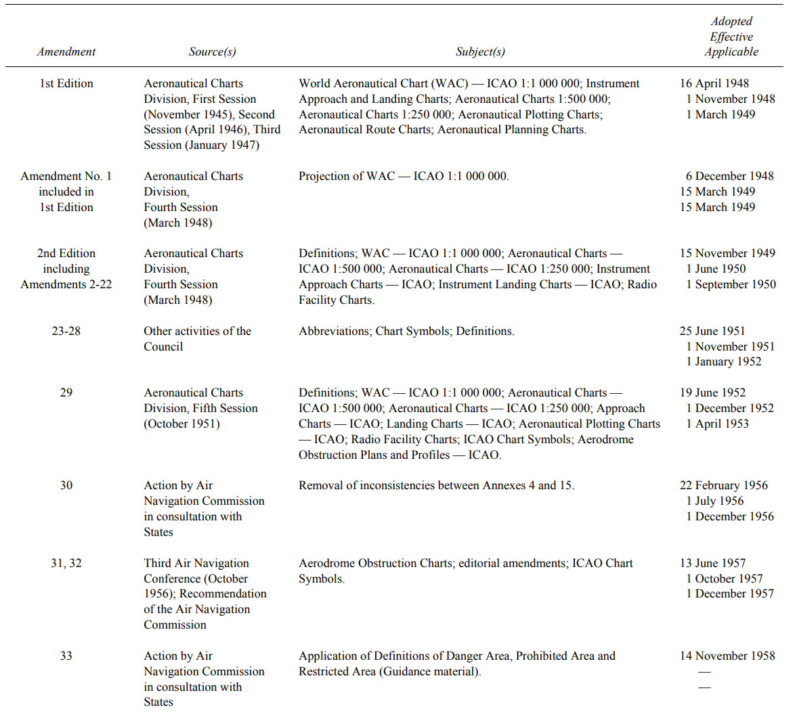
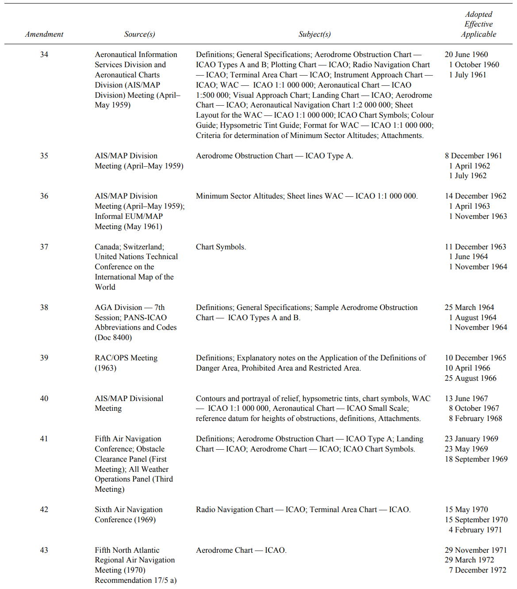
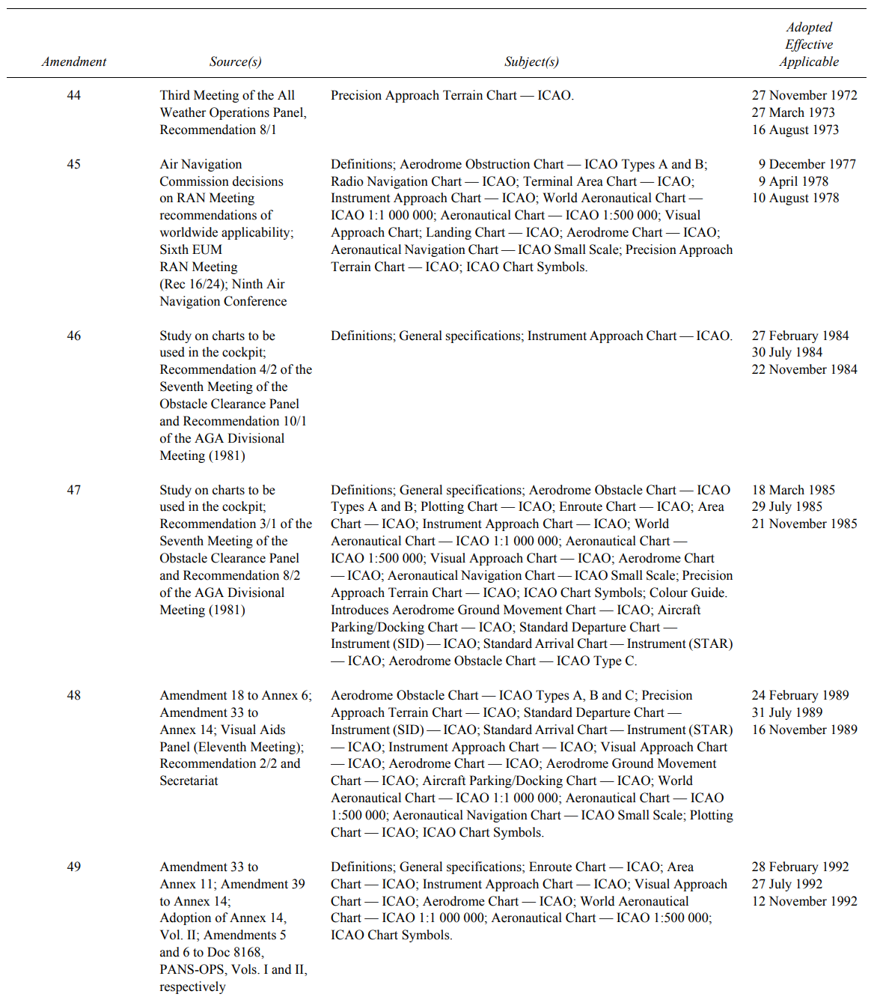
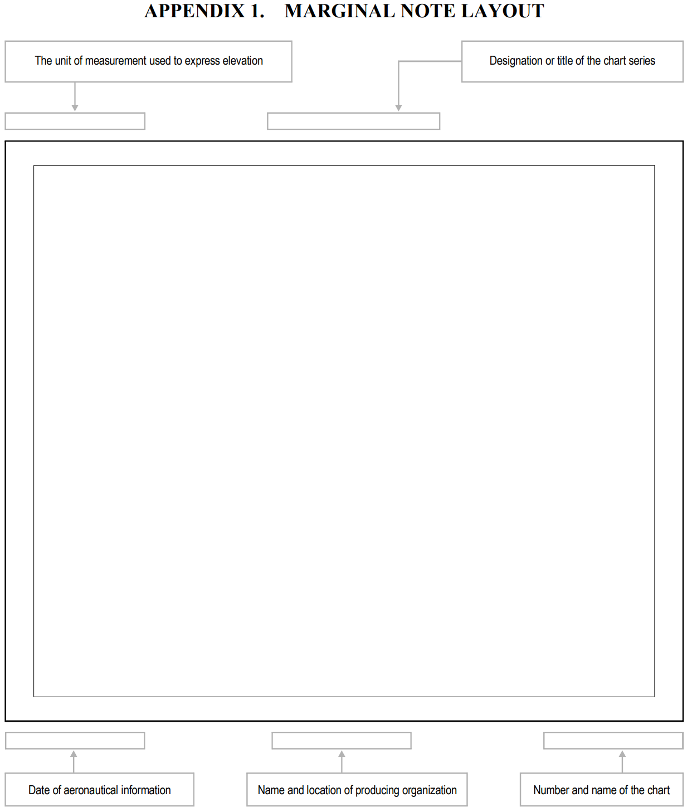

# ICAO-Annex-4-Aeronautical-Charts

Amendments to Annex 4

## 1 DEFINITIONS, APPLICABILITY AND AVAILABILITY

### 1.1 Definitions

|英文|中文|含义|
|----|----|----|
|Aerodrome|机场|飞行器到达、撤离、表面移动的地面或水体上的定义区域（包含任意建筑，设施和设备）|
|Aerodrome elevation|机场标高|着陆区域的最高点高程|
|Aerodrome operating minima|机场最低飞行条件||
|Aerodrome reference point|机场基准点||
|Aeronautical chart|航图|满足航空导航需求的被特定设计的地球及其文化、信仰的局部表达|
|Aircraft stand|飞行器停机坪||
|Air defence identification zone|防空识别区||
|Air traffic service|空域交通服务|包括航空信息服务，预警服务，空域交通警报服务，空域交通控制服务（区域控制、路径控制、机场控制等）等|
|Air transit route|空域交通路线||
|Airway|航线|廊道（corridor）形式的控制区域|
|Altitude|海拔|点距平均海平面的垂直高度|
|Application|应用||
|Apron|停机坪|陆地机场中用于乘客、信件、货物的装卸，添加燃油，停泊或维护的特定区域|
|Area minimum altitude(AMA)|区域最低海拔|在仪器气象条件（lMC）下使用的最小高度|
|Area navigation(RNAV)|区域导航||
|Arrival routes|到达路线||
|ATS route|ATS航路|有交通流空域交通服务的航路|
|ATS surveillance system|ATS监测系统|地面识别飞行器信息的监测系统，如ADS-B,PSR,SSR|
|Bare Earth|裸土||
|Canlendar|历元||
|Canopy|带植被的裸土||
|Change-over point|转换点|在参考甚高频全向无线电范围定义的ATS航路段上导航的飞机预计将转移其主要导航的点。从飞机后面的设施到飞机前面的下一个设施的参考（？）|
|Clearway|净航道||
|Contour line|等高线||
|Culture|文化|如城市、轨道、运河等地表的人造要素|
|Cyclic redundancy check(CRC)|循环冗余校验||
|Danger area|||
|Data product specification|||
|Data quality|||
|Data resolution|||
|Data set|||
|Data set series|||
|Datum|||
|Digital Elevation Model(DEM)|||
|Displaced threshold|移位阈值|跑道错位的极限阈值|
|Eletronic aeronautical chart display|电子航图展示||
|Elevation|高程||
|Ellipsoid height(Geodetic height)|椭球高（大地高）||
|Feature|要素||
|Feature attribute|||
|Final approach|||
|Final approach and take-off area(FATO)|||
|Final approach fix or point|||
|Final approach segment|||
|Flight information region|||
|Flight level|||
|Geodesic distance|||
|Geodesic datum|||
|Geoid|||
|Geoid undulation|||
|Glide path|||
|Gregorian calendar|||
|Height|||
|Helicopter stand|||
|Heliport|||
|Heliport reference point(HRP)|||
|Holding procedure|||
|Hot spot|||
|Human Factrs principles|||
|Hypsometric tints|分层设色||
|Initial approach segment|||
|Instrument approach procedure|||
|Integrity classification(aeronautical data)|数据的完整性分类||
|Intermediate approach segment|||
|Intermediate holding position|||
|Isogonal|||
|Isogriv|||
|Landing area|||
|Landing direction indicator|||
|Level|||
|Logon address|Logon地址|与ATS单元联系的特殊编码|
|Magnetic variation|||
|Manoeuvring area|||
|Marking|||
|Metadata|||
|Minimum en-route altitude(MEA)|||
|Minimum obstacle clearance altitude(MOCA)|||
|Minimum secor altitude(MSA)|||
|Missed apprroach point(MAPt)|||
|Missed apprroach procedure|||
|Movement area|||
|Navigation specification|||
|Obstacle|障碍物||
|Obstacle clearance altitude/height (OCA/OCH)|||
|Obstacle free zone(OFZ)|||
|Orthometric height|||
|Performance-based navigation(PBN)|||
|Point light|||
|Portrayal|||
|Position(geographical)|经纬点位置||
|Precision approach procedure|||
|Procedure altitude/height|||
|Procedure turn|||
|Prohibited area|||
|Relief||航图上以等高线、分层设色、阴影或点高程表达的高程的不平等性（?）|
|Reporting point|报告点|飞行器报告位置的地理坐标点|
|Restricted area|||
|Reversal procedure|||
|Runway|||
|Runway-holding position|||
|Runway strip|||
|Runway visual range(RVR)|||
|Shoulder|||
|Significant point|||
|Stopway|||
|Taxiing||飞行器基于其燃料的在机场的移动，不包括起飞和降落|
|Taxi-route|||
|Taxiway|||
|Terminal arrival altitude(TAA)|||
|Terrian|||
|Threshold|||
|Touchdown and lift-off area(TLOF)|||
|Touchdown zone|||
|Track|||
|Transition altitude|||
|Vectoring|||
|Visual approach procedure|||
|Waypoint|||

## 2 GENERAL SPECIFICATIONS
### 2.1 Operational requirements for charts
航行被分为如下阶段：

+ taxi from aircraft stand to take-off point
+ take-off and climb to en-route ATS route structure
+ en-route ATS route structure
+ descent to approach
+ approach to land and missed approach
+ landing and taxi to aircraft

有如下标准和建议：
1. 每类图表均应提供与图标功能相关的信息，以及其设计应当考虑到人类活动因素
2. 每类图表均应提供其对应阶段的合适信息
3. 信息的表达应当精准，清楚，不应失真混乱，在常规操作情况下可读
4. 在各种自然和人工光下等高线、分层设色和分类数量都应被飞行员易读易解释
5. 信息的表现形式应当让飞行员在与工作负载及操作条件下相适应的情况下得到
6. 信息的表达应当使不同阶段之间的图表的转换平滑（smooth transition）
7. r: 真北朝向
8. r: 纸质地图的基础大小应该是210*148mm

+ Titles：标题文本与图表功能相适应
+ Miscellaneous information：标准模板，缩写和符号图例，地图生产方名称与地址

+ Symbols：ICAO提供了一套图表符号；点符号的表达顺序，符号涵盖地形、水文、文化、机场、雷达导航援助、航空交通服务及特殊图的符号表达
+ 度量单位：测地线距离/使用哪些单位比较合适/数值表达精度/单位提示应当醒目/不同单位之间的转换规则
+ 比例尺和投影：大区域需要同时给出比例尺和投影；小区域只需要给出比例尺
+ 空域信息的有效日期
+ 地理名称拼写
+ 缩写
+ 行政边界：应当表达
+ 颜色：有参考标准
+ relief：满足如下需求：定向和识别/安全地形示意/航空信息示意/规划（？）
+ 禁止区、限制区和危险区
+ ATS服务区
+ 磁偏角
+ 地形
+ 空域数据：数据质量评估/精度适应用途/数据从产生到分发的整个过程应当可维护/数据集中的存储和传输中的数据错误检测
+ 常用参照系统：水平参照系+垂直参照系+时间参照系

以下各章节介绍不同类型地图的若干特性。包括：

+ aerodrome obstacle A: operating limitations
+ aerodrome obstacle B: 机场障碍物信息
+ aerodrome terrain and obstacle chart：机场地形和障碍物的电子图
+ precision approach terrain chart
+ enroute chart
+ area chart
+ standard departure chart - instrument
+ standard arrival chart - instrument
+ instrument approach chart
+ visual approach chart
+ aerodrome/heliport chart
+ aerodrome ground movement chart
+ aircraft parking/docking chart
+ world aeronautical chart
+ aeronautical chart: ICAO 1:500000
+ aeronautical navigation chart: ICAO small scale
+ plotting chart
+ electronic aeronautical chart display
+ arc surveillance minimum altitude chart
