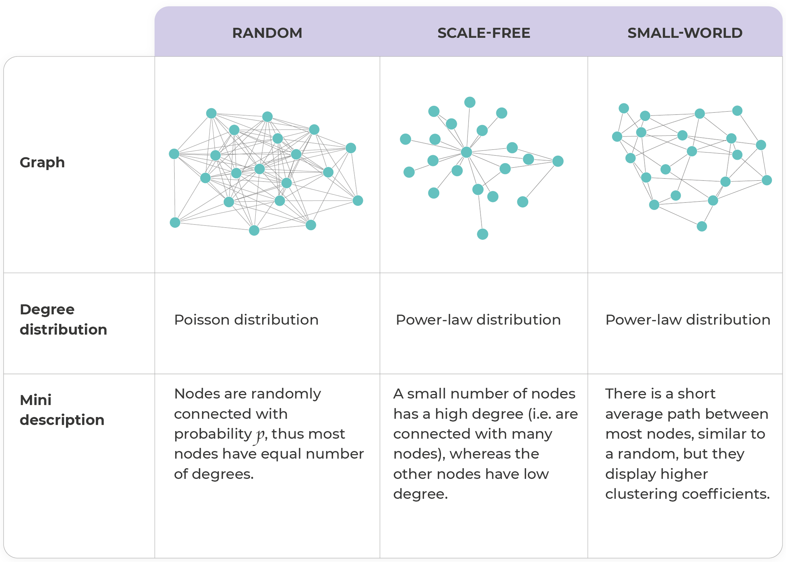

# 空间网络与空间认知

参考文献：
1. Spatial Networks: A Complete Introduction: From Graph Theory and Statistical Physics to Real-World Applications, 2022, Marc Barthelemy
2. The Geography of Transport Systems (5th ed.), 2020, Jean-Paul Rodrigue
3. Spatial networks [2011] Barthélemy M.
4. Future directions in human mobility science [2023]  Luca Pappalardo, Ed Manley, Laura Alessandretti et al.
5. （general/physics）Network Science [2016] Albert-László Barabási，Márton Pósfai
6. （computer/information science）Networks, Crowds, and Markets: Reasoning About a Highly Connected World [2010] David EasleyJon Kleinberg
7. （social science/economics）The Evolution of Social and Economic Networks [2002] Matthew O. Jackson

参考资源：https://github.com/mszell/geospatialdatascience

## 网络科学与空间网络基础

network = graph + real-work meaning, e.g. www, publication network

网络的重要度量指标：node,edge,degree,weight,centrality,cluster coefficient,modularity,motif(Network motifs are recurrent and statistically significant subgraphs or patterns of a larger graph.)

常见的三类网络：

空间网络的度量指标：距离，绕路系数（detour index），角度与信息熵，度分布

## 空间网络基础概念与实证研究

+ 平面图（planner graph）：边不相交、可被嵌入欧氏空间平面的图
+ 不同的空间网络：航空网络（nodal hierarchy），海运网络（circuitous nodal hierarchy），货运网络（sequential multi-node hierarchy），路网（hierarchy meshes），轨道网络（linear nodal hierarchy），基础设施网络（sequential linear hierarchy），不同的空间网络性质差异较大

1.路网——网络生长过程中的实证发现，Elementary processes governing the evolution of road networks. Emanuele Strano, Vincenzo Nicosia, Sergio Porta & Marc Barthélemy et al.

+ 'densification', an increase in the local density of roads around existing urban centers.
+ 'exploration', new roads trigger the spatial evolution of the urbanization front.

还探讨了人口数与网络属性的关系、路网总长度与节点数的幂律规律（亚线性）、度为1和3的节点占比下降趋势、地块形态趋向均匀、地块形状因子的变化、新增路网的介数和长度的关系等。

在巴黎，更关注路网角度的变化：Self-organization versus top-down planning in the evolution of a city [2013] Marc Barthelemy, Patricia Bordin, Maurizio Gribaudi et al.

2.航空网络，The worldwide air transportation network: Anomalous centrality, community structure, and cities' global roles [2005] R. Guimerà, S. Mossa, L.A. N. Amaral et al.：航空网络同时有无标度和小世界的一些特性，对betweenness和degree的差异做了探讨

3.骨架（Backbone）

提取骨架，Extracting the multiscale backbone of complex weighted networks: Extracting the multiscale backbone of complex weighted networks [2009] M Ángeles Serrano, Marián Boguná, Alessandro Vespignani

4.网络优化

e.g. Optimal design of spatial distribution networks. Michael T. Gastner and M. E. J. Newman

5.一些新的方向

+ Sustainability：在拓扑上对block的连通性进行探讨，定义了拓扑复杂度，成熟街区一般为2，对复杂 度较高的贫民窟地区的街区通过添加关键边降低复杂度的方式进行了探讨，Toward cities without slums: Topology and the spatial evolution of neighborhoods [2018]   Christa Brelsford, Taylor MartinLuís, M. A. Bettencourt et al.网站：reopening blocks
+ Resillence:   洪水影响交通网络：Local floods induce large-scale abrupt failures of road networks [2019] Weiping Wang, Saini Yang, Jianxi Gao et al.;电力网络的失效情景下的韧性：Small vulnerable sets determine large network cascades in power grids   YANG, YANGTAKASHI NISHIKAWAAND, ADILSON E. MOTTER

## 空间网络模型

随机几何图：随机生成节点，节点间距离小于一定长度连边-->连边可以增加距离约束-->节点可以增加生成机制-->边也可以增加生成机制，e.g. Topological Phase Transitions in Spatial Networks [2018] Paul Balister, Chaoming Song, Albert-Laszlo Barabasi et al.；Hyperuniform organization in human settlements [2023] Lei Dong 

空间网络的cost benefit分析：The universality in urban commuting across and within cities [2022] Lei DongPaolo SantiCarlo Ratti et al.

物理约束的网络模型：Isotopy and energy of physical networks [2020]  Yanchen Liu, Nima Dehmamy,  Albert-László Barabási

## 信息熵视角下的城市

+ 奠基性工作：Networks and Cities: An Information Perspective [2005]  M. Rosvall, A. Trusina, K. Sneppen et al.
+ 对导航信息熵的定量计算：Quantifying navigation complexity in transportation networks [2022] Zhuojun Jiang, Lei Dong, Yu Liu et al.
+ 8bit导航信息的认知上限？：Quantifying navigation complexity in transportation networks [2022] Zhuojun Jiang,Lei Dong, Yu Liu et al.
+ 人的成长环境对空间认知能力的影响，对性别、受教育程度、交通网络的复杂度与空间认知等进行了相关性分析（使用游戏虚拟环境）：Entropy of city street networks linked to future spatial navigation ability [2022] A. Coutrot, E. Manley, H. J. Spiers et al.
+ 基于真实数据的空间认知研究，O到D和D到O的路径不一样现象发现与模型解释（与角度因素有关）：Vector-based pedestrian navigation in cities [2021] Christian Bongiorno, Yulun Zhou, Carlo Ratti et al.
+ 空间认知领域的议题展望：Future directions in human mobility science [2023] Luca Pappalardo, Ed Manley, Laura Alessandretti et al.
+ 其他议题：超图/多层网络/网络上的传播过程（动力学）/空间网络与深度神经网络的关系，Seeing is Believing: Brain-Inspired Modular Training for Mechanistic Interpretability [2023] Ziming Liu, Eric Gan, Max Tegmark
