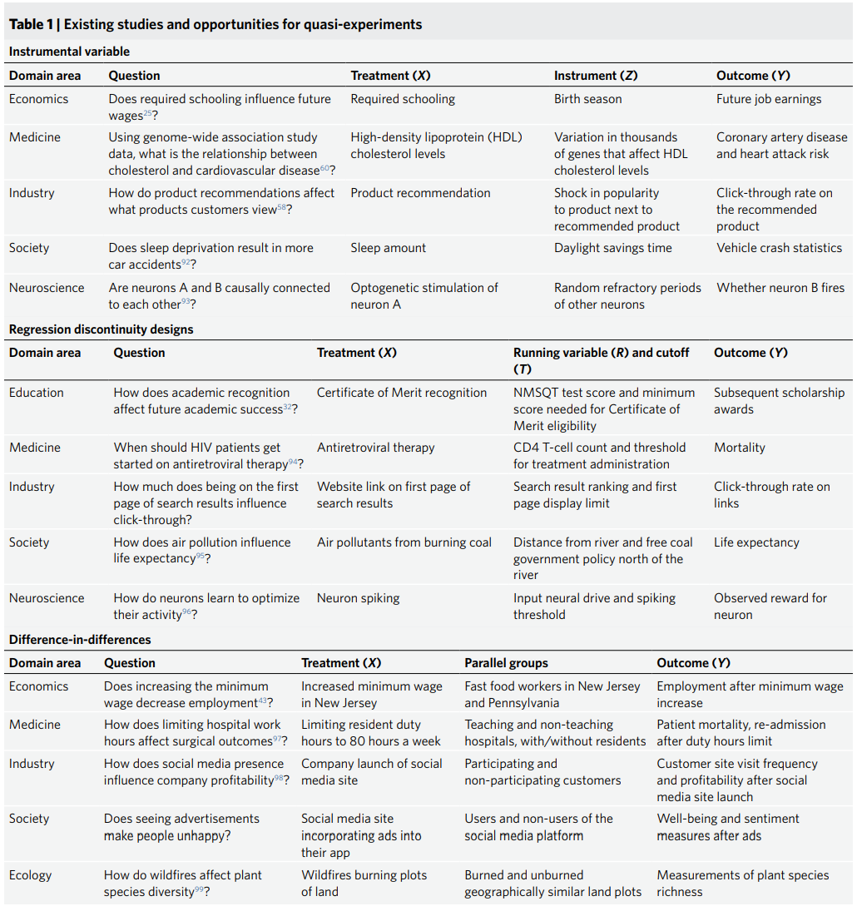

# 城市科学中的因果性
## 1 地理因果的必要性

时空相关性的陷阱：The conspiracy of Covid-19 and 5G: Spatial analysis fallacies in the age of data democratization，相关性不一定是因果性，因果性是更本质、更真实的相关性-->“我们如何得到更真的知识”

一些causality的应用：
+ The causality analysis of climate change and large-scale human crisis
+ On the causal structure between CO2 and global temperature
+ Community and the Crime Decline
+ Bright lights, big city: Causal effects of population and GDP on urban brightness
+ Causality Between the Built Environment and Subjective Wellbeing: Applying Difference-in-Differences and Synthetic Control Methods to Longitudinal Data From England

其他引入：
+ 地理学定律 v.s. 因果机理（causal mechanism）
+ 因果性特征是更本质的特征：Deep Stable Learning for Out-Of-Distribution Generalization
+ 在深度学习中引入因果性：Causality for Machine Learning，CausalGNN: Causal-Based Graph Neural Networks for Spatio-Temporal Epidemic Forecasting，

## 2 RCT及其基本原则

RCT: Randomized Controlled Trial，随机对照试验

1. 随机化原则(randomization)：所有研究对象有相同的机会被分配到所有组别
2. 对照原则 (control)：一组或多组接受正在评估的干预措施(treatment)，另一组接受无干预措施。
3. 盲法原则（blinding）：为避免研究结果受安慰剂效应或观察者偏向所影响，通常RCT采取盲法原则。设计良好的RCT通常采用双盲设计 (double blind)，即实验者与研究对象都不知道具体的干预措施，从而避免数据收集和评价过程中带来的偏倚。如可观条件限制无法采用双盲设计，则应采用单盲设计和其他方法降低偏倚。

RCT是样本量较小的局部性研究，进行推广时需要考虑内部有效性和外部有效性的问题。对于地理领域，研究对象以分组，且涉及到复杂的时空因素，开展RCT难度极大。

## 3 自然实验及准实验

+ 自然实验(Nature experiment)是指在沿袭治疗生物学对照实验设定的基础上，由已发生的自然事件(例如自然灾害、地理边界及出生时间等) 评估因果的实验方法，相较于随机实验，自然实验的最大特点是其治疗组和对照组是由纯粹的外生因素设定，而并非人为划分。
+ 准实验(Quasi-experiment)该方法在实验分组设定依据上较自然实验有所放松，可能涉及部分人为主观因素，常使用双重差分法(Difference-in-difference)、工具变量的局部平均处理效应 (Local Average Treatment Effects，LATE) 、断点回归(Regression Discontinuity Design)、重差分法(Triple Difference) 、倾向得分匹配(Propensity Score Matching)及合成控制方法(Synthetic Control Method)等。

“经济学在过去二十年最重要的发展趋势之一，就是实验和自然实验方法得到了日益广泛的应用。”

Quantifying causality in data science with quasi-experiments [2021] Tony Liu, Lyle Ungar, Konrad Kording

1. 工具变量分析(Instrumental Variable Analysis)

两条假设：
+ 没有混淆因子可以同时影响工具变量IV和结果Y
+ 工具变量IV对结果的影响只能通过影响感兴趣的变量X（treatment）来产生

工具变量是该分析的重点， 选取的工具变量必须与X有强相关性。如两阶段最小二乘：

$$\hat X=\alpha IV$$
$$\hat Y=\beta \hat X$$

2. 断点回归(Regression Discontinuity Design)

假设：
+ 只有断点变量存在一个不连续的条约，驱动干预和结果之间的因果关系
+ 个体不能完全操纵断点变量

3. 双重差分(Difference In Difference)

假设：
+ 存在平行趋势，即Control group 和Treated group 不会随着时间的推移受到混淆因子的不同影响
+ 不存在溢出效应，即干预本身不会导致Control group 和Treated group的组成发生变化

双重差分分析方法使用Treated group偏差减去Control group的偏差来矫正混淆因子的影响

一个应用场景的举例：

地理学中的RD常用设定：地理分界。

e.g. Chen Y, Ebenstein A, Greenstone M, et al. Evidence on the impact of sustained exposure to air pollution on life expectancy from China’s Huai River policy[J].Proceedings of the National Academy of Sciences, 2013, 110(32): 12936-12941.