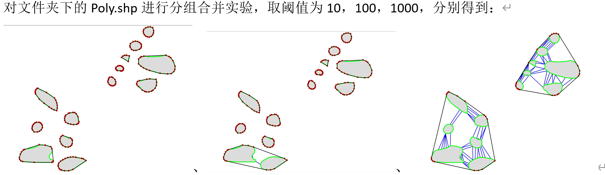
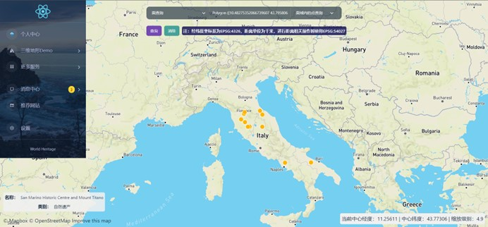
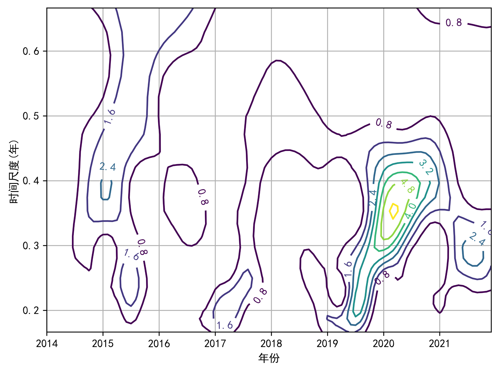
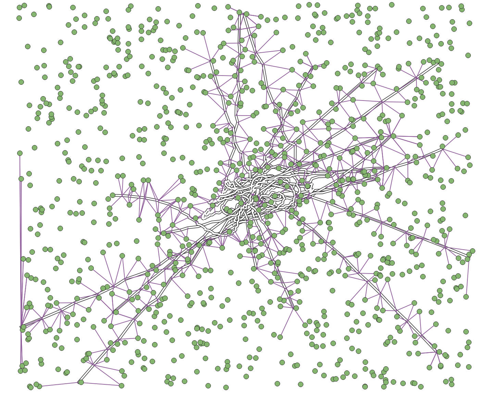

# Shuaichen Yan's Gallery

Here is a selection of the courses I have taken, the projects I have participated in, and some of the maps and spatial data visualizations I have worked on during my research. These selected works include those with watermarks due to data restrictions or because they were not completed independently. I appreciate your understanding.

## Selected Course Work

### Undergraduate Courses (Bachelor's Degree)

#### Principles of Geographic Information System

- **Term**: : Spring 2020 Term
- **Description**: After studying GIS data models, this was my initial exposure to map data, where I learned about the data structures for points, lines, and polygons, as well as the organizational structure of map layers. I also gained a basic understanding of cartographic symbols and map representation. The map was manually vectorized from a raster image using CorelDRAW.
- **Tools**: CorelDRAW, ArcGIS

- **Term**: : Spring 2020 Term
- **Description**: Network analysis of the distance from residential points to various facility points, incorporating decay rates weighted by road intersections to calculate walkability indices.
- **Tools**: ArcGIS

#### Geovisualization

- **Term**: : Spring 2020 Term
- **Description**: A comprehensive visualization of COVID-19 data, including a bivariate map of hospital bed capacity per thousand people and the HAQ index, a dot map of mortality rates, a map of COVID-19 research publication distribution, an OD (origin-destination) diagram of international aid, a timeline of key events, a line chart illustrating the relationship between lockdown measures and growth rates, and a word cloud of defamatory remarks. The visualization utilizes a range of visual variables to enhance the spatial data representation. The analysis emphasizes the importance of international cooperation, scientific research, regulatory measures, and foundational efforts in response to the pandemic, rather than baseless accusations and defamation.
- **Tools**: ArcGIS, Python, Adobe Inllustrator, Microsoft Excel

#### Map Algebra

- **Term**: Fall 2020 Term
- **Description**: Map algebra greatly simplifies the complexity of spatial relationships, with distance transformation being a core concept of map algebra. The first image shows a Voronoi diagram generated using the distance transformation method of map algebra. This diagram uses a ninth-order Euclidean distance template, and the results are nearly identical to those obtained using vector-based methods. The second image illustrates the use of map algebra’s distance transformation to calculate the central axis of a complex shape. Using a purely vector-based method would be extremely tedious. The core concept of distance transformation in map algebra significantly improves computational efficiency.
- **Tools**: C++

#### Map Generalization and Scale Transformation

- **Term**: Fall 2020 Term
- **Description**: This image demonstrates the aggregation of polygon groups using Delaunay triangulation based on different distance thresholds. Delaunay triangulation is a fundamental technique that plays a key role in many map generalization algorithms. The project was developed using a single third-party C++ DLL, and the environment setup and code comprehension posed significant challenges. Concepts from modern C++, such as smart pointers, as well as the use of the MFC library for rendering, greatly increased the difficulty of this assignment. This was one of the more challenging assignments during my undergraduate studies.
- **Tools**: C++

#### Lushan Geography Comprehensive Practice

- **Term**: Fall 2020 Term
- **Description**: This map provides a comprehensive representation of Mount Lu and the practice route on Mount Lu. The focus of this map is on the visualization of the terrain, the use of vector tile layers, and the representation of GPS trajectory points. Key practice locations for explanation are also marked on the map.
- **Tools**: QGIS

#### Spatial Analysis

- **Term**: Fall 2020 Term
- **Description**: This is one of the assignments in the Spatial Analysis course. The task required encapsulating the data structures for points, lines, and polygons into classes in C++ and implementing some geometric algorithms. This image demonstrates the result of differecing two polygons using a C++ algorithm implementation, with the rendering done using MFC. Completing this assignment was somewhat challenging, as points, lines, and polygons were not independent classes, and implementing a set of robust geometric algorithms in C++ was not an easy task.
- **Tools**: C++

--------

- **Term**: Fall 2020 Term
- **Description**: This is another assignment from the Spatial Analysis course, where the task was to perform various statistical analyses on tabular data using a range of software tools. This image compares the results of ordinary least squares (OLS) regression and spatial regression. From the OLS regression results (left image), the R² is 0.632, the adjusted R² is 0.627, and the F-statistic p-value is less than 0.001. The coefficients and intercept pass the t-test, suggesting a negative correlation between the urbanization rate and the dependent variable. However, the Jarque-Bera test is significant, the L-M Error test is significant, but the L-M Lag test is not, indicating that spatial error regression should be used for modeling. From the spatial regression analysis results (right image), the R² is 0.683, and the parameters pass the significance tests. Comparing the AIC and log-likelihood values with those of OLS, it is evident that the regression performance of the spatial model is superior to that of OLS.
- **Tools**: GeoDa, SPSS, ArcGIS

#### Principle of Spatial Database

- **Term**: Fall 2020 Term
- **Description**: This image demonstrates the results of a spatial query performed in pgAdmin using PostGIS. The query identifies the facility points within a specified distance threshold of a highway. Establishing appropriate spatial indexes can significantly improve the efficiency of spatial queries.
- **Tools**: PostgreSQL/PostGIS, QGIS

#### Social Geocomputation

- **Term**: Fall 2020 Term
- **Description**: The Social Geocomputation course uses spatial methods to analyze sociological issues. One of the assignments in this course required the use of Arcpy to batch process large volumes of spatial data, calculate the polycentricity of a city, and then extract additional urban data to build statistical models for analysis. The model directly presented in the image is a linear regression model, with polycentricity as the independent variable and the dependent variables shown in the figure. All variables are statistically significant, allowing for a straightforward and intuitive interpretation of the results.
- **Tools**: ArcGIS(arcpy), Python, SPSS

#### Remote Sensing Practice

- **Term**: Fall 2020 Term
- **Description**: This course is a practical application of the knowledge gained in remote sensing digital image processing. The assignment in the first image required the use of C++ libraries such as GDAL and Armadillo to process and compute spatial raster data, with QT used for software development. The image demonstrates high-pass and low-pass filtering of a classic image. Having previously worked with MFC and manually implemented native algorithms, completing this assignment was relatively smooth. The assignment in the second image involved remote sensing analysis using Google Earth Engine (GEE). This image shows the land use classification of a large-scale region in the United States using a random forest classifier after manually preparing the Region of Interest (ROI) training data. Compared to desktop software like ENVI, GEE excels in spatial big data computing capabilities.
- **Tools**: C++(QT, GDAL, Armadillo), GEE

#### Practice of Geographic Information System

- **Term**: Fall 2021 Term
- **Description**: One of the assignments in the Practice of Geographic Information System course (other assignments included QGIS plugin development and spatial data analysis tasks). This image shows the complete creation of a standard map of Wuhan. This task requires extensive knowledge of cartography, including how to design the layout, organize and process the data, configure symbols and labels, and manage the relationships between labels and symbols. All of the work shown in this image was completed using QGIS.
- **Tools**: QGIS, Python

#### Practice of WebGIS and Location-based Service

- **Term**: Fall 2021 Term
- **Description**: The project shown in the image is a frontend-backend separated World Heritage WebGIS project. It uses Java Spring Boot for the backend and JavaScript React for the frontend. Spatial data visualization is implemented using JavaScript libraries such as three.js, OpenLayers and Mapbox, with PostgreSQL/PostGIS used for the database. This project spanned an entire semester and served as a comprehensive practical application of the theoretical concepts learned during the Spring 2021 semester.
- **Tools**: Java(Spring Boot), JavaScript(React, three.js, OpenLayers, Mapbox), PostgreSQL/PostGIS

### Master's Courses (Graduate Studies)

#### The Research Paradigm and Method of Urban Space

- **Term**: Fall 2022 Term
- **Description**: Collaborated with my group members to organize literature related to Space Syntax, review its applications in urban studies, and prepared a presentation.
- **Tools**: -

#### Quantitative Methods in Geography

- **Term**: Fall 2022 Term
- **Description**: Used GEE (Google Earth Engine) to extract the NDVI index for Shenzhen over the years by partitioning the city. Performed time series analysis using the wavelet analysis method. The modulus of the Morlet wavelet coefficients reflected the distribution of energy density corresponding to different time scale periodic changes in the time domain. A larger modulus indicated a stronger periodicity at the corresponding time period or scale. From the resulting graphs, it could be observed that around 2015, the modulus corresponding to the 0.4-year time scale was relatively large, and between 2020 and 2021, the modulus corresponding to the 0.3~0.4-year time scale was relatively large.
- **Tools**: Python, GEE

#### Science and Technical Writing

- **Term**: Spring 2023 Term
- **Description**: Utilized GNN (Graph Neural Networks) for identifying urban functional zones in Shenzhen. The city was spatially partitioned using both hexagonal and square grids, with spatial proximity relationships constructed. The adjacency relationships were weighted based on the road network. Feature engineering was carried out from dimensions including spectral features, built environment characteristics, POI features, and ecological environment features. A small number of training samples were manually labeled, and the networks converge during training. One of the prediction results and a local zoom-in view were also presented here.
- **Tools**: Python(Pytorch), QGIS

#### Transportation Planning and Policy

- **Term**: Spring 2023 Term
- **Description**: The network centrality and accessibility of public transportation stations in Shenzhen were calculated separately, and the differences among them were analyzed. Some stations show mismatches between topological importance and functional importance (as shown in the figure). Here, the network centrality was the weighted average of several centrality metrics, and accessibility was calculated using the two-step moving search method.
- **Tools**: Python, QGIS

#### Big Data, Machine Learning, Planning & Design

- **Term**: Spring 2022 Term
- **Description**: The centrality of roads and the corresponding average speeds for different time periods were calculated using Python’s numerical and network analysis libraries on the San Francisco dataset from May 2019, which contains approximately 28.5 million speed records. R was used to visualize the correlation coefficients, with non-significant correlations omitted from the plot. From the analysis of speed and spatial features, it was observed that closeness centrality, degree centrality, and eigenvector centrality showed consistent trends with the average speed across all periods and for the four specific time periods. In contrast, betweenness centrality showed the opposite result compared to the other three centrality metrics.
- **Tools**: R, Python

## Selected Research Projects

### Undergraduate

#### Shenzhen City Atlas

- **Date**: July 2019 - July 2020
- **Project Leader**: Prof. Du Qingyun
- **Supervisors**: Prof. Pang Xiaoping, Prof. Cheng Xiong et al
- **Description**: Participated in the full process of creating geographic location maps, including data collection, data visualization, coastline mapping generalization, map sheet optimization, and various other tasks such as data collection and modification for other maps. This was my first project, where I gained extensive knowledge in cartography and spatial data visualization through hands-on practice. I became familiar with many data sources and websites, which greatly fueled my passion for cartography and GIS.
- **Tools**: ArcGIS, Adobe Illustrator

#### Automatic Mapping QGIS Plugin Development

- **Date**: March 2021 - July 2021
- **Project Leader**: Prof. Cai Zhongliang
- **Description**:  Developed an algorithm for moving and removing point features on maps using Delaunay triangulation and the maximum entropy method. Contributed to the code development of other functionalities.
- **Tools**: QGIS (pyqgis, pyqt), Python

### Master's

#### CitySPS

- **Date**: September 2021 - present
- **Project Leader**: Prof. Zhao Pengjun
- **Description**: **This is a research and engineering project on urban system modeling. I was involved in the full process, including the design of computational principles and methods, data processing, functional design, page design, interface design, backend development, frontend development and algorithm development.**
- **Tools**: Python, JavaScript, QGIS, Adobe Illustrator etc.
- **Online Website**: http://test.beijing.cityspsindex.cn/

#### Urban-Rural Integration in the Guangdong-Hong Kong-Macau Greater Bay Area

- **Date**: September 2021 - December 2022
- **Project Leader**: Prof. Zhao Pengjun
- **Description**: This is a project studying the urban-rural integration in the Guangdong-Hong Kong-Macao Greater Bay Area using mobile signaling data. I was responsible for the overall map design, calculation of various indicators, as well as processing and analyzing large-scale enterprise-related datasets.
- **Tools**: ArcGIS(arcpy), Python, QGIS, SQL etc.

## Selected Intern Work

- **Date**: June 2024 - November 2024
- **Mentor**: Dr. Hu Xiao, IDEA
- **Description**: This figure shows UAV activity in Shenzhen in 2024. We also conducted preliminary statistical analysis and made predictions on low-altitude economic activities.
- **Tools**: Python, QGIS

## Selected Other Works

- **March 2021**: Work from the QGIS Map Design course.  
  

- **June 2022**: Data visualization for the paper *Cui Y, Zhao P, Li L, et al. A new model for residential location choice using residential trajectory data* [J]. *Humanities and Social Sciences Communications*, 2024, 11(1): 1-13.  
  

- **July 2023**: Data visualization for the paper *Zhao P, Liu Q, Ma T, et al. Policy instruments facilitate China’s COVID-19 work resumption* [J]. *Proceedings of the National Academy of Sciences*, 2023, 120(41): e2305692120.  
  

- **April 2024**: Data visualization for the paper *Zhao P, Wang H, Liu Q, et al. Unravelling the spatial directionality of urban mobility* [J]. *Nature Communications*, 2024, 15(1): 4507.  
  

...
