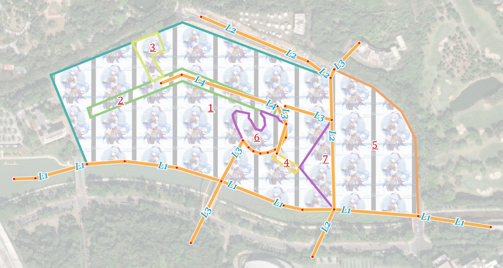
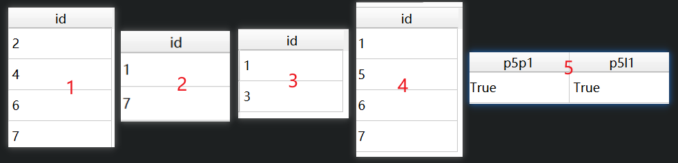

# 空间拓扑关系

## 概述

一种对空间对象（Spatial Object）关系的划分是距离关系（Distance Relations）、拓扑关系（Topological Relations）和角度关系（Directional Relations）。

距离关系和角度关系是显然的，如对象A距离对象B500米，这就是一种距离关系，对象A在对象B的西边，这就是一种角度关系。而A在B的内部，这算是一种拓扑关系。在空间分析中经常使用的空间连接工具中两个图层间要素的关系往往就是拓扑关系，如相交（intersect），包含（contain），接触（touch）等等。而拓扑关系之所以称为拓扑关系，是因为这种关系在两个几何在同时进行任意弯曲、拉伸、缩小等连续变形下是保持不变的（如一张纸上有一个墨点，无论如何揉搓这张纸墨点依然在纸上），而拓扑学研究几何在拓扑变换下保持不变的性质。

本文从代数拓扑的对几何的基本认知入手，对四交模型、九交模型和OGC维度拓展的九交模型进行介绍，并对PostGIS、QGIS、shapely中的相关操作进行演示，帮助不熟悉有关知识的同学建立正确的知识框架。

## 代数拓扑视角下的空间关系

代数拓扑是一个研究表达几何配置及其关系的符号的代数操作的几何学分支。（Algebraic topology is a branch of geometry that deals with the algebraic manipulation of symbols that represent geometric configurations and their relationships to one another.）

代数拓扑空间数据模型基于cell，不同空间维度下的cell有不同的定义：

1. 0-cell是一个节点（node）
2. 1-cell是两个不同的0-cell之间连接（link）
3. 2-cell是由三个不相交的1-cell的闭合序列描述的区域（area）
4. n-cell A的表面（face）是包含在A中的任意（0,...,n）-cell

接下来给出几个基础的定义：

1. *closure*（闭包）: The closure of an n-cell $A$, denoted by $\bar A$, is the set of all faces $r$-face of $A$, where $0 \le r \le n$,i.e.,

$$
\bar A=\cup_{r=0}^{n}{r-\text{face}\in A}
$$

2. *boundary*（边界）: The set-theoretic boundary of an n-cell $A$, denoted by $\partial{A}$, is the union of all $r$-faces, where $0 \le r \le (n - 1)$, that are contained in A:

$$
\partial{A}=\cup_{r=0}^{n-1}{r-\text{face}\in A}
$$

3. *interior*（内部）: The interior of a cell $A$, denoted by $A^\circ$, is the set difference between $A$'s closure and $A$'s boundary:

$$
A^\circ = \bar A - \partial A
$$

4. *exterior*（外部）: The exterior of a cell A, denoted by $A^-$, is the set of all cells in the universe $U$ that are not elements of the closure.

$$A^- = U - \bar{A}$$

5. *cell complexes*（cell复形）: cell复形由基础的cell聚合得到。假设complex $C$由$x$个cell组成，$C=(A_1,...A_x)$，则其boundary, interior和exterior分别可以进行如下定义：

$$
\partial{C}=(\cup_{i=1}^{x}{\partial{A_i}})-(\cup_{i=1}^{x}\cup_{j=i+1}^{x}(\partial A_i \cap \partial A_j))
$$
$$
C^\circ = (\cup_{i=1}^{x}{\bar A_i})-\partial C
$$
$$
C^-=\cap_{i=1}^{x}{A_i^-}
$$

至此，interior，boundary和exterior被严格区分，以下的表述会大量用到这三个名词。此外，以下的cell均指cell complexes。

为了将所有cell置于统一的universe下讨论，基础的拓扑结构需要满足一下两条完备性定理：

+ 存在完备性（completeness of incidence）：The intersection of two cells is either empty or a face of both cells. => No two geometric objects must exist at the same location.
+ 包含完备性（completeness of inclusion）：Every n-cell is a face of a (n+1)-cell. => 在二维空间中，每个0-cell必然是一个1-cell的起始节点或者终止节点，每一个1-cell也必然在2-cell的boundary中。

此外，这里还假设，任意cell的闭包严格位于通用的universe之内，如$A\subset R^2$

嵌入空间的维数和cell的维数之差被定义为codimension。如对于3维空间中的2-cell而言，其codimension为1；对于2维空间中的1-cell而言，其codimension也为1；2维空间中的2-cell的codimension则为0。

接下来介绍在代数拓扑视角下的GIS和地图制图中常见的点（point）、线（line）、面（region）的对应的cell 复形子集。这些复形是同质n维（homogeneously n-dimension）的，且没有被分割为非空且不相连的部分。

+ A *region* is a 2-complex in $R^2$ with a non-empty, connected interior.（一个面是有非空且连通内部的2维cell复形）
  + A region without holes is a region with a connected exterior and a connected boundary(thus also called a region with connected boundaries).（其中，没有洞的面有连通的外部和连通的边界）
  + A region with holes is a region with a disconnected exterior and a disconnected boundary.（有洞的面有不连通的外部和不连通的边界）
+ A *line* is a sequence of connected 1-complexes in $R^2$ such that they neither cross each other nor form closed loops.（一个线是连通的1维cell复形序列，这些1维cell复形彼此既不交叉也不形成闭环）
  + A simple line is a line with two disconnected boundaries.（简单线有两个不连通的边界）
  + A complex line is a line with more than two disconnected boundaries.（复杂线有超过两个不连通的边界）
+ A *point* is a single 0-cell in $R^2$.（一个点是一个单独的0-cell）

## 四交模型和九交模型

四交模型（4-intersection model）是Egenhofer等提出的，使用内部和边界是否交集为空，进行空间对象关系判断的模型。九交模型（9-intersection model）在此基础上，额外引入外部，进行空间关系的判断。已有研究证明，在codimension=0，即嵌入空间和几何对象的维数相等时，四交模型和九交模型有相同的结果；在codimension>0时，即嵌入空间和几何对象的维数不相等时，九交模型可以提供更多的细节信息，这些信息在判断相等关系时至关重要。

对于空间对象$A$和$B$，四交模型矩阵可以表达为：

$$
I_4(A,B)=
\left(
\begin{matrix}
A^\circ\cap B^\circ &  A^\circ\cap \partial B\\
\partial A \cap B^\circ & \partial A \cap \partial B
\end{matrix}
\right)
$$

矩阵元素为二者的交集（$\emptyset$或$\neg{\emptyset}$），如对于region A 和 region B, 

$$
I_4(A,B)=
\left(
\begin{matrix}
\neg\emptyset & \neg\emptyset\\
\emptyset & \emptyset
\end{matrix}
\right)
$$

表示，region B 包含于 region A。

九交模型的矩阵可以表达为：

$$
I_9(A,B)=
\left(
\begin{matrix}
A^\circ\cap B^\circ &  A^\circ\cap \partial B & A^\circ\cap B^-\\
\partial A \cap B^\circ & \partial A \cap \partial B & \partial A\cap B^-\\
A^- \cap B^\circ & A^- \cap \partial B & A^- \cap B^- 
\end{matrix}
\right)
$$

理论上使用九交模型，有$2^9=512$种空间关系，在$R^2$，可以证明，仅有一小部分可以在空间对象间被实现。

+ $R^2$内2个region之间存在的九交关系：与四交模型一致，有8种：
  + disjoint（均为空集）
  + contains（A的内部与B的内部和边界交集为非空集，A的边界与B的内部和边界的交集为空集）
  + inside（A的内部和边界与B的内部交集为非空集，与B的边界交集为空集）
  + equal（A的内部与B的内部交集为非空集，与B的边界交集为空集，A的边界与B的内部交集为空集，与B的边界交集为非空集）
  + meet（A的边界与B的边界交集为非空集，其他为空集）
  + covers（A的内部与B的内部和边界交集为非空集，A的边界与B的内部交集为空集，与B的边界交集为非空集）
  + covered by（A的内部与B的内部交集为非空集，与B的边界交集为空集，A的边界与B的内部和边界交集均为非空集）
  + overlap（均为非空集）
+ $R^2$内2个line之间存在的九交关系：在$R^1$内，与四交模型一致，有8种空间关系，在$R^2$内，简单线有额外的33种空间关系，复杂线有更额外的24种空间关系
+ $R^2$内1个line和1个region之间存在的九交关系：简单线和region有19种拓扑关系，如果线有分支，则存在第20种。

## 基于维度拓展的九交模型

基于维度拓展的九交模型（Dimensionally Extended Nine-Intersection Model, DE-9IM）是由OGC"Simple Features for SQL"定义计算空间几何拓扑关系的矩阵模型，其同样基于外部、内部和边界，在$R^2$使用-1，0，1，2表示几何$A$和$B$各部分相交集合的维度（即-1表示二者交集为空，0表示二者交集为点集，1表示二者交集为线集，2表示二者交集为面集）。进一步地，以$F$表示-1，以$T$表示0，1或2，以$*$表示-1，0，1或2。基于该模型定义了8种空间关系，也就是QGIS等软件中空间连接时要求选择的八种要素几何的空间关系，即：equals（相等），disjoint（相离）,intersects（相交），touches（接触），crosses（交叉），within（在内部），contains（包含），overlaps（重叠）。可以对DE-9IM进行如下形式的表达：

$$
DE-9IM(A,B)=
\left(
\begin{matrix}
dim(A^\circ\cap B^\circ) &  dim(A^\circ\cap \partial B) & dim(A^\circ\cap B^-)\\
dim(\partial A \cap B^\circ) & dim(\partial A \cap \partial B) & dim(\partial A\cap B^-)\\
dim(A^- \cap B^\circ) & dim(A^- \cap \partial B) & dim(A^- \cap B^-) 
\end{matrix}
\right)
$$

其中，$dim(x)$表示计算$x$的空间维度，其值域为$\{-1,0,1,2\}$。

这里首先对OGC定义几何类型及其对应的内部、边界和外部进行总结


则对于几何$A$和几何$B$，OGC定义的$A$与$B$的8种拓扑关系有如下结果：

1. equals：在拓扑意义上A和B相等：A和B有完全相同的内部和边界
$$
\left(
\begin{matrix}
T & * & F\\
{*} & * &F\\
F & F &*
\end{matrix}
\right)
$$
2. disjoin：A和B没有公共点：A和B的边界和内部均与另一个的边界和内部交集为空
$$
\left(
\begin{matrix}
F & F & *\\
F & F & *\\
{*} & * & *
\end{matrix}
\right)
$$
3. intersects: A和B至少有一个公共点：不disjoint即为intersects
$$
\left(
\begin{matrix}
T & * & *\\
{*} & * & *\\
{*} & * & *
\end{matrix}
\right) or
\left(
\begin{matrix}
{*} & T & *\\
{*} & * & *\\
{*} & * & *
\end{matrix}
\right) or 
\left(
\begin{matrix}
{*} & * & *\\
{T} & * & *\\
{*} & * & *
\end{matrix}
\right) or
\left(
\begin{matrix}
{*} & * & *\\
{*} & T & *\\
{*} & * & *
\end{matrix}
\right)
$$
4. touches: A和B至少有一个公共的边界点，但是没有公共的内部点：A和B的内部不相交，但是二者边界交集非空，或一个的边界与另一个的内部交集非空
$$
\left(
\begin{matrix}
{F} & * & *\\
{*} & T & *\\
{*} & * & *
\end{matrix}
\right) or
\left(
\begin{matrix}
{F} & T & *\\
{*} & * & *\\
{*} & * & *
\end{matrix}
\right) or
\left(
\begin{matrix}
{F} & * & *\\
{T} & * & *\\
{*} & * & *
\end{matrix}
\right)
$$
1. crosses: 基准低维几何A与高维几何B的内部和外部交集均非空，一般适用于line/polygon和line/line的情况（multipoint也可以crosses linestring或polygon），以下两种情况分别适用于line/polygon和line/line的情况
$$
\left(
\begin{matrix}
{T} & * & T\\
{*} & * & *\\
{*} & * & *
\end{matrix}
\right) or
\left(
\begin{matrix}
{0} & * & *\\
{*} & * & *\\
{*} & * & *
\end{matrix}
\right) 
$$
1. overlaps: 内部交集非空，但彼此互不包含且不相等,一般适用于polygon/polygon和line/line的情况（multipoint也可以overlaps multipoint）），以下分别为这两种情况的矩阵
$$
\left(
\begin{matrix}
{T} & * & T\\
{*} & * & *\\
{T} & * & *
\end{matrix}
\right) or
\left(
\begin{matrix}
{1} & * & T\\
{*} & * & *\\
{T} & * & *
\end{matrix}
\right) 
$$
1. winthin: 内部交集非空，基准几何的内部和边界与所包含几何的外部的交集为空，注意，基准几何的边界可能与所包含几何的边界交集非空
$$
\left(
\begin{matrix}
{T} & * & F\\
{*} & * & F\\
{*} & * & *
\end{matrix}
\right) 
$$
1. contains: 内部交集非空，且被包含几何的内部和边界与基准几何的外部的交集为空，注意，被包含对象的边界与基准几何的边界可能交集非空
$$
\left(
\begin{matrix}
{T} & * & *\\
{*} & * & *\\
{F} & F & *
\end{matrix}
\right) 
$$

## 一些实操

### 数据概述

这里以北大深研院为背景简单创建了一个线图层和一个面图层，面图层有7个面，线图层有4条线，二者的CRS均为`EPSG:4547`，如下图所示，面图层以`fid`字段进行标注，线图层以`'L'`拼接`fid`字段进行标注。以下`fid=1`的面要素对应的几何被称为`P1`，`fid=1`的线要素对应的几何被称为`L1`，按照这种命名方式，将通过多种方式将完成如下任务：

1. P1包含（contains）的其他面有哪些？
2. P4相交（intersects）的其他面有哪些？
3. 穿过（crosses）P1的线有哪些？
4. 与L3相交（intersects）的其他线有哪些？
5. P5与P1和L1的空间关系是接触（touches）吗？



### PostGIS

以下SQL语句是对上述问题的求解：

```sql
select b.fid from (select * from simple_polygon where fid=1) a,(select * from simple_polygon where fid!=1) b where st_contains(a.geom, b.geom);
 
select b.fid from (select * from simple_polygon where fid=4) a, (select * from simple_polygon where fid!=4) b where st_intersects(a.geom, b.geom);
 
select b.fid from (select * from simple_polygon where fid=1) a, simple_line b where st_crosses(b.geom, a.geom);

select b.fid from (select * from simple_line where fid=3) a, (select * from simple_polygon where fid!=3) b where st_intersects(a.geom, b.geom);

select st_touches(a.geom,b.geom) p5p1, st_touches(a.geom,c.geom) p5l1 from (select * from simple_polygon where fid=5) a, (select * from simple_polygon where fid=1) b, (select * from simple_line where fid=1) c;
```
执行结果如下：



让我们来检查一下执行结果的正确性：

1. 看上去P3似乎也被P1包含，实际上并没有，放大后可以发现如下图所示的情况，值得指出的是在8:1的比例尺下才有这样的明显的效果，但实际上程序不会以为这样小的参差而认为P1包含P3，这也说明了空间数据的质量问题不可忽视，如主观期待3被1包含，那么如果用这份数据会产生错误的结果。此外，PostGIS认为P1是包含P7的，实际上P1与P7的边界是交集非空的，这一点在后面的判别上存在着些许差异，这值得注意。
2. 1包含4，4与7的边界交集非空（一个点），所以相交关系成立，其他面均与4相离。
3. 只有L1和L3的内部与P1的内部和外部交集均非空，L2虽然与P1的外部交集非空，但与其内部交集为空，只是与其边界交集非空。这里L1的确与P1的内部存在交集（虽然极其小）。
4. L3的内部或边界与P1、P5、P6、P7的内部或边界的交集至少为点集，与P2、P3、P4的内部或边界没有交集。
5. P5的内部与P1的内部交集为空，但P5的边界与P1的边界交集非空，所以P5和P1存在接触关系；P5的内部与L1的内部交集为空，但P5的边界与L1的内部交集非空，所以P5和L1也存在接触关系。


### QGIS

在QGIS中用`pyqgis`进行问题的求解：

```Python
lineLayer = QgsProject.instance().mapLayersByName('simple_line')[0]
polygonLayer = QgsProject.instance().mapLayersByName('simple_polygon')[0]
# 1
P1 = polygonLayer.getFeature(1)
idList = []
for polygonFeature in polygonLayer.getFeatures():
    if polygonFeature['fid'] != P1['fid'] and P1.geometry().contains(polygonFeature.geometry()):
        idList.append(polygonFeature['fid'])
print(f"P1包含（contains）的其他面有：{idList}")
# 2
P4 = polygonLayer.getFeature(4)
idList = []
for polygonFeature in polygonLayer.getFeatures():
    if polygonFeature['fid'] != P4['fid'] and P4.geometry().intersects(polygonFeature.geometry()):
        idList.append(polygonFeature['fid'])
print(f"P4相交（intersects）的其他面有：{idList}")
# 3
idList = []
for lineFeature in lineLayer.getFeatures():
    if lineFeature.geometry().crosses(P1.geometry()):
        idList.append(lineFeature['fid'])
print(f"穿过（crosses）P1的线有：{idList}")
# 4
L3 = lineLayer.getFeature(3)
idList = []
for lineFeature in lineLayer.getFeatures():
    if lineFeature['fid'] != L3['fid'] and lineFeature.geometry().intersects(L3.geometry()):
        idList.append(lineFeature['fid'])
print(f"与L3相交（intersects）的其他线有：{idList}")
# 5
P5 = polygonLayer.getFeature(5)
L1 = lineLayer.getFeature(1)
print(f'P5与P1和L1的接触关系分别是{P5.geometry().touches(P1.geometry())}，{P5.geometry().touches(L1.geometry())}')
```

运行结果如下图所示，与PostGIS的运行结果完全一致。


### shapely

`geopandas`依赖于`shapely`，使用其读取空间数据并进行判断：

```Python
import geopandas
polygonGdf = geopandas.read_file(r'F:\shchyan\a.gpkg', layer='simple_polygon')
polygonGdf['fid'] = list(range(1, polygonGdf.shape[0]+1))
lineGdf = geopandas.read_file(r'F:\shchyan\a.gpkg', layer='simple_line')
lineGdf['fid'] = list(range(1, lineGdf.shape[0]+1))
# 1.
containsResult = polygonGdf[polygonGdf.geometry.within(polygonGdf[polygonGdf['fid'] == 1].geometry.iloc[0]) & (polygonGdf.fid != 1)]['fid'].values.tolist()
print(f"1. P1包含的其他面：{containsResult}")
# 2.
intersectsResult = polygonGdf[polygonGdf.geometry.intersects(polygonGdf[polygonGdf['fid'] == 4].geometry.iloc[0]) & (polygonGdf.fid != 4)]['fid'].values.tolist()
print(f"2. P4相交的其他面：{intersectsResult}")
# 3.
crossesResult = lineGdf[lineGdf.geometry.crosses(polygonGdf[polygonGdf['fid'] == 1].geometry.values[0])]['fid'].values.tolist()
print(f"3. 穿过P1的线：{crossesResult}")
# 4.
intersectsLinesResult = lineGdf[lineGdf.geometry.intersects(lineGdf[lineGdf['fid'] == 3].geometry.iloc[0]) & (lineGdf['fid'] != 3)]['fid'].values.tolist()
print(f"4. 与L3相交的其他线：{intersectsLinesResult}")
# 5.
p5TouchesP1 = polygonGdf[polygonGdf['fid'] == 5].geometry.values[0].touches(polygonGdf[polygonGdf['fid'] == 1].geometry.values[0])
p5TouchesL1 = polygonGdf[polygonGdf['fid'] == 5].geometry.values[0].touches(lineGdf[lineGdf['fid'] == 1].geometry.values[0])
print(f"5. P5与P1和L1分别接触吗？{p5TouchesP1}，{p5TouchesL1}")

```

运行结果如下图所示，与PostGIS的运行结果也完全一致。


### 较大数据集下的情况

在QGIS环境主要使用`Processing Toolbox`的`Join attributes by location (summary)`工具对43000+个网格对700000个建筑进行分割，统计每个网格内包含（contains）的分割后的建筑数量，直接使用下图所示的pipeline进行处理：


对count的统计进行可视化，局部结果：


显然，它统计错误了。使用geopandas进行类似的操作也会出现类似的问题，这里不再截图示意。经过测试小数据集上没有出现此问题，具体原因未知。

如果添加一个buffer操作，使添加面积字段后的几何进行负值的缓冲区生成再进行空间连接，则得到：


处理结果：


此时统计正确了。

## 小结

本推文从代数拓扑对几何的内部、边界和外部的定义入手，对GIS的四交模型、九交模型和维度拓展的九交模型进行了较为详细的介绍，并使用PostGIS、QGIS和shapely进行了示例演示，值得注意的是在大数据集上目前的QGIS和shapely似乎存在着一些问题，如果遇到这种特殊情况需要灵活处理。

此外，值得指出的是，除了代数拓扑，还可以根据目的从其他角度对GIS中的几何进行定义，但大体最终会落到点、线、面上。

之所以专门写一下这个，是因为有同学之前在问我空间连接时关系怎么选。写本推文的初衷也是帮助对空间连接参数陌生的同学正确地使用空间连接工具，顺便对GIScience学科的知识进行了解，希望可以帮助到有需要的同学捏！

ヾ(•ω•`)o就先这样结束啦！下一篇写点什么好呢？（如果有机会的话）

## Reference

1. Longley P A, Goodchild M F, Maguire D J, et al. Geographic information science and systems[M]. John Wiley & Sons, 2015.
2. Strobl C. Dimensionally extended nine-intersection model (de-9im)[J]. 2008.
3. Egenhofer M J, Herring J. Categorizing binary topological relations between regions, lines, and points in geographic databases[J]. The, 1990, 9(94-1): 76.
4. Mark D M, Egenhofer M J. Modeling spatial relations between lines and regions: combining formal mathematical models and human subjects testing[J]. Cartography and geographic information systems, 1994, 21(4): 195-212.
5. Egenhofer M J, Sharma J, Mark D M. A critical comparison of the 4-intersection and 9-intersection models for spatial relations: formal analysis[C]//AUTOCARTO-CONFERENCE-. ASPRS AMERICAN SOCIETY FOR PHOTOGRAMMETRY AND, 1993: 1-1.
6. https://postgis.net/workshops/postgis-intro/spatial_relationships.html
7. https://docs.safe.com/fme/html/FME-Form-Documentation/FME-Transformers/Transformers/spatialrelations.htm
