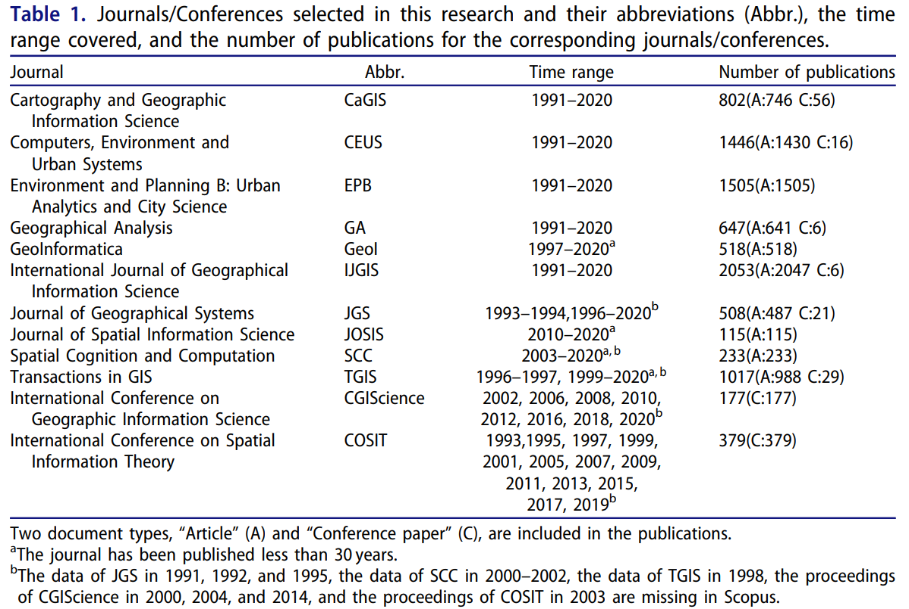
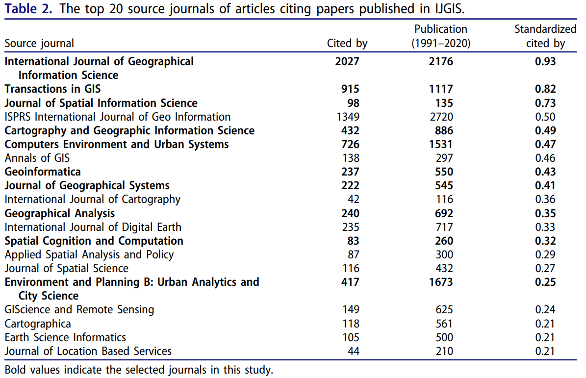

# 论文学习：Research themes of geographical information science during 1991-2020: a retrospective bibliometric analysis

## 总述

本文由北京大学的刘瑜教授、邬伦教授和Xiaohuan Dong，以及北京师范大学的董卫华教授执笔，发表在《INTERNATIONAL JOURNAL OF GEOGRAPHICAL INFORMATION SCIENCE》上，链接地址为 https://doi.org/10.1080/13658816.2022.2119476 。本文使用文献计量方法对GISciene领域10个国际期刊和2个国际会议发表的9400篇论文进行了分析，分别对期刊和会议发表物的领域主题及发展趋势进行了分析，并通过对引文网络的社区检测得到了15个研究主题及代表作者，不同研究主题下出版物数量的变化也反映了学界对关注问题类型的演进；此外还对不同主题的期刊分布进行了简单分析；最后对GIScience领域一些未来值得关注的点进行了阐述。

## 各部分内容评析

### Introduction

本部分内容主要是对GIScience的发展过程中一些代表性事件的回顾和GIScience领域的文献计量研究的综述。

前者大致列举了如下表所示的若干时间节点。

| 时间节点  |       代表学者/机构        | 相关事件                                                                      |
|:-----:|:--------------------:|:--------------------------------------------------------------------------|
| 1960s |   Roger Tomlinson    | Canada Geographic Information System的产生，第一个地理信息系统                         |
| 1988  |          -           | National Center for Geographic Information and Analysis的创立，使用GIS进行基础研究    |
| 1992  | Michael F. Goodchild | GIScience概念的提出——"the science behind the systems"                          |
| 1996  |          -           | University Consortium for Geographic Information Science的成立，进行地理信息科学的前沿研究 |
| 2006  |      UCGIS,AAG       | 对地理信息科学的学科知识的整理发表                                                         |
| 2006  |        Turner        | 强调地理信息技术和工具对非专业地理学者的使用                                                    |
| 2007  | Michael F. Goodchild | 提出"citizens as sensors"的理念，并提出VGI（Volunteered Geographic Indormation）的理念  |
| 2014  |       Zheng Yu       | 提出城市计算的概念（Urban Computing）                                                |
| 2015  |        Liu Yu        | 提出社会感知的概念（Social Sensing）                                                 |
|   -   |          -           | 以深度学习为代表的人工智能技术在学科中的应用，包括在采样、插值、模式识别、预测等问题中的应用                            |

后者指出目前的GIS领域的文献计量大多只是针对单一领域的，较少关注整个GIS领域，极少关注GIS学科领域的发展流变。

### Materials and methods

本文使用的文献统计数据来自Scopus（ https://www.scopus.com/ ），本文通过选取较为纯粹的GIScience领域的期刊和会议来筛选GIScience领域的论文（而不是通过关键词筛选），得到了下表：

值得注意的是，城市科学倾向较为明显的《Environment and Planning B: Urban Analytics and City Science》入选，该刊物所发文章被IJGIS所发文章的引用次数较多，见下表：

这里使用“Author(s) ID” and “Affiliations”来对作者及其所属国家和地区进行计数，使用“Author Keywords”进行主题词提取，提取前对关键词进行了简单的文本预处理。

这里的社区检测算法的思路来自Scival网站（ https://www.elsevier.com/solutions/scival ），其基本思路为：

+ community detection was used to cluster papers in the citation network
+ keywords were used to understand the theme meanings of communities
+ small communities were merged into large communities with similar themes according to their text information

这里作者指出"title"和"abstract"在本研究中只是对"author keywords"的补充，只有"author keywords"被用于主题提取，因为keywords are concise, refined and representative enough.

实际操作中使用了VOSviewer软件（ https://www.vosviewer.com/ ），其使用到的社区检测算法为 smart local moving algorithm。

### Results

1. 发文量

    近30年来（1991-2020），各期刊的发表论文数量都呈现上升趋势。

2. 国家和地区分布

    按数量排名，前十位依次是美国（3615）、英国（1224）、中国（1045）、德国（629）、荷兰（585）、加拿大（537）、澳大利亚（485）、法国（287）、中国香港（269）、意大利（267），可见英美仍是GIS研究的大本营，中国学者也为GIS的学科发展贡献了很多，欧洲地区也有着较为浓厚的GIS研究氛围；按各年份的论文数量来看，英国、德国、荷兰整体发文量增长较为缓慢，美国在高发文量的前提下有着较高的增长速度，中国学者在2014年之后发文量增长显著，按作者的说法，造成这种现象的原因是中国学者早期的研究主要见诸中文刊物。

3. 社区检测结果 & 各领域关键字分析 & 各领域 leading authors

    共检测出了15个研究主题（作者姓名后标注该作者在该领域的发表论文数，论文后标注该论文的被引用次数）：

|序号|研究主题|文章数量|代表作者|主题词同组其他词|代表著作|
|:----:|:----:|:----:|:----:|:----:|:----:|
|1|Cellular automata （元胞自动机）|939|Li X[34] Liu X[27] Clarke K.C.[24]|agent-based model（基于智能体的模型） land use/land cover change（土地利用变化）|EPB-Clarke et al. (1997) [1057] IJGIS-Stockwell and Peters (1999) [1033] IJGIS-Clarke and Gaydos (1998) [827]|
|2|Geographically weighted regression （地理加权回归）|752|Griffith D.A. [30] Deng M. [24] Brunsdon C. [22]|spatial data mining（空间数据挖掘） spatial autocorrelation（空间自相关）|GA-Anselin (1995) [6150] GA-Getis and Ord (1992) [3117] GA-Ord and Getis (1995) [1854]|
|3|Moving object （移动目标）|679| Shaw S.-L. [19] Miller H.J. [17] Li Q. [15] Timmermans H. [15]|time geography（时间地理学） trajectory（轨迹）|GeoI-Brinkhoff (2002) [719] IJGIS-Miller (1991) [477] GA-Miller (2005) [358]|
|4| Digital elevation model （数字高程模型）|678| Goodchild M.F. [20] Zhu A.-X. [18] Leung Y. [13]|uncertainty（不确定性） Lidar（雷达）|IJGIS-Wang et al. (2010) [792] IJGIS-Hutchinson (1995) [617] IJGIS-Gessler et al. (1995) [507]|
|5|Ontology （本体论）|680| Kuhn W. [15] Goodchild M.F. [14] Rajabifard A. [13] Worboys M. [13]|spatial data infrastructure（空间数据基础设施） interoperability（互操作）|IJGIS-Dragut¸ et al. (2010) [595] SCC-Grenon and Smith (2004) [438] IJGIS-Peuquet and Duan (1995) [418]|
|6|Spatial optimization （空间优化）|537|Murray A.T. [36] Church R.L. [21] Jankowski P. [13] Tong D. [13]|genetic algorithm（遗传算法） multicriteria decision analysis（多准则决策分析）|IJGIS-Malczewski (2006) [1227] IJGIS-Carver (1991) [753] IJGIS-Jankowski (1995) [515]|
|7| Wayfinding （路径搜索）|501| Winter S. [30] Egenhofer M.J. [26] Raubal M. [13]|navigation（导航）  qualitative spatial reasoning（定性空间关系推理）|IJGIS-Egenhofer and Franzosa (1991) [1254] GeoI-Cohn et al. (1997) [426] COSIT-Egenhofer and Mark (1995) [352]|
|8|Volunteered geographic information （志愿地理信息）|474| Janowicz K. [18] Zipf A. [13] Purves R.S. [12] McKenzie G. [12]|social media（社交媒体） Twitter（推特）|EPB-Haklay (2010) [1003] TGIS-Girres and Touya (2010) [424] CaGIS-Hawelka et al. (2014) [410]|
|9| Planning support system （决策支持系统）|513|Lai L.W.C. [12] Wikle T.A. [10] Geertman S. [10]|urban planning（城市规划） public participation（公众参与）|IJGIS-Goodchild (1992) [552] EPB-Albrechts (2004) [472] EPB-Healey (1996) [420]|
|10|Accessibility （可达性）|536|Timmermans H. [13] Peponis J. [10] Hillier B. [9]|space syntax（空间句法） shape grammar（形状文法）|EPB-Hillier et al. (1993) [851] EPB-Luo and Wang (2003) [771] GA-Kwan (2010) [677]|
|11| Geovisualization （地理可视化）|350| MacEachren A.M. [18] Kraak M.J. [12] Robinson A.C. [11]|visualization（可视化） uncertainty（不确定性）|IJGIS-Andrienko et al. (2010) [312] IJGIS-Andrienko et al. (2007) [299] IJGIS-Andrienko and Andrienko (1999) [261]|
|12|Areal interpolation （面插值）|340|Sadahiro Y. [23] Kyriakidis P.C. [8] Leyk S. [7]|census data（普查数据） modifiable areal unit problem（可变面元问题）|CaGIS-Eicher and Brewer (2001) [356] GA-Kyriakidis (2004) [244] EPB-Pendall (1999) [237]|
|13|Map generalization （地图综合）|330|Ai T. [16] Weibel R. [16] Li Z. [14] |automated map generalization（自动地图综合） cartographic generalization（地图制图综合）|GeoI-Jiang and Claramunt (2004) [200] CaGIS-Saalfeld (1999) [168] IJGIS-Li et al. (2004) [152]|
|14|3D city model （3D城市模型）|327|Stoter J.E. [22] Ledoux H. [12] van Oosterom P. [11]|citygml（CityGML，一种3D城市模型的数据标准） Lidar（雷达）|EPB-Turner et al. (2001) [540] CEUS-Wiginton et al. (2010). [269] EPB-Batty (2001) [234]|
|15|Map projection （地图投影）|74|Jenny B. [9] White D. [7] Strebe D. [7] Savric, B. [7]|discrete global grid system（离散全球格网系统） map projection distortion（地图投影变形）|CaGIS-Sahr et al. (2003) [406] CaGIS-White et al. (1992) [225] CaGIS-Kimerling et al. (1999) [85]|

作者也给出了各研究主题之间的关系：

+ Geographically weighted regression、Cellular automata、Accessibility、Volunteered geographic information、Spatial optimization是GIS领域有影响力的（influential）领域
+ Moving object 和 Volunteered geographic information、Accessibility 联系紧密
+ Ontology 和 Wayfinding 联系紧密
+ Cellular automata 和 Spatial optimization 联系紧密

简单评析：

+ 专题2直接冠以地理加权回归的名字似乎不太妥当，不妨称之为空间数据挖掘，本领域的三篇高被引论文的引用数均比其他领域的最高被引论文的引用数更高，Anselin教授的《Local indicators of spatial association—LISA》一文在Google Scholar上显示的的被引量已经超过了14000，Getis和Ord的《The analysis of spatial association by use of distance statistics》和《Local spatial autocorrelation statistics: distributional issues and an
application》也分别有着高达6000+和3000+的被引量，三者均是关于空间自相关统计量的开创性文章，这与GWR的直接关系也不大，但足可见空间统计在GIS领域是很重要的
+ 高被引论文的作者与发表论文数量多的作者之间并没有必然关系
+ 这些研究主题似乎已经涵盖了相当多的方面：GIS数据（4、5、8、14），空间分析（1、2、3、6、7、9、10、12），地图学（11、13、15）。GIS数据方面即对应VGI数据、三维数据、传统DEM数据、数据基础设施的管理；空间分析方面，出行、轨迹是一大主题（3，7，10），空间统计与地统计是一大主题（2，12），元胞自动机与空间优化是一大主题（1，6），所谓的决策支持系统应当只是过去的讨论主题了
+ 空间优化在本人本科期间接触极少，但是有一个优化建模的思想似乎还是比较必要的
+ 地图学是GIS的重要领域，比较可惜的是不少人似乎只是将其视作一种最后的成果展示方式，缺乏基本的地图学素养，不考虑地图投影的选择，也不考虑实际打印内容的大小，更不必说对地图综合有基本的概念了，更遑论地图制图学了，但当然这也都是可以理解和接受的
+ moving object的相关文章如此之多是没有想到的，一些moving object相关的应用研究似乎很多，比如交通地理学
+ Cellular automata的相关文章如此之多，是不是与研究土地利用变化的学者十分多有关？
+ GIS毕竟是交叉学科，不可避免地会有很多关联学科关键字的融入，如元胞自动机并不是GIS学者的原创，遗传算法、形状文法也来源于计算机科学

6. 研究主题的演进

    主要有以下几点结论：

    + 在GIS发展的不同历史时期，各研究主题论文数的比例有显著差异
    + 1，2，3，8主题论文数呈上升趋势，其中元胞自动机相关的稳定增长，大数据的引入使得空间数据挖掘、VGI数据和轨迹数据的关注越来越多
    + 4，5，9主题论文数呈下降趋势，似乎DEM和决策系统相关的论文已经较难见到了
    + 地图学领域的三个主题（11，13，15）论文数保持平稳

### Discussion

1. 研究主题的期刊分布

    显然，不同期刊接收的文章主题是会有差异的。IJGIS的接收文章的主要主题有：moving object, digital elevation model, ontology, spatial optimization, volunteered geographic information, areal interpolation。此外，本部分还对不同期刊的引文联系进行了总结。

2. 未来GIScience的发展方向

    主要有以下四点讨论：

    + GIS已经走过了由creation到popularization的阶段，未来仍将随着社会的发展而升级进步，5G时代，GIS与时空大数据、与云计算对智慧城市的建设将密不可分；
    + 新的技术和方法助力对传统话题进行再认识，比如不确定性（uncertainty），空间（大）数据的质量问题，空间大数据情境下如何对数据进行空间分析和可视化；
    + 未来有关土地利用的研究将进入新的阶段，原因如下：对中国而言，快速的城市化使得土地利用快速变化，2030年碳达峰、2060年碳中和的规划将持续推动土地利用变化的相关研究的开展；此外，气候变化带来的土地利用变化也会吸引相关学者，对于土地利用变化的建模和分析对于实现可持续发展也有重要意义；
    + 人工智能（Artificial Intelligence）在GIScience领域的应用在过去五年间开始呈现活力，其将促进GIScience的分析方法的增进和大数据应用问题的解决。前者主要有两方面，一是深度学习模型的可迁移性和泛化性将促进地理规律从特殊性到一般性的认知，二是解释型模型和预测型模型的结合对于地理学问题机理的揭示将起作用；后者主要体现在基于机器学习和深度学习的空间分析方法将增强对地理现象的智能推理和知识发现能力。

### Conclusions

对文章内容的总结，The goal of this work is to help readers deepen their understanding of GIScience and insprire theit future research through a retrospective bibliometric analysis of the selected 9400 publications. 还指出了文章在数据和方法上的一些不足，展望方面则给出了如下论述：分析这些GIS研究主题的演进是有意义的，结合当下的热点研究主题和传统的研究主题进行研究可能会有新的发现，如VGI数据的不确定性，流数据的空间自相关计算；这种演进可以揭示不同研究主题间的流变，帮助探索GIScience的本质；理解GIScience和其他学科的联系对于促进GIScience的发展和寻找新的研究主题也是有裨益的。

## 结语

本文是一篇对1991-2020这30年间GIScience发展历程的文献计量论文，本文提取出的各个研究主题和不同时期研究主题的演变对于通览整个GIScience学科很有帮助，最后对GIS未来发展的一些论述也很有见地，想学习不同主题下的奠基性论文此文也是很好的参考。

第一次写，诚惶诚恐，不知道有没有下一次了捏...

(●—●)Bye-bye!
