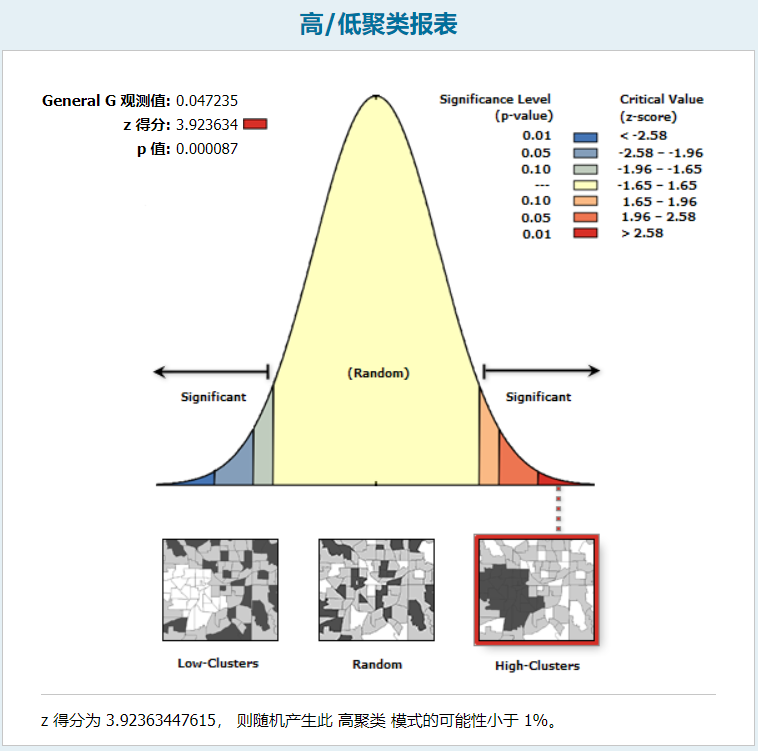

# Welcome to YSC's Github Page

初来乍到，算是第一次参考教程在Github上搭建页面……

## 这是一个到待写的博客首页的传送链接

[MY BLOGS](./TESTMD.md)

ECharts测试
[1](./ChinaAfforestationAreaSerires.html)
[2](./ShaanxiEconomicForestChange.html)
[3](./ShaanxiForestAreaSeries.html)
[4](./ShaanxiForestCoverRateSeries.html)
[5](./China20202002NDVISubtract.html)
[6](./timeline.html)

图片


### Markdown

Makedown是一种适用于格式化写作内容的轻量级的易于使用的语言，它包含如下一些规则：

Markdown is a lightweight and easy-to-use syntax for styling your writing. It includes conventions for

```markdown

使用#以高亮语句块

Syntax highlighted code block

# Header 1
## Header 2
### Header 3


使用-或数字加'.'以生成列表

- Bulleted
- List

1. Numbered
2. List

使用**str**以加粗str
使用_str_以倾斜str
使用`str`以代码化str

**Bold** and _Italic_ and `Code` text

链接网址或图片资源的方式

[Link](url) and 
```

了解更多关于markdown的细节请访问其[Github Flavored Markdown](https://guides.github.com/features/mastering-markdown/)

For more details see [GitHub Flavored Markdown](https://guides.github.com/features/mastering-markdown/).

### Jekyll Themes

本页面采用从仓库设置中挑选的Jekyll主题的布局与风格。主题名被保存在_config.yml这个配置文件中。

Your Pages site will use the layout and styles from the Jekyll theme you have selected in your [repository settings](https://github.com/Schalal/Schalal.github.io/settings/pages). The name of this theme is saved in the Jekyll `_config.yml` configuration file.

### Support or Contact

页面初始默认生成的

如果对本页面有问题请查看[官方文档](https://docs.github.com/categories/github-pages-basics/)或者[联系以获取支持](https://support.github.com/contact)，我们将帮您解决问题。

Having trouble with Pages? Check out our [documentation](https://docs.github.com/categories/github-pages-basics/) or [contact support](https://support.github.com/contact) and we’ll help you sort it out.

### CONTACT ME

这个指的是联系我

-EMAIL:herryschalal@gmail.com
